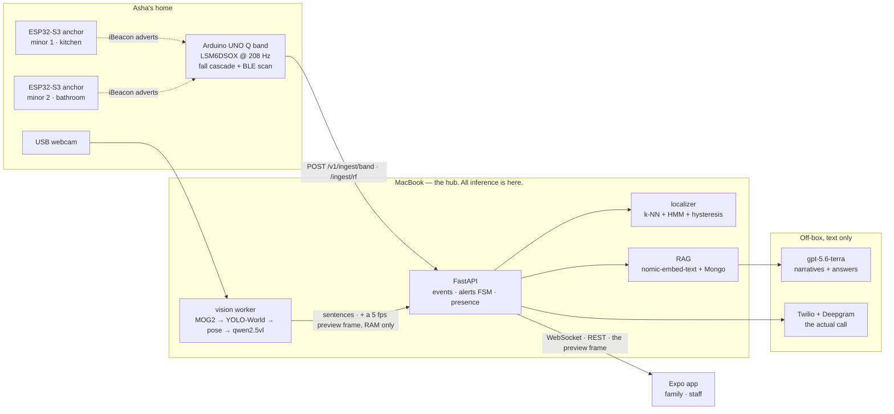

<div align="center">

# Dhyaan

**Eldercare sensing that phones the grandparent first, and the family second.**

A wrist band that feels a fall, ESP32 anchors that know which room she is in,
and a camera read only by models on this laptop — folded into one event
stream the family can ask questions of.

`HackMIT 2026` · Arduino UNO Q + ESP32-S3 + MacBook-local inference

</div>

---

## Demo

https://github.com/user-attachments/assets/REPLACE-ME

<!-- 25 s launch video, 1920x1080. The file is committed at demo/dhyaan-launch.mp4.
     GitHub only plays video it hosts itself, so a relative path will not render:
     drag demo/dhyaan-launch.mp4 into the README editor (or into any issue
     comment), then paste the user-attachments URL it hands back over the line
     above. Source composition: brag-output/composition/. -->

**[`demo/dhyaan-launch.mp4`](demo/dhyaan-launch.mp4)** — 25 seconds, the five
beats below in order. The beat sheet the video follows — and the boot order that makes it
reproducible — is [`DEMO_RUNBOOK.md`](DEMO_RUNBOOK.md).

| Beat | What you see | Where it comes from |
|---|---|---|
| **Where she is** | Room changes as the band walks past the anchors, bathroom dwell raises a flag | `backend/app/location.py` · `beacons/beacon.ino` |
| **What she did today** | "Asha ate lunch at the table, 12:31–12:48." No stored image, no room name | `backend/vision/` → `backend/app/presence.py` |
| **The fall** | Band buzzes, 30 s to cancel, then the phone rings *her* | `band/fallband/sketch/` → `backend/app/alerts.py` |
| **The second opinion** | Camera independently reports `on_floor`, which jumps the queue | `backend/vision/keyframe.py` |
| **The escalation** | She doesn't answer → the family's phone rings and the app goes full-screen | `backend/app/alerts.py` · `frontend/src/app/alert/` |

---

## Everything that looks at a person runs on this laptop

Not a design goal we bolted on afterwards. It is why the camera lane can exist
at all: the moment a frame is a request body to someone else's API, the
consent conversation with a 79-year-old is over.

| Job | Model | Where it runs | Measured |
|---|---|---|---|
| Scene → sentence | `qwen2.5vl:3b` | Ollama, `localhost:11434` | 0.69 s / call, warm |
| Person + food + dishes + seating | `yolov8s-worldv2` (open-vocabulary) | in-process, Ultralytics | ~13 ms / frame live |
| Posture (hips vs shoulders vs knees) | MediaPipe `pose_landmarker_lite` | in-process | ~13.8 ms / frame |
| Prompt vocabulary embeddings | CLIP `ViT-B/32` | in-process, once at startup | 3.1 s, startup only |
| Motion | MOG2 on 320×180 grey | OpenCV | ~2 ms / frame |
| Daily-narrative embeddings | `nomic-embed-text`, 768-d | Ollama | offline once pulled |
| Fall cascade | threshold state machine, 208 Hz | STM32U585 **on the band** | no network at all |
| Room estimate | weighted k-NN + HMM + hysteresis | in the API process | pure functions, no model |

**No frame is ever written to disk.** There is no `cv2.imwrite`, no
`VideoWriter`, no `frames/` directory anywhere in `backend/vision/`, and a test
in `backend/tests/test_vision_gate.py` walks the package's AST and fails the
build if anyone adds one. It is a structural promise, not a convention.

**A frame does now cross the LAN, and it is a relaxation, not a feature.** The
only socket that carries a frame to a *model* is still loopback to Ollama. But
the hub also posts the annotated frame it draws in its own window to
`POST /v1/ingest/camera/frame` about five times a second, and the family app's
camera screen renders it — the picture on the phone is the picture on the hub.
The API keeps exactly one JPEG per camera in RAM, refuses the post when consent
is off or the camera is paused (`_live_camera`, the same gate as every other
device route), serves nothing older than 5 s so a stale frame cannot pass for a
live one, and writes nothing to Mongo or to disk. `VISION_STREAM=0` turns the
relay off and the screen goes back to geometry and a sentence. The comment over
`_FRAME` in `routers/camera.py` calls it a demo-only relaxation of this lane's
oldest rule and says what it would take to ship: auth on the route, its own
consent grant, and a screen that asks for the picture instead of receiving it.

### The two things that leave the LAN, named out loud

| Edge | What crosses | What never crosses |
|---|---|---|
| **OpenAI** (`gpt-5.6-terra`, `backend/app/llm.py`) | The day's event sentences, for the daily narrative and the family's questions | Pixels, audio, video |
| **Twilio + Deepgram** (`dhyaan/voice/`) | The disclosed phone call, during the call only | Nothing is stored: we keep the transcript, never the audio (D-004) |

Both are text-only, both are off the sensing path, and pulling the API keys
degrades the system instead of breaking it — `AVAILABLE = bool(OPENAI_API_KEY)`
and the voice bridge only mounts when Twilio credentials exist, so `./dev.sh`
runs zero-config with neither.

The text path is one `httpx` POST to `/v1/chat/completions` — no vendor SDK, no
framework, an 8 s timeout and one retry — and it is the first link of a chain
rather than a dependency. A family question that OpenAI does not answer falls
to a chat model on the same local Ollama (`rag._ollama_answer`, off unless
`CHAT_FALLBACK_MODEL` is set; `dev.sh` points it at the `qwen2.5vl:3b` already
pulled for the camera), and then to a deterministic template that groups the
retrieved sentences by *you told us* / *Dhyaan saw* / *from her pattern*. The
daily narrative has the template but not the middle link. With no key at all
the app still answers — it answers less well, and nothing 500s.

One honest edge on that row: the questions are scrubbed of room names before
they go out (`rag.scrub_rooms`, on every retrieved hit), but the daily-narrative
prompt is the day's raw event sentences, and a band or beacon sentence can name
a room. What renders on the family surface is scrubbed again server-side.

---

## Architecture



---

## The camera lane, in order

`backend/vision/` is the only process that runs a model on a pixel — the API's
relay buffer, above, holds one JPEG at a time and writes it nowhere. Every
stage exists to avoid paying for the next one.

| Stage | What it does | Cost | Drops |
|---|---|---|---|
| 0 · sample | Every 2nd frame at 30 fps → 15 fps | — | half |
| 1 · mask | Black out a normalised rectangle *before* any detector sees it | ~0 | the doorway you excluded |
| 2 · motion | MOG2 foreground ratio > 0.008 | ~2 ms | an empty room, all day |
| 3 · gate | One YOLO-World pass: person, food, dishes, seating | ~13 ms | frames with nobody in them |
| 3b · posture | MediaPipe pose — hips relative to shoulders and knees | ~13.8 ms | false `on_floor` |
| 3c · post | The detector's own observation, the moment `(people, food, dishes, posture band)` changes | ~0 | a flapping label: one post a second, at most |
| 4 · keyframe | Is this frame worth 0.7 s of VLM? | pure state machine | every frame but one a minute |
| 5 · VLM | 448×252 JPEG → `qwen2.5vl:3b` → strict JSON | 0.69 s | — |
| 6 · fold | Observations → one open interval per activity → one event | — | five duplicate lunches |

**Two things come out of that cascade, on two clocks.** The detector answers
every structural question — is she there, is someone with her, is there food,
is she up or seated — in ~13 ms, so stage 3c posts its own observation the
moment that answer changes and does not wait for a keyframe. `quick_min_s`
(1.0 s) is the floor under it: a label sitting on its confidence threshold
flaps, and without the floor each flap was a write, fifteen a second, for ever.
The VLM only writes the sentence, on stage 4's much slower cadence. Before that
split every observation cost a model call and the app sat six seconds behind a
camera that already knew.

**Why posture is its own module.** The bbox aspect ratio (taller than wide =
standing, wider = floor) returned `on_floor` on 20 out of 20 webcam frames of
someone *sitting at a desk*. A desk does that to a rectangle: the chair, the
lean, the crop at the waist. A body does not become horizontal because its box
did. So we ask the body. And when the knees are under the desk — landmark
visibility 0.15 and 0.03 on those same frames — the answer is `unclear`, which
is a first-class result here. A carer paged at 3am by a confident wrong posture
is worse than one not paged by an admitted unknown.

`unclear` is also the answer when a body is pointed at the lens. Lying with her
head toward the camera projects the shoulders and hips almost on top of each
other: the torso measures shorter than the shoulders are wide, the tilt reads
*vertical*, the knees sit in front of the hips, and the geometry that follows
from that says `seated`, at full confidence — a real fall confidently
contradicted, with the VLM then never asked. A torso that projects shorter than the shoulder width is
not a torso seen side-on, whatever its angle says, so that branch withholds the
answer. It can only ever produce `unclear`, never an `on_floor`: two normalised
landmarks cannot tell lying-toward-the-camera from leaning-hard-toward-it, and
guessing wrong there puts "she appeared to be on the floor" on a family's
screen. The depth cue that would turn it into a positive is MediaPipe's world
landmarks, which we do not read yet.

**Why this model.** Same live frame, same prompt, warm, on this machine:

| Model | Latency | Verdict |
|---|---|---|
| `qwen3-vl:8b` | 7.3 s | too slow to be a "live" surface |
| `qwen3-vl:4b` | 1.95 s | spends its tokens on a `<think>` preamble |
| **`qwen2.5vl:3b`** | **0.69 s** | **shipped** — clean JSON, no thinking tax, same scene right |
| `moondream` | — | returned nothing usable against this schema |

**What the model is asked** (`backend/vision/vlm.py`): one JSON object, fixed
keys, closed value sets — `activity`, `person_count`, `posture`, `movement`,
`spot`, `assistive_device`, `food_visible`, `hand_to_mouth_observed`,
`confidence`, and one `evidence` clause under 70 characters. The prompt
forbids describing clothing, body, hair, race, age or health, and forbids
guessing what anyone is thinking. The resident's memory conditions the prompt
with her name, her appearance and her usual spots — but **not** her routine
facts, deliberately: "she eats at 8" must not turn an empty table into
breakfast.

**What it becomes.** `presence.py` folds observations into intervals (a meal
needs ≥2 observations over ≥120 s) and emits one event with a plain sentence:
*"Asha ate lunch at the table, 12:31–12:48."* The family surface gets that
sentence. It never gets the room name, the posture or the evidence string, and
the only pixels it ever gets are the live relay above, which is stored nowhere
and stops with consent — the filter is server-side, in `routers/camera.py` and
`rag.search(family=True)`, because a client-side privacy filter is not a
privacy control.

**Fall corroboration, and the three gates in front of it.** `on_floor` is the
one posture band that jumps the keyframe queue: it force-flushes the ring and
spends a VLM call now rather than at the next scheduled one. Everything about
that path is built to be hard to enter.

- **The pose read has to repeat.** A single landmark frame saying "on the
  floor" was wrong 104 times in 2091 observations across one morning — 5%,
  with nobody ever on the floor, because the landmarker puts the hips
  somewhere plausible when it cannot really see them and a hip guessed
  sideways of the shoulders is a torso past 55°. So `wide` is reported only
  after `pose_wide_run` (3) uninterrupted reads, about 0.2 s at this frame
  rate, and a marginal read before then is `None` — not "seated", because we
  do not know.
- **Then the selector confirms it again.** `on_floor_confirm` (2) consecutive
  wide frames before the queue is jumped. YOLO's bbox aspect oscillates across
  the 0.8 line frame to frame, so a bare "became wide" test fired on almost
  every frame and force-flushed a one-frame batch each time.
- **And stage 3c borrows the same confirm.** The detector's change-post was a
  second route from a rectangle to the word "floor" and had no confirm of its
  own, so a nap on the sofa or a sideways bend became "she appeared to be on
  the floor at 3:14 pm" off one frame. It now reads `selector.floor_confirmed`
  and drops `wide` to `None` without it. No single frame anywhere in this lane
  can put someone on the floor.

The 30 s cooldown (`on_floor_cooldown_s`) caps what survives all that, because
a subject who is merely wide — someone cropped at the waist by a low camera —
can otherwise re-arm every second or two. But a cooldown armed by a *false*
read must not sit on a real fall, which is what it did: the reason was ANDed
away, `min_gap_s` ate the fall-through, and the fall arrived 20–30 s late. A
run of four — twice the confirm, strictly more evidence than the read that
armed the cooldown ever had — now goes through it.

The band is still what opens the alert; the camera is the second opinion that
lands in the same event stream seconds later, flagged `on_floor`, so the person
looking at the alert sees both sensors agreeing before anyone picks up a phone.
What none of this proves is that `on_floor` is *right*: nobody lay on the floor
for a camera during the build, so the positive case rests on synthetic-landmark
tests (`test_posture.py`), not on a real fall.

---

## Where she is: ESP32 anchors, all day

Falls are the headline. Location is the thing that runs the other 23 hours and
59 minutes, and it is the modality that catches the *slow* emergencies —
a bathroom dwell, a front door at 3am, a bedroom she never left.

**The anchors** (`beacons/beacon.ino`, NimBLE-Arduino 2.x). An ESP32-S3 per
room, advertising a hand-built iBeacon frame every 100 ms: Apple company ID,
type `0x02`, our site UUID `eee6331c-…`, major `1`, a per-room **minor**, and
the calibrated 1 m TX power. One line changes between boards:

```c
static const uint16_t ROOM_MINOR = 1;   // 1=kitchen 2=bathroom 3=bedroom 4=front_door
```

```sh
./beacons/flash.sh /dev/cu.usbmodemXXXX 2        # DevKitC → bathroom
./beacons/flash.sh /dev/cu.usbmodemXXXX 1 box    # S3-BOX  → kitchen
```

**The band scans, it does not transmit.** The UNO Q's Linux side runs a BLE
scan plus a Wi-Fi BSSID scan and POSTs the pair to `/v1/ingest/rf`. RSSI on a
2.4 GHz channel with a body in the way is brutally noisy, so each reading is
the **median over a 3 s window**, not a sample and not a mean — a mean chases
outliers.

**Three boring layers** (`backend/app/location.py`), stacked so the estimate
stops flapping:

1. **Weighted k-NN in signal space** (k=3). Compare the live vector to the
   surveyed fingerprints; an anchor seen in one vector and missing from the
   other costs 20 dB. Below a confidence floor of 0.35 the answer is
   "garbage scan", never a confident wrong room.
2. **A discrete Bayes filter over a room adjacency graph.** The bathroom is
   reachable from the hallway and nowhere else, and `p_stay` is 0.95 in the
   bedroom and 0.50 in the hallway, because a hallway is a place you pass
   through. A teleport floor keeps a zeroed posterior recoverable.
3. **Dwell hysteresis.** Two consecutive ticks *and* posterior ≥ 0.60 before
   we commit to a room change. Three weak ticks and we say `unknown` out loud.

We do not trilaterate. Nearest-room-with-hysteresis, never a dot on a floor
plan — a dot promises metre accuracy we cannot deliver, and the first time it
is in the wrong room the staff stop believing everything else on the screen.

**Calibration is a product step, not a lab step.** The onboarding survey walks
the family room by room and stores a fingerprint per zone; the API refuses a
zone with fewer than three samples (`MIN_SURVEY_SAMPLES`, `routers/setup.py`)
and the app says *not enough signal collected* in those words. It no longer
prints a `separability_db` per room pair: the app was deriving that from the
sample count, which is a guess wearing a unit, and `frontend/src/lib/http.ts`
deleted it rather than keep it. The advice it existed to give still holds and
now lives in `beacons/README.md` — below ~6 dB between two rooms, merge them:
one correct "downstairs" beats two rooms that are right 55% of the time. Unplug
an anchor and nothing announces it (`beacon_offline` is a declared event type
with no producer anywhere in the code); the room degrades to `unknown` the slow
honest way instead, on three ticks with the posterior under 0.45.

**Honest accuracy.** Room-level, not metre-level: ~85–95% of committed
estimates in walled rooms after a survey; poor in an open-plan kitchen/living
room, which is one RF room and should be one zone; 20–60 s to commit a change.

**And the family never sees any of it** (D-001). Room, zone, posture and
evidence are for the staff surface and the baseline learner. The family gets
home/out, counts, and deviations from her own baseline. Priya knowing her
mother is in the bathroom *right now* is exactly the surveillance Asha
would take the band off over.

---

## The fall, and the ladder

On-band, at 208 Hz and ±16 g, with two entry paths — because a forearm band
is not a waist-mounted research dataset. The arm flails, the body pivots at
the feet, and insisting on a deep free-fall window is how a detector scores
95% on a treadmill and 40% on a grandmother.

| Path | Requires |
|---|---|
| `FREEFALL_IMPACT` | free-fall window → impact, lower impact bar |
| `SOFT_FALL` | no free fall at all → higher impact **plus** a mandatory orientation change |

Then the escalation, timings in `backend/app/alerts.py`:

| t | State | What happens |
|---|---|---|
| `T+0` | `SUSPECTED` | Buzzer + all three LEDs blinking on the band. The hub knows. **Nobody is phoned yet** (D-002) |
| `T+0…30 s` | `LOCAL_CANCEL` | She presses the button → resolved `false_positive`, and nothing else happens |
| `T+30 s` | `CALLING_RESIDENT` | **She** gets the call. A voice agent, disclosed as recorded and as AI. 25 s of ringing, then 90 s to say something (`RESIDENT_RESPONSE_TIMEOUT_S`) |
| on no-answer | `RETRY_RESIDENT` | One retry, 15 s later |
| `T+~120 s` | `CALLING_CONTACT_1` | Family call + full-screen in-app alert |
| `+60 s` | `CALLING_CONTACT_2` | Contact 1 is not hung up on |
| `+60 s` | `ESCALATED_FINAL` | Every remaining contact. **We never dial 911 ourselves** (D-005) |

30 s, not 60: someone who dropped the band knows within 5 seconds, and someone
who actually fell is not cancelling.

Four things that table would let you believe and shouldn't. **The retry rung
is reachable but not automatic:** `RETRY_RESIDENT` is entered only on an
explicit `no_answer` classification, and the timer out of `CALLING_RESIDENT` is
`silence`, which goes straight to contact 1 — with the stub voice layer, the
retry never runs. **The contacts are sequential**, 60 s apart, not parallel.
**And the final escalation does not speak the address or 911 guidance:**
`voice_adapter.speak_final_escalation` logs both and says so in its own comment.
The contact hears the agent; they do not hear where she lives. There is also no
push sender in the repo — `POST /push/register` stores a token nothing reads —
so "the family's phone rings" is the phone call and the websocket, not a
notification.

---

## Privacy, as enforced code

| Promise | Where it is enforced | How it fails |
|---|---|---|
| No frame ever hits disk, on either side | AST walk over `backend/vision/` in `test_vision_gate.py`; the API's relay buffer is one dict in RAM | the test suite goes red |
| No frame reaches a model off this machine | one socket, loopback to Ollama | — |
| The live picture stops when she does | the relay posts through `_live_camera` like every device route, and the API serves nothing older than 5 s | consent off or paused → 403, and the screen says it has no picture |
| Consent is checked before the device opens and on every config poll, and the device is **closed** the moment it is withdrawn | `vision/worker.py` | a failed config fetch means *no consent*, not "carry on" |
| Camera ingest fails closed | `routers/camera.py` | no camera doc, consent off or paused → nothing is written at all |
| Family never sees a room | server-side filter in `routers/camera.py`, `rag.py`, `presence.py` | — |
| No audio from the camera, ever | the worker never opens a microphone | — |
| Call audio is never stored | `dhyaan/voice/` holds base64 in and out and opens no file; we keep the text transcript | D-004's 7-day retention is *not* built — `observations` is the only collection with a TTL |

> **This build has no authentication.** No login, no API key, no band key, no
> token on the websocket, and CORS is wide open. One laptop, one LAN, one
> demo. The notice at the top of `backend/app/main.py` says the same thing at
> more length. Do not expose it. The consent gates above still run — they
> protect the resident from the system, not the server from the network.

---

## Run it

Prerequisites: [Docker Desktop](https://www.docker.com/products/docker-desktop/),
[Ollama](https://ollama.com) (`brew install ollama`), `uv` (`brew install uv`)
or a Python 3.11+ you trust, and Node.

```bash
# first time only
cd backend && uv venv && uv pip install -e ".[vision]" --group dev
cd ../frontend && npm install && cd ..

# every time after that
./dev.sh
```

`dev.sh` starts mongo in Docker, starts `ollama serve` if it is not already
up, pulls `nomic-embed-text` once, seeds Asha if the DB is empty, and runs
the API on `0.0.0.0:8000` — reachable from a phone on the LAN, not just the
Mac. Re-running it is safe: it skips what is already running and never reseeds
a database that has data. Ctrl-C stops only what that run started.

It prints your Mac's LAN URL and the exact Expo command, because a phone in
Expo Go cannot resolve `localhost` to your Mac:

```bash
cd frontend
EXPO_PUBLIC_API_BASE=http://<mac-ip>:8000/v1 npx expo start --lan
```

(`cd backend && make ip` prints `<mac-ip>`. The iOS Simulator is fine with the
`localhost` default: `npx expo start`, then `i`. To demo with no backend at
all, `EXPO_PUBLIC_USE_MOCKS=true`.)

**The camera lane starts separately**, because it wants a camera or an explicit
stand-in:

```bash
cd backend
make vlm                                              # pull + warm qwen2.5vl:3b, once (3.2 GB)
.venv/bin/python -m vision --source 0 --camera-id cam_mac_01 --demo
.venv/bin/python -m vision --source 0 --preview       # watch the cascade decide, live
make vision-synthetic                                 # no webcam: synthetic frames
```

`--demo` is not a separate code path. It is the same rules with smaller
numbers, so a bite becomes a sentence inside a 3-minute slot.

**Tests** need mongo but not `dev.sh`:

```bash
cd backend && make mongo && make test     # 340 tests, 36–46 s
make -C band test                         # fall detector + payload shapes
```

---

## Layout

| Path | What |
|---|---|
| [`backend/app/`](backend/app/) | FastAPI + MongoDB: events, alerts FSM, localizer, RAG, presence, memory |
| [`backend/vision/`](backend/vision/) | The camera worker. The only process that ever holds pixels |
| [`frontend/`](frontend/) | Expo / React Native app — family and staff surfaces |
| [`band/`](band/) | Arduino UNO Q band: 208 Hz fall cascade + BLE/Wi-Fi uplink |
| [`beacons/`](beacons/) | ESP32-S3 iBeacon room anchors |
| [`dhyaan/voice/`](dhyaan/voice/) | Twilio ↔ Deepgram bridge for the escalation call |
| [`scripts/`](scripts/) + [`test_audio/`](test_audio/) | The voice lane's offline dev loop: replay a wav at the agent, no phone call |
| [`docs/`](docs/) | Specs, decisions, contracts. Start at [`docs/README.md`](docs/README.md) |

---

## Extending it

### Heart rate — the next sensor, and it is a small change

The band's sensors hang off a Qwiic (I²C) chain, which is exactly why this is
cheap: the SparkFun **SEN-15219** (MAX30101 optical front end + MAX32664
biometric hub, address `0x55`) plugs into the free end of the existing chain.
No new bus, no level shifting, no board change, ~$49.

What it buys, in order of how much it is worth:

1. **A fall gets a vital sign attached.** Right now the escalation call is the
   only way to learn anything about the person after an impact. Resting HR at
   `T+5 s` and again at `T+60 s` turns "she is not answering" into "she is not
   answering and her heart rate went from 68 to 130", which is the difference
   between a message and a dispatch.
2. **Immobility gets a second opinion.** `prolonged_inactivity` from an IMU
   cannot distinguish a nap from a syncope. A pulse can.
3. **The baseline learner already has the shape for it.** `baseline.py` learns
   per-resident distributions and flags deviation; resting HR is another
   series with a p5/p95, and *her* normal is the only normal that matters.

The work: a `ModulinoHR`-style read in the sketch's 1 Hz slow loop (the 208 Hz
fall loop is untouched — the MAX32664 hub does its own DSP and answers over
I²C at ~1 Hz), one more field on `POST /v1/ingest/heartbeat`, and a new event
type. The wire contract already carries `battery_pct` in that payload, so the
shape is there.

The honest caveat: wrist/forearm PPG is motion-sensitive and this band sits on
a forearm strapped next to a power bank. It is a *trend* sensor, not a medical
one, and it would be labelled that way in the app.

### Speakers and a microphone — wanted, and not possible on this hardware

Design called for a two-way in-room voice: Asha says "I'm okay" instead of
finding a button, and the band answers out loud during the grace window. We
could not build it in this box, for reasons that are hardware, not scheduling:

- **Qwiic is I²C.** The entire Modulino chain runs at 100–400 kHz on two
  wires. Audio wants I²S. There is no I²S microphone or speaker node in the
  Modulino line, and the bus the band is built on cannot carry a PCM stream
  at any bit depth worth hearing.
- **The UNO Q has no audio path.** No codec, no analog out, no MEMS mic. The
  only sound the band can make is the Modulino Buzzer — a self-oscillating
  piezo on the I²C bus — which is why the grace window is a 2 kHz chirp and
  three blinking LEDs rather than a voice.
- **The one board in the lab that *does* have a speaker and a mic array — the
  ESP32-S3-BOX — was already spoken for.** The hardware lab had exactly one
  DevKitC and one S3-BOX, and room localization needs two anchors at opposite
  corners or the fingerprints do not separate. Location beat audio for that
  board. (`beacons/README.md` still carries the note that the S3-BOX "later
  doubles as the in-room chime" — that is the path back.)
- **And the legal ceiling is real even with the hardware.** Always-on in-room
  audio is the single most restricted thing in this product category:
  Virginia bans audio outright in shared rooms, and the worst case is an
  all-party-consent state with no authorising statute. The camera lane
  therefore records no audio at all, by design — the only audio in the system
  is a disclosed phone call. See `docs/PRODUCT_SPEC.md`.

The product answer is the ESP32-S3-BOX as a dedicated in-room node, separate
from the band: speaker + mic array + Wi-Fi, mains-powered, one per room, with
the wake word and the ASR staying on the hub next to the VLM. The band keeps
the buzzer.

### The band itself

The 24 h prototype is a credit-card SBC and a 223 g power bank velcroed to a
forearm. It is a functional fall detector, room locator and uplink. It is not
something anyone would wear to bed. The product is an nRF52840- or
ESP32-C6-class band: the LSM6DSOX stays, the MCU shrinks to a 64 MHz Cortex-M4,
the battery becomes a 120 mAh pouch, and the budget is ~2 mA average, which is
about two months per charge. **The detection cascade and the RSSI pipeline port
unchanged**, which is why both are written as threshold state machines over
physical units rather than as a black box.

---

## Docs

[`docs/README.md`](docs/README.md) indexes everything. The short version:

| Doc | Read it for |
|---|---|
| [`docs/PRODUCT_SPEC.md`](docs/PRODUCT_SPEC.md) | What this is, who it is for, the competitive landscape, and where it is weak |
| [`docs/TECHNICAL_PRD.md`](docs/TECHNICAL_PRD.md) | The whole system: event model, alert FSM, voice layer, localization maths |
| [`docs/DECISIONS.md`](docs/DECISIONS.md) | Every D-0xx decision and the argument behind it |
| [`docs/KNOWN_ISSUES.md`](docs/KNOWN_ISSUES.md) | What is still wrong, and what we decided not to fix |
| [`docs/VLM_PLAN.md`](docs/VLM_PLAN.md) | The camera lane, including what it honestly cannot do |
| [`docs/HARDWARE_SPEC.md`](docs/HARDWARE_SPEC.md) | BOM, radios, power budget, placement, the fall cascade in pseudocode |
| [`docs/HARDWARE_INTEGRATION.md`](docs/HARDWARE_INTEGRATION.md) | The contract firmware must meet |
| [`docs/backend-README.md`](docs/backend-README.md) · [`docs/voice-README.md`](docs/voice-README.md) | Per-lane guides: API and known ceilings; the Twilio/Deepgram slice |
| [`docs/frontend-DESIGN.md`](docs/frontend-DESIGN.md) | The app's design system and its copy rules |
| [`docs/API_CONTRACT_V2.md`](docs/API_CONTRACT_V2.md) · [`docs/API_CONTRACT_V3.md`](docs/API_CONTRACT_V3.md) | Frozen HTTP surfaces. **Not successive versions** — V2 is setup/admin (pairing, survey, contacts, push), V3 is the camera lane. Disjoint endpoints, unfortunate names |

Bring-up, hands on hardware:
[`band/README.md`](band/README.md) · [`band/fallband/README.md`](band/fallband/README.md) ·
[`beacons/README.md`](beacons/README.md) · [`DEMO_RUNBOOK.md`](DEMO_RUNBOOK.md)

Why the detector stack is what it is: the `testcam/` bench was removed once it
had done its job (`12d53ff`) and survives at commit `56e2237`, which timed
seven detectors on the same frames and carries the finding that drove the whole
open-vocabulary gate — COCO has exactly ten food classes, so a crisp packet, a
noodle box, a wrapper and a mug of soup are all invisible to a plain YOLO. "Did
she eat?" is unanswerable with a closed vocabulary. Its numbers are quoted
inline at the top of stage 3 in `backend/vision/gate.py`.

Judging write-ups: [`SUBMISSIONS.md`](SUBMISSIONS.md) indexes them —
[`COST.md`](COST.md), [`docs/DROPBOX_CHALLENGE.md`](docs/DROPBOX_CHALLENGE.md),
[`docs/META_CHALLENGE.md`](docs/META_CHALLENGE.md).

---

## Three things to say out loud to a judge

**Asha's 15 days of history come from a seed script. The learner running on
top of it is real** — `baseline.py` builds her distributions from whatever
events exist, and it does not know or care that a script wrote them.

**The camera never writes a frame to disk, and the family never sees a room
name.** The disk guarantee is structural and tested; the room filter is
server-side. What the family reads is sentences, and that is not a limitation
we are apologising for — it is the only version of this product a grandparent
would agree to live with.

**The family *can* now see the live picture, and we are not going to hide
that.** One screen in this build shows the annotated frame the hub is looking
at, in the app's own words: *"This is her camera, live. Nothing is recorded and
nothing is kept: each picture is replaced by the next one and the last one is
gone."* That is accurate — RAM only, stale after 5 s, gone when consent goes
off — and it is still a relaxation of the rule the rest of this lane was built
around. On a build with no auth, anything on the LAN can pull that frame.
Before it shipped it would need its own consent grant, auth on the route, and a
screen that asks for the picture rather than receiving it.
