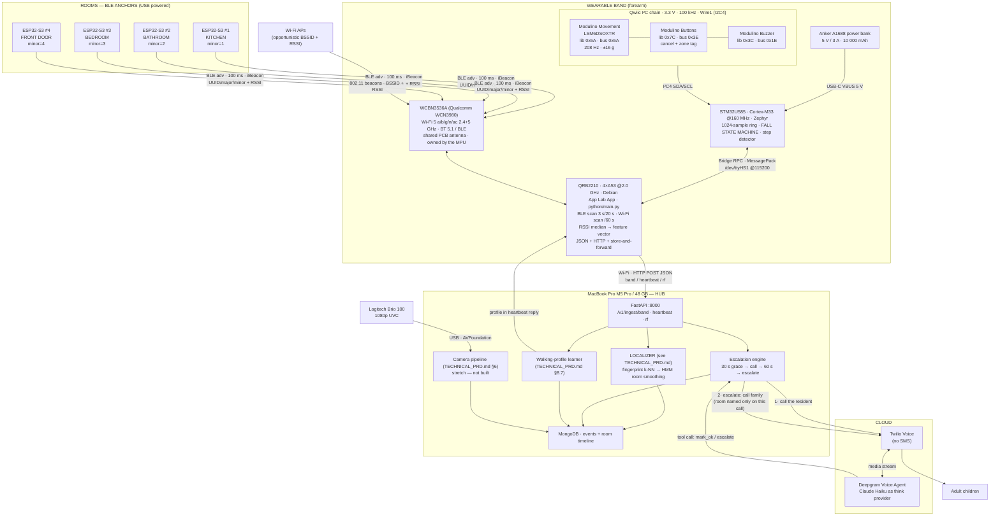

# HARDWARE SPEC — Dhyaan
**Elder-care fall sensing, behavior & indoor location.** **HackMIT 2026 · 24 h · team of 4 · rev B**

Three sensing jobs, one band:

| | B2C | B2B (care homes) |
|---|---|---|
| Device | 1 wearable band per user | N wearables + CCTV + BLE beacons |
| Falls | IMU cascade on-band (§6) | same |
| **Location** | **BLE beacon + Wi-Fi RSSI → room, all day (§3)** | same, per resident |
| Behavior | — | local VLM on CCTV: ate? walked? inactive? |
| Action | Deepgram voice agent calls grandparent → Twilio calls adult child | same + staff dashboard |
| Compute | MacBook Pro M5 Pro / 48 GB unified — local inference box + hub | same box, more streams |

Verified against vendor docs as of **2026-09-19**. Anything unconfirmed is tagged **`[UNVERIFIED]`** and repeated in §13. Localization *algorithms* (fingerprinting, k-NN, HMM room smoothing, event generation) live in **`TECHNICAL_PRD.md`** — this document owns the radios, beacons, power, placement and site survey.

---

## 1. Bill of Materials

### 1.1 HAVE / assumed on hand

| Part | What it does here | Source | Price |
|---|---|---|---|
| MacBook Pro, M5 Pro, 48 GB unified | Hub + local VLM + Deepgram/Twilio/Claude egress. 48 GB unified fits a 7–13 B VLM at 4-bit with room for the video pipeline. | own | — |
| iPhone (iOS 16+) | Fallback accel source (§12.1). Also the "adult child" phone Twilio rings. **Not** a beacon scanner: iOS hides iBeacon adverts from ordinary Bluetooth scanning and Safari has no Web Bluetooth (§12.3, `DECISIONS.md` D-013). | own | — |
| Wi-Fi hotspot (phone) | Band → hub transport. **Bring one. See §11 gate H2.** | own | — |

### 1.2 NEED — core path

| Part | SKU | What it does here | Source | Price | Link |
|---|---|---|---|---|---|
| **Arduino UNO Q, 4 GB / 32 GB** | ABX00173 | Band brain. QRB2210 runs Debian + BLE scan + uplink; STM32U585 runs the 208 Hz fall detector. **Buy 4 GB, not 2 GB.** | Arduino Store | **$79.00** | https://store-usa.arduino.cc/products/uno-q-4gb |
| UNO Q, 2 GB / 16 GB *(alt)* | ABX00162 | Acceptable if 4 GB is out of stock | Arduino Store | $59.00 | https://store-usa.arduino.cc/products/uno-q |
| **Modulino Movement** | ABX00101 | LSM6DSOXTR 6-axis IMU. This *is* the fall sensor. | Arduino Store | **$11.80** | https://store-usa.arduino.cc/products/modulino-movement |
| **Modulino Buttons** | ABX00110 | "I'm okay" cancel + manual zone tag (§12). 3 buttons + 3 LEDs. **⚠ listed SOLD OUT at store-usa on 2026-09-19 — see §1.4.** | Arduino Store | $7.60 | https://store-usa.arduino.cc/products/modulino-buttons |
| **Modulino Buzzer** | ABX00108 | Local pre-alarm during the 30 s grace window | Arduino Store | **$6.50** | https://store-usa.arduino.cc/products/modulino-buzzer |
| **BLE beacons ×4** | ESP32-S3-DevKitC-1 | Room anchors: kitchen / bathroom / bedroom / front door (§5) | **HackMIT hardware lab (Espressif is a sponsor) — free** | $0 if borrowed | https://docs.espressif.com/projects/esp-dev-kits/en/latest/esp32s3/esp32-s3-devkitc-1/user_guide.html |
| 4× USB wall wart + cable | any 5 V / 1 A | Powers the ESP32 beacons | hub / own | ~$0 | — |
| **USB-C power bank** | Anker Zolo **A1688**, 10 000 mAh, 30 W | Band battery. **5 V⎓3 A printed on the spec** — most banks don't print it. 223 g. | Amazon / Anker | **$29.99** | https://www.anker.com/products/a1688 |
| **USB-C↔C cable, 5 A e-marked** | SUNGUY B0GJZT95SD (2-pk, 3 ft) | Flash + power. **A 480 mA phone cable will brown-out the board.** | Amazon | **$8.99** | https://www.amazon.com/dp/B0GJZT95SD |
| **Forearm strap** | VELCRO elastic cinch, 8 in × 1 in, 4-pk | Straps board + bank to the forearm | Amazon | **$8.02** | https://www.amazon.com/dp/B09QT182R3 |
| **USB webcam (UVC)** | Logitech **Brio 100** 960-001574 | B2B CCTV. Plug-and-play on macOS via AVFoundation/OpenCV — **zero network config**. | Logitech / Amazon | **$24.99** | https://www.logitech.com/en-us/shop/p/brio-100-webcam.960-001574 |
| Qwiic cables 100 mm ×2 | SparkFun **PRT-17259** | Chain the Modulinos. Each Modulino ships with one 5 cm cable, so you may not need these. | SparkFun | $1.95 ea | https://www.sparkfun.com/qwiic |

**Core-path subtotal: ~$177** (beacons borrowed, phone/Mac owned).

### 1.3 NICE-TO-HAVE — cut first

| Part | SKU | Price | Why | Verdict |
|---|---|---|---|---|
| Modulino Pixels | ABX00109 | $9.90 | Green idle / amber grace / red confirmed — great on video | buy if convenient |
| SparkFun Pulse Ox + HR (Qwiic) | **SEN-15219** | $48.95 | MAX30101 + MAX32664 hub @ **0x55**. Adds resting HR to "are they okay". | cut unless ahead |
| SparkFun Photodetector (Qwiic) | SEN-16474 | $34.39 | MAX30101 raw @ 0x57, you write the HR algorithm | cut |
| Purpose-built iBeacon pucks | Blue Charm BC021 / MINEW / Estimote | **`[UNVERIFIED]`** — vendor pages 404'd, web-search budget exhausted | Coin-cell, 1–2 yr life, IP67. The *product* answer, not the hackathon answer. | skip for 24 h |
| Reolink RLC-510A PoE | — | $74.99 | Native RTSP, realistic CCTV story | adds network debugging you don't have |

### 1.4 Substitutions when something is out of stock

| If unavailable | Substitute | Price | Note |
|---|---|---|---|
| **Modulino Buttons (sold out)** | **Arduino Plug and Make Kit AKX00069** — contains Movement, Buttons, Buzzer, Pixels, Thermo, Knob, Distance + a UNO R4 WiFi | **$87.99** | Cheaper than buying 4 nodes separately, and the spare UNO R4 WiFi is a free extra beacon/backup board. **This is probably the right buy regardless.** https://store-usa.arduino.cc/products/plug-and-make-kit |
| Modulino Buttons (still nothing) | any momentary switch to a JDIGITAL pin with `INPUT_PULLUP` | $0 | 3.3 V bank, no level shifting needed |
| Modulino Buzzer | Adafruit **1536** self-oscillating 5 V buzzer — apply 3–5 V, no driver | **$0.95** | One review flags the Modulino Buzzer as "not loud enough" anyway. https://www.adafruit.com/product/1536 |
| ESP32 beacons | nRF52840 dongle, or **any spare phone** running an iBeacon-transmitter app | varies | phones make fine temporary beacons |
| Anker A1688 | Anker Nano 5K **A1653**, 69.7 g, $29.99 | $29.99 | Far lighter on the arm, but 5 V/3 A is **`[UNVERIFIED]`** (Amazon lists 9 V/2 A) and 5 000 mAh only lasts ~5 h |

### 1.5 NOT buying, and why

| Thing | Why not |
|---|---|
| LiPo cell + PowerBoost 1000C | UNO Q wants **5 V @ 3 A**. **PowerBoost 1000C is rated 1000 mA** (https://www.adafruit.com/product/2465) — it cannot do the job. Its `VBAT` pin is documented *"reserved for system design and future features"*, not a user LiPo input. The only 3 A-capable boost path (Pololu U3V70F5, $25.95) still gives you no USB-PD contract. **A $30 power bank wins on every axis.** See §4.5. |
| Arduino shield | Qwiic gives you the whole sensor chain solder-free |
| u.FL antenna mod | The WCN3980 uses a **shared PCB antenna** with no external connector (§5.1) |
| Custom PCB / 3D-printed watch case | 24 hours. See §1.6. |

### 1.6 Reality check on the "wearable" — say this before a judge asks

- The UNO Q is **68.85 × 53.34 mm** (standard UNO outline) — a credit-card SBC, not a watch.
- A quad-core Cortex-A53 at 2.0 GHz running Debian plus a Wi-Fi 5 radio is roughly three orders of magnitude more silicon than a fall detector needs, at hundreds of mA where the job wants single digits.
- **The 24 h prototype is:** a UNO Q + Modulino chain + a 223 g power bank velcro-strapped to a forearm. It is a *functional* fall detector, room-locator and uplink. It is not ergonomic and nobody would wear it to bed.
- **The real product is:** an nRF52840- or ESP32-C6-class band. The LSM6DSOX stays (or becomes an LSM6DSV16X with an on-chip fall FSM), the MCU shrinks to a Cortex-M4 at 64 MHz, the radio becomes BLE-to-phone or LTE-M, and the battery becomes a 120 mAh pouch behind silicone. Budget ~2 mA average → ~2 months per charge. **The detection logic in §6 and the RSSI pipeline in §5 port unchanged** — that's why both are written as threshold state machines over physical units, not as a black box.

The UNO Q earns its place because the *system* needs Linux on the band to do Wi-Fi, BLE scanning, JSON and HTTP in one night. An MCU-only band would have cost you the whole hackathon in networking.

---

## 2. System Block Diagram



---

## 3. Radio Hardware & RF Localization

### 3.1 UNO Q radio capability — verified

| Property | Value | Source |
|---|---|---|
| Radio module | **WCBN3536A**, silicon = **Qualcomm WCN3980** (designator U2901) | UNO Q datasheet §2.2.2 |
| Wi-Fi | **Wi-Fi 5, 802.11a/b/g/n/ac, dual-band 2.4 GHz + 5 GHz** | datasheet §2.2.2 |
| Bluetooth | **Bluetooth 5.1**, incl. **Bluetooth Low Energy** | datasheet §2.2.2, §13.1 |
| BLE band / max TX | **2400–2483.5 MHz, 9.5 dBm** (BT Classic 15 dBm) | datasheet §13.1 RED compliance table |
| Wi-Fi max TX | 2.4 GHz **19.59 dBm EIRP**; 5 GHz **17.64 dBm EIRP** (13.95 in the 5725–5875 upper band) | datasheet §13.1 |
| Antenna | **Shared PCB (trace) antenna. No u.FL / IPEX connector.** Wi-Fi and BT share it. | datasheet §2.2.2: *"The wireless module uses SDIO for Wi-Fi data and a UART for Bluetooth control, with a shared PCB antenna."* |
| Host interface | Wi-Fi over **SDIO**; Bluetooth over **UART** | same |
| **Radio owner** | **The QRB2210 / Linux side. Not the MCU.** | UNO Q user manual: *"Since the radio module is connected to the Qualcomm microprocessor, we need the Bridge to expose the connectivity to the microcontroller."* |

Datasheet: https://docs.arduino.cc/resources/datasheets/ABX00162-ABX00173-datasheet.pdf · Manual: https://docs.arduino.cc/tutorials/uno-q/user-manual/

**Three consequences you must design around:**
1. **All BLE scanning and all Wi-Fi scanning happen in Python on Debian.** The STM32 sketch cannot see a beacon. Localization is 100 % a Linux-side job — which is convenient, because BlueZ and `bleak` are already there.
2. **Shared antenna + shared 2.4 GHz band.** Wi-Fi on 2.4 GHz and a BLE scan contend for the same radio and the same trace. Expect scan gaps and dropped adverts. **Put your hotspot on 5 GHz** so Wi-Fi traffic and BLE scanning stop fighting. This is the single cheapest RF improvement available to you.
3. **A PCB trace antenna against a human forearm is detuned and shadowed.** Body-worn RSSI swings ±10 dB with orientation. This is a physical fact, not a bug — it is why §8 has a site-survey step and why every threshold lives in config.

**`[UNVERIFIED]` — BLE scan + advertise on the shipped Debian image.** The hardware supports both; whether the shipped BlueZ stack and WCN3980 firmware expose passive scanning without fuss is not documented. **Run this at hour 1, before anything else:**

```bash
bluetoothctl --version              # expect BlueZ 5.6x
hciconfig -a                        # expect hci0, UP RUNNING, with a BD address
sudo btmgmt info                    # look for 'le' and 'adv' in supported settings
sudo btmgmt find -l                 # LE-only discovery; should print nearby BLE devices
python3 -c "import bleak; print(bleak.__version__)" || pip3 install bleak
```
If `hciconfig` shows no `hci0`: `sudo systemctl status bluetooth`, `sudo rfkill list`, `sudo rfkill unblock bluetooth`, `dmesg | grep -i blue`. If it is still dead by **hour 6**, take the §11 H6 gate.

### 3.2 Beacon hardware — recommendation

**Recommended: 4 × ESP32-S3-DevKitC-1 flashed as iBeacon advertisers, borrowed from the HackMIT hardware lab.**

| Option | Hardware | Cost | Power | Battery life | Verdict |
|---|---|---|---|---|---|
| **✅ ESP32-S3-DevKitC-1** | ESP32-S3-WROOM-1, BLE 5 (LE), PCB trace antenna, USB-C | **$0 borrowed.** Module alone is $5.66 @1 at DigiKey (`ESP32-S3-WROOM-1-N8`, https://www.digikey.com/en/products/detail/espressif-systems/ESP32-S3-WROOM-1-N8/15200089); **board price `[UNVERIFIED]`** | **USB wall wart** | n/a (mains) | **Take these.** Espressif sponsors HackMIT; the lab stocks S3-DevKitC-1 and S3-Box. Free, flashable in 10 min, and you control the advert config completely. |
| ESP32 (classic) DevKitC | ESP32-WROOM-32, BLE 4.2 | $0 borrowed | USB | n/a | Equally fine. iBeacon is iBeacon. |
| nRF52840 Dongle | Nordic PCA10059 | ~$10 `[UNVERIFIED]` | USB-A | n/a | Lowest-power silicon, but needs nRF Connect + a bit of tooling. Only if ESP32s are gone. |
| Blue Charm **BC021** / MINEW / Estimote | purpose-built iBeacon puck | **`[UNVERIFIED]`** — vendor pages returned 404, web-search budget exhausted. Typically $15–30 ea. | CR2477 or 2×AA | 1–2 yr claimed | **The product answer, not the hackathon answer.** Wrong lead time, no config control, and you cannot change the advert interval without their app. |
| Spare phones | any | $0 | phone battery | hours | Emergency substitute. An iBeacon-transmitter app makes a phone a legitimate anchor. |

**Beacon count and placement:**

| Rule | Detail |
|---|---|
| **Minimum 3** | kitchen, bathroom, bedroom — the three rooms that carry clinical meaning (ate / hygiene + highest fall risk / slept) |
| **Recommended 4** | + front door, which gives you "left the house" and "came home", the highest-value B2B event after falls |
| Height | **chest height, 1.2–1.5 m.** Floor level is shadowed by furniture; ceiling level over-hears the next room. |
| Line of sight | Out in the open. **Never inside a metal cabinet, behind a fridge, or on a mirror** (bathroom mirrors are metal-backed and kill 2.4 GHz). |
| Spacing | **3–8 m apart.** Closer than 3 m and the RSSI vectors are indistinguishable. Farther than 8 m and you get dead zones between them. |
| **Never two on the same wall** | Co-planar anchors are near-degenerate — their RSSI difference collapses to noise and k-NN cannot separate them. Spread them across the space. |
| Doorways | Put the door beacon **beside** the frame, not in it. A beacon in a doorway is maximally ambiguous by construction. |
| Fixing | Gaffer tape. Mark each one with its minor number in marker so you can debug from across the room. |

### 3.3 Advertising configuration

| Parameter | Demo value | Product value | Why |
|---|---|---|---|
| Format | **iBeacon** (Apple AltBeacon-compatible layout) | iBeacon or Eddystone-UID | Universally parseable; `bleak` gives you the raw manufacturer data and you parse 25 bytes |
| **UUID** | one per deployment — `uuidgen` it, never copy a vendor's | per customer | Lets you ignore every other beacon in a building full of them |
| **major** | `1` = site/floor | building × floor | |
| **minor** | `1`=kitchen `2`=bathroom `3`=bedroom `4`=front_door | room id | `minor` → room is a config lookup, never a hardcoded `if` |
| **TX power** | **0 dBm** | −4 dBm | 0 dBm at 3–8 m spacing gives clean overlap. Lower TX = tighter cells but more dropouts and dead zones. |
| **Advertising interval** | **100 ms** | **500–1000 ms** | See below |
| **Measured power (`TxPower` byte)** | **MEASURE IT (§8). −59 dBm is only a starting guess.** | measured per unit | This byte is the RSSI at exactly 1 m. Every distance estimate downstream scales off it. |

**Advertising interval tradeoff:**

| Interval | Adverts seen in a 3 s scan | Median RSSI quality | Beacon current (est.) | CR2032 life (est.) |
|---|---|---|---|---|
| **100 ms** | **~30** | **Good** — enough samples to median out body-shadowing | ~45 µA on nRF52 | ~6 months |
| 500 ms | ~6 | Marginal — one bad sample moves the median | ~12 µA | ~2 years |
| 1000 ms | ~3 | Poor — a single dropout is 33 % data loss | ~7 µA | ~3 years |

**Use 100 ms for the hackathon.** Your beacons are mains-powered ESP32s; battery life is literally zero cost tonight, and RSSI quality is the thing that makes or breaks the demo. Note in the deck that the shipping coin-cell puck runs 500 ms and trades ~5× latency for ~4× battery.

### 3.4 ESP32-S3 iBeacon sketch (Arduino core, ~10 min per beacon)

Boards Manager URL: `https://espressif.github.io/arduino-esp32/package_esp32_index.json` → install **esp32 by Espressif Systems** → board **ESP32S3 Dev Module**.

```cpp
// beacon.ino — flash one per room; change ROOM_MINOR and nothing else.
#include <NimBLEDevice.h>     // Library Manager: "NimBLE-Arduino" (much smaller than the stock stack)

// ---- PER-ROOM CONFIG: the ONLY line you edit between beacons ----
static const uint16_t ROOM_MINOR = 1;   // 1=kitchen 2=bathroom 3=bedroom 4=front_door
// -----------------------------------------------------------------

static const char*    SITE_UUID  = "b9407f30-f5f8-466e-aff9-25556b570000"; // uuidgen your own!
static const uint16_t SITE_MAJOR = 1;
static const int8_t   MEASURED_POWER_1M = -59;   // PLACEHOLDER — overwrite from the §8 survey
static const uint16_t ADV_INTERVAL_MS   = 100;

void setup() {
  Serial.begin(115200);
  NimBLEDevice::init("");
  NimBLEDevice::setPower(ESP_PWR_LVL_P3);        // ~0 dBm. P9 ~ +9 dBm if a room needs more reach.

  NimBLEBeacon beacon;
  beacon.setManufacturerId(0x004C);              // Apple, required for the iBeacon layout
  beacon.setProximityUUID(NimBLEUUID(SITE_UUID));
  beacon.setMajor(SITE_MAJOR);
  beacon.setMinor(ROOM_MINOR);
  beacon.setSignalPower(MEASURED_POWER_1M);

  NimBLEAdvertisementData adv;
  adv.setFlags(0x04);                            // BR/EDR not supported
  adv.setManufacturerData(beacon.getData());

  NimBLEAdvertising* a = NimBLEDevice::getAdvertising();
  a->setAdvertisementData(adv);
  a->setMinInterval(ADV_INTERVAL_MS * 1000 / 625);   // units of 0.625 ms
  a->setMaxInterval(ADV_INTERVAL_MS * 1000 / 625);
  a->start();

  Serial.printf("iBeacon up: major=%u minor=%u @ %u ms\n",
                SITE_MAJOR, ROOM_MINOR, ADV_INTERVAL_MS);
}

void loop() { delay(10000); }   // advertising runs in the BLE stack; nothing to do here
```

Flash four boards with `ROOM_MINOR` = 1, 2, 3, 4. **Label each board with a marker before you unplug it from the laptop** — four identical black PCBs in a bag is a 45-minute mistake.

### 3.5 Beacon power and the `beacon_offline` story

| Power source | Beacon current @100 ms | Life | Use |
|---|---|---|---|
| **USB wall wart (ESP32-S3)** | **~45–70 mA continuous (est.)** — ESP32 BLE advertising without light-sleep is not low-power | **∞** (mains) | **Tonight, and honestly fine for care homes** — anchors sit near outlets by definition |
| CR2032 coin cell (nRF52 puck) | ~45 µA avg (est.) | ~6 months @100 ms, ~2 yr @500 ms | Product, ceiling/awkward placements |
| 2×AA (BC021-class puck) | ~45 µA avg (est.) | 2–4 yr | Product, install-and-forget |

**`beacon_offline` handling.** Every beacon that has been seen in the last hour is expected in every scan. The hub raises `beacon_offline` when a known `minor` is missing from **10 consecutive scans (~200 s)**, and includes the last RSSI trend — a slow decline over days means a dying cell, an abrupt disappearance means it was unplugged or moved. The localizer must then **drop that anchor's dimension from the feature vector rather than treating it as −100 dBm**, because a missing beacon and a very distant beacon are not the same observation and conflating them will confidently place the resident in the wrong room. That is the whole design rule for this feature: **degrade to `location_unknown`, never to a confident wrong room** (§12.3).

---

## 4. Electrical

### 4.1 Voltage rails

All from https://docs.arduino.cc/tutorials/uno-q/power-specification/

| Rail | Net | Origin | Exposed on | Notes |
|---|---|---|---|---|
| 5.0 V | `5V_SYS` | diode-OR of USB-C VBUS (Schottky D2801) and the 7–24 V buck (D2803) | `5V_USB_VBUS` on JANALOG, JSPI, JMISC | power only, **not** a logic level |
| 3.8 V | `PWR_3P8V` | TPS62A02A buck from `5V_SYS` | `VBAT` on JMISC | **reserved for future features — NOT a battery input** |
| 3.3 V | `PWR_3P3V` | TPS62A02A buck from `PWR_3P8V` | JANALOG, JDIGITAL, JMISC, **QWIIC** | 3.1 / 3.3 / 3.5 V min/typ/max |
| 1.8 V | `VREG_L15A_1P8V` | PM4125 PMIC LDO L15A | JMISC, JCTL | QRB2210 I/O domain |

**Hard rules.** Maker I/O (JDIGITAL, JANALOG, QWIIC, JSPI) = **3.3 V nominal, 3.6 V absolute max**. Processor I/O (JMEDIA, JMISC, JCTL) = **1.8 V nominal, 2.1 V absolute max** — 3.3 V here kills the SoC. Every Modulino is 3.3 V, so keep the chain on QWIIC and you never touch the 1.8 V bank. `A0`/`A1` are direct ADC inputs and **not 5 V tolerant**. Operating range −10 °C to +60 °C; a board inside a neoprene sleeve runs warm, so leave the sensor face open.

### 4.2 Input power

| Source | Voltage | Recommended current | Connector |
|---|---|---|---|
| USB-C VBUS | 5 V | **≥ 3 A** | USB-C (JUSB1) |
| VIN (DC IN) | 7–24 V | sized to the 5 V budget | JMEDIA, JANALOG |
| 5 V pin | 5 V | ≥ 3 A | JANALOG |

The UNO Q negotiates a **USB-PD 5 V / 3 A contract only** — no 9 V or 20 V profiles. Any PD or plain 5 V/3 A source works; a 65 W laptop charger buys nothing over a $30 power bank. Arduino's warning is explicit: if the supply current-limits on a peak, the rail sags and the board resets.

### 4.3 Power budget

Arduino publishes **no typical-current figure** for the UNO Q, only "≥3 A". The A53/radio numbers below are engineering estimates for budgeting — **measure them at hour 2 with a USB-C power meter and rewrite this table.**

| Component | Rail | Current | Basis |
|---|---|---|---|
| Modulino Movement — accel | 3.3 V | **0.17 mA** | ABX00101 datasheet §4.1 — **verified** |
| Modulino Movement — gyro | 3.3 V | **0.55 mA** | ABX00101 datasheet §4.1 — **verified** |
| Modulino Buttons (MCU + 3 LEDs) | 3.3 V | **10.9 mA** all LEDs on (3.4 mA idle) | ABX00110 datasheet §4.1 — **verified** |
| Modulino Buzzer (sounding) | 3.3 V | **6.4 mA**, duty ≈ 2 % | ABX00108 datasheet §4.1 — **verified** |
| Modulino Pixels (if fitted) | 3.3 V | ~80 mA typ, **264 mA at full white** — keep brightness ≤ 25 | ABX00109 — datasheet internally inconsistent |
| STM32U585 @160 MHz + I²C + Bridge | 3.3 V | ~25 mA | est. |
| QRB2210 + LPDDR4, Debian, light load | 5 V | **~450 mA** | **est.** |
| eMMC + PMIC + regulator losses | — | ~60 mA | **est.** |
| **Wi-Fi associated, ~1 pkt/s** | 5 V | **~90 mA avg**, ~450 mA TX peaks | **est.** |
| **BLE scan burst (active)** | 5 V | **~70 mA above idle** | **est.** |
| **Wi-Fi active scan burst (2.4+5 GHz sweep)** | 5 V | **~200 mA above idle**, ~3 s per sweep | **est.** |

**RF duty cycle and what it actually costs:**

| Task | Burst current (est.) | Duration | Period | Duty | **Average adder** |
|---|---|---|---|---|---|
| BLE scan | +70 mA | 3 s | 20 s | 15 % | **+10.5 mA** |
| Wi-Fi scan | +200 mA | 3 s | 60 s | 5 % | **+10.0 mA** |
| | | | | **RF total** | **+20.5 mA (est.)** |

| Configuration | Average @5 V | Peak |
|---|---|---|
| Band, falls only | ≈ 645 mA (est.) | ≈ 1.6 A |
| **Band, falls + RF localization** | **≈ 666 mA (est.)** | ≈ 1.8 A |

**The headline: RF localization costs about 3 % of the band's power budget on this hardware.** The A53 running Debian dominates so completely that scanning is nearly free, so **do not compromise scan cadence to save battery** — you will not notice. (On the shipped nRF52 band this inverts completely: BLE scanning becomes the dominant load and 3 s/20 s would be far too aggressive. Say this if a judge asks about the product roadmap.)

**Battery sizing for a 10 h demo day:**

```
Anker A1688: 10 000 mAh at 3.7 V cell nominal      = 37.0 Wh
Boost to 5 V at ~87 % efficiency                   ≈ 32.2 Wh
Usable at 5 V                                      ≈ 6 440 mAh @ 5 V
Runtime @ 666 mA (falls + RF)                      ≈ 9.7 h    ✅
Runtime @ 900 mA (pessimistic)                     ≈ 7.2 h    ✅
A 5 000 mAh bank @ 666 mA                          ≈ 4.8 h    ⚠ you WILL swap mid-demo
```

**Buy the 10 000 mAh.** The 69.7 g Anker A1653 is far nicer on the arm but its 5 A/3 A rating is unverified and 5 h is not a demo day.

**Power-bank trap:** many banks auto-shut-off below ~50–100 mA draw. The UNO Q idles far above that so you are safe — but **do not implement a sleep mode**, you will kill your own supply. Verify with a 20-minute untouched idle soak at hour 3.

### 4.4 Wiring / connector table

Nothing on the core path is soldered. That is deliberate — soldering is the fastest way to lose 3 hours of 24.

| From | Connector | To | Signals | Voltage |
|---|---|---|---|---|
| Power bank USB-C | USB-C, 5 A e-marked cable | UNO Q JUSB1 | VBUS 5 V, GND, CC | 5 V |
| UNO Q **QWIIC (A4)** | Qwiic JST-SH 1.0 mm 4-pin | Modulino Movement **J1** | GND, 3V3, SDA, SCL | 3.3 V |
| Movement **J2** | Qwiic | Buttons J1 | same bus | 3.3 V |
| Buttons J2 | Qwiic | Buzzer J1 | same bus | 3.3 V |
| *(optional)* Movement 1×10 header `INT1` | soldered wire | UNO Q `D2` (JDIGITAL) | LSM6DSOX free-fall INT | 3.3 V |
| ESP32 beacons ×4 | USB-C/micro-USB | 5 V wall wart | — | 5 V, **not** on the band |

**Qwiic 4-pin order** (SparkFun standard — board connector `SM04B-SRSS-TB`, cable `SHR-04V-S`, https://www.sparkfun.com/qwiic; confirmed on the ABX00101 pinout):

| Pin | Colour | Signal |
|---|---|---|
| 1 | black | GND |
| 2 | red | 3.3 V |
| 3 | blue | SDA |
| 4 | yellow | SCL |

**I²C facts you must not get wrong:**

- The UNO Q Qwiic connector is the **secondary I²C bus (I2C4)** → the Arduino object is **`Wire1`, not `Wire`**. (`Wire` is D20/D21 on the UNO headers.) This is the #1 UNO Q + Modulino mistake.
- `Arduino_Modulino` already knows: on `ARDUINO_UNO_Q` its `begin()` defaults to `Wire1`. Just call `Modulino.begin()`.
- `ModulinoClass::begin()` forces **100 kHz**. At 208 Hz × 12 B that is ~2.5 kB/s against 12.5 kB/s — ~20 % utilisation. Fine, but don't add a fourth chatty node without re-checking.
- **⚠ The addresses in the Modulino datasheets are 8-bit left-shifted. The library divides by 2** (`Modulino.h`: `address = discover() / 2;`). So the numbers you pass in code and the numbers a bus scanner prints are **different**:

| Node | Library / datasheet address | **What a raw `Wire1` scan prints** |
|---|---|---|
| Movement (LSM6DSOX — a true 7-bit part, the exception) | `0x6A` | **`0x6A`** (may also show `0x7E`) |
| Buttons | `0x7C` | **`0x3E`** |
| Buzzer | `0x3C` | **`0x1E`** |
| Pixels | `0x6C` | `0x36` |

Get this wrong at hour 4 and you will "confirm" your chain is broken when it is fine.

**INT1 caveat:** LSM6DSOX `INT1`/`INT2` are on the Modulino Movement's **1×10 solder header only — not on Qwiic.** Hardware free-fall interrupt requires soldering one wire. For 24 h, **poll in software** (§6.6) and treat INT1 as a stretch goal.

### 4.5 LiPo safety — read even though we're using a power bank

We chose a sealed, UL-listed USB power bank on purpose. If you ignore §1.5 and use a raw cell anyway:

1. **Never charge unattended or overnight.** A hackathon floor at 4 a.m. is the definition of unattended.
2. **Never exceed 4.2 V/cell.** Use a dedicated CC/CV charger IC (MCP73831, TP4056, bq24074) — never a bench supply, never a USB rail directly.
3. **Never discharge below 3.0 V/cell.** Cheap boost boards often have no low-voltage cutoff; over-discharge grows internal copper shunts that cause runaway *later*.
4. **Never short JST-PH leads.** Adafruit and SparkFun use **opposite** polarity on the same connector. Meter every pack before plugging anything in.
5. **Never puncture, crease, or strap a bare pouch cell flat against a forearm.** Mechanical damage is the #1 field cause of runaway, and this is a wearable on a human.
6. **Inspect for swelling before every session.** Puffy = dead. Bag it in sand or salt water and hand it to the hardware lab. Do not bin it.
7. **LiPo fires are self-oxidising** — a CO₂ extinguisher will not stop one. Know where sand or a Class D unit is. A LiPo-safe charging bag is $10.
8. **Anything on a body must be fused and enclosed** — PTC/polyfuse plus a hard shell between cell and wearer, or don't put it on a person.

---

## 5. Firmware / Software Stack on the Device

### 5.1 Split of responsibilities

The UNO Q is two computers in one outline. Real-time work on the MCU, everything else on Linux.

| **STM32U585** (Zephyr, `sketch/sketch.ino`) | **QRB2210** (Debian, `python/main.py`) |
|---|---|
| I²C at 208 Hz to the LSM6DSOX via `Wire1` | **BLE scan (`bleak`) 3 s every 20 s — all localization** |
| 1024-sample ring buffer of raw accel (§6.4) | **Wi-Fi scan (`iw dev wlan0 scan`) every 60 s** |
| The fall state machine (§6) | RSSI median → feature vector → POST |
| 30 s grace timer, buzzer, button scan | HTTP POST to the hub (`requests`) |
| Buttons + Buzzer + Pixels on the same I²C chain | JSON serialisation + schema versioning |
| `Bridge.notify("fall_event", ...)` upward | Store-and-forward spool when Wi-Fi drops |
| Step detector + walking summary per heartbeat window (§6.9) | Wi-Fi via NetworkManager / `nmcli` |
| `Bridge.provide_safe("set_thresholds", ...)` | Config (`config.json`), threshold push-down — including the per-wearer walking profile the hub returns on each heartbeat (§6.9) |

**This split is not optional.** The radio hangs off the *microprocessor* (§3.1). The sketch physically cannot open a socket or see a BLE advert. There is a `BridgeTCPClient<>` that tunnels TCP through Bridge, but pushing JSON up to Python and letting Python own both the HTTP client and the BLE scanner is simpler and far easier to debug.

### 5.2 Arduino App Lab "App" structure

```
fallband/
├── app.yaml                 # manifest: name, icon, active Bricks (App Lab manages this)
├── python/
│   ├── main.py              # MANDATORY — Linux entry point; BLE + Wi-Fi scan + uplink
│   └── requirements.txt     # requests, bleak
├── sketch/
│   ├── sketch.ino           # MCU fall detector
│   └── sketch.yaml          # MANDATORY when a sketch exists — FQBN + libraries
├── config.json              # tuning constants: thresholds AND beacon map (§7.4, §8.5)
└── README.md
```
Apps live in `/home/arduino/ArduinoApps/`. Source: https://docs.arduino.cc/software/app-lab/apps/about-apps/

**Bricks** are prepackaged Python modules — some pure-Python, some Docker-backed — that App Lab registers in `app.yaml` and puts on `sys.path`. The catalog includes `vlm`, `cloud_llm`, `cloud_asr`, `asr`, `tts`, `web_ui`, `dbstorage_sqlstore`, `motion_detection`. Source: https://docs.arduino.cc/software/app-lab/bricks/about-bricks/

**We use at most one Brick: `web_ui`**, and only for an on-band debug page showing live RSSI per beacon — genuinely useful during the §8 site survey. **We do not run the VLM Brick on the band.** A 4 GB QRB2210 can host a small VLM, but the CCTV workload belongs on the 48 GB Mac. Do not discover this at hour 19.

### 5.3 MCU ↔ Linux: the Bridge

`Arduino_RouterBridge` is **MessagePack-RPC in a star topology** through the `arduino-router` daemon, which owns `/dev/ttyHS1` at 115200 and exposes `/var/run/arduino-router.sock`.

| Call | Use |
|---|---|
| `Bridge.begin()` | init; false if the router isn't up |
| `Bridge.notify(m, ...)` | fire-and-forget MCU → Linux. **A fall event uses this** — never block the 208 Hz loop on the network. |
| `Bridge.call(m, ...)` | blocking RPC with a result |
| `Bridge.provide(name, fn)` | expose an MCU function to Linux; runs in the RPC thread |
| `Bridge.provide_safe(name, fn)` | same, executed in `loop()` context — **use this** for anything touching Arduino APIs |

Two rules the docs shout about, both of which will bite you:
- **Never call `Bridge.call()`, `Serial.print()` or `Monitor.print()` inside a `provide()` callback.** Opening a transaction while answering one deadlocks the system.
- **Never open `/dev/ttyHS1` yourself.** `arduino-router` holds an exclusive lock.

As of Zephyr core 0.55.0 `Arduino_RouterBridge` ships by default and `Serial` routes to the App Lab Serial Monitor.

### 5.4 Transport: device → hub

**Decision: HTTP POST (JSON over plain HTTP on the LAN) for 24 h. MQTT is the right B2B answer and is out of scope tonight.**

| | HTTP POST | MQTT |
|---|---|---|
| Deps on band | `requests` (already there) | `paho-mqtt` + a broker to stand up |
| Debuggability | `curl` reproduces any event in one line | needs `mosquitto_sub` in another terminal |
| Latency, 1 event | ~15–40 ms on LAN | ~5–10 ms |
| 200 bands @ 3 scans/min | connection churn, needs a real LB | **wins** — fan-out, and retained LWT gives free offline detection |
| Offline band detection | hub-side heartbeat timeout | broker LWT, automatic |

For one to three bands on a hotspot with a judge watching, debuggability beats scalability. Write it behind a single `publish(payload)` so the MQTT swap is a 20-line diff, and say exactly this when asked about scale.

> **Superseded — the band posts to the backend's contract, not the paths below** (`DECISIONS.md`
> D-011; resolved at the H1 standup in the todo files). Endpoints are `POST /v1/ingest/band`,
> `/v1/ingest/band/cancel`, `/v1/ingest/heartbeat` and `/v1/ingest/rf`, each with an `X-Band-Key`
> header. **The exact JSON is `backend/fixtures/*.json`** — fixtures beat the prose payloads in
> §5.5–5.7, which remain here as the full field list to draw from. The heartbeat carries the walking
> summary and its reply carries the walking profile (§6.9, `TECHNICAL_PRD.md` §8.7).

| Method | Path (original design) | Body | Purpose |
|---|---|---|---|
| POST | `/v1/events` → **`/v1/ingest/band`** | fall event (§5.5) | triggers the escalation FSM |
| POST | `/v1/telemetry` → **`/v1/ingest/heartbeat`** | heartbeat (§5.7) | liveness, health, drift, walking summary |
| POST | `/v1/location` → **`/v1/ingest/rf`** | RF scan (§5.6) | feeds the localizer (**`TECHNICAL_PRD.md §7`**) |
| POST | `/v1/events/{id}/cancel` → **`/v1/ingest/band/cancel`** | `{"reason":"button"}` | late cancel after upload |
| GET | `/v1/config/{device_id}` | — | band pulls tuned thresholds + beacon map on boot (not in the backend yet; use the local `config.json`) |

Retry: 3 attempts at 0.5 / 2 / 5 s, then spool to `/home/arduino/spool/*.json` and drain on the next successful heartbeat. **`/v1/location` posts are cheap and idempotent — drop them under pressure. A fall event is never dropped.**

### 5.5 Fall-event payload

```json
{
  "schema": "fallband.event.v1",
  "event_id": "b3f1c2a0-5d4e-4f8a-9c11-2e7a6d0b3f44",
  "device_id": "band-001",
  "user_id": "grandparent-nancy",
  "fw": { "sketch": "1.2.0", "python": "1.2.0" },
  "event": "fall_suspected",
  "ts": "2026-09-19T21:04:17.412Z",
  "ts_monotonic_ms": 8412773,
  "confidence": 0.82,
  "detector": {
    "path": "FREEFALL_IMPACT",
    "freefall_min_g": 0.31, "freefall_duration_ms": 148,
    "impact_peak_g": 4.17, "impact_duration_ms": 43, "jerk_peak_g_per_s": 96.4,
    "orientation_change_deg": 71.3,
    "post_impact_still_ms": 2000, "post_impact_accel_std_g": 0.041,
    "post_impact_gyro_max_dps": 11.2,
    "sample_rate_hz": 208, "accel_fs_g": 16
  },
  "location": {
    "room": "bathroom", "room_confidence": 0.88,
    "source": "ble_fingerprint",
    "age_ms": 4200,
    "beacons": [
      { "minor": 2, "room": "bathroom",  "rssi_median": -58, "n": 29 },
      { "minor": 1, "room": "kitchen",   "rssi_median": -81, "n": 24 },
      { "minor": 3, "room": "bedroom",   "rssi_median": -89, "n": 11 },
      { "minor": 4, "room": "front_door","rssi_median": null, "n": 0 }
    ]
  },
  "window": {
    "pre_ms": 1000, "post_ms": 2200, "rate_hz": 208, "unit": "g",
    "ax": [0.02, -0.01, "...666 floats..."], "ay": ["..."], "az": ["..."]
  },
  "grace": { "seconds": 30, "cancelled": false, "cancel_source": null },
  "battery": { "source": "usb_powerbank", "level_pct": null },
  "net": { "rssi_dbm": -54, "ssid": "demo-hotspot-5g" }
}
```

**The `location` block is why this feature exists.** "Nancy fell" is an alert. **"Nancy fell in the bathroom, 4 seconds ago"** is a dispatch instruction — it changes what the responder brings and which door they go to first, and bathrooms are where the serious falls happen. `age_ms` is mandatory: a 4 s-old fix is actionable, a 90 s-old fix is a guess and the hub must present it as one.

`confidence` is the §6.5 weighted score, **not** a model probability — do not call it one. `window` is the raw trace from 1 s before the impact to the end of the 2 s stillness check (~3.2 s, ~15 kB as JSON); drop it on retry under bad Wi-Fi and keep `detector`. It is taken from the ring at the moment of confirmation, which is why the ring is 1024 samples (4.9 s): an earlier draft asked for ±4 s from a 512-sample (2.46 s) ring, and for 3 s of post-impact data in an event that is sent 2.2 s after the impact (`DECISIONS.md` D-008). The hub treats this payload as the full field list; the built backend's contract is `backend/fixtures/band_fall.json` (§5.4), and neither carries a battery level — a USB power bank reports none (D-013). `ts_monotonic_ms` is authoritative for ordering because the wall clock may be unset until NTP lands.

`event` ∈ `fall_suspected` · `fall_confirmed` · `fall_cancelled` · `impact_only` · `inactivity_alert` · `beacon_offline`.

### 5.6 RF scan payload

`POST /v1/location` every **20 s** (BLE) with Wi-Fi refreshed every third scan. The band ships **observations, not conclusions** — the hub runs the classifier (**`TECHNICAL_PRD.md §7`**). Keeping inference off the band means you can retune the model without reflashing anything.

```json
{
  "schema": "fallband.rfscan.v1",
  "device_id": "band-001",
  "ts": "2026-09-19T21:04:00.000Z",
  "ts_monotonic_ms": 8395000,
  "scan": { "ble_duration_ms": 3000, "ble_mode": "passive", "wifi_age_ms": 41000 },
  "ble": [
    { "uuid": "b9407f30-f5f8-466e-aff9-25556b570000", "major": 1, "minor": 1,
      "rssi_median": -81, "rssi_min": -92, "rssi_max": -74, "n": 24, "tx_power_1m": -61 },
    { "uuid": "b9407f30-f5f8-466e-aff9-25556b570000", "major": 1, "minor": 2,
      "rssi_median": -58, "rssi_min": -66, "rssi_max": -51, "n": 29, "tx_power_1m": -59 },
    { "uuid": "b9407f30-f5f8-466e-aff9-25556b570000", "major": 1, "minor": 3,
      "rssi_median": -89, "rssi_min": -95, "rssi_max": -85, "n": 11, "tx_power_1m": -60 }
  ],
  "ble_missing_minors": [4],
  "wifi": [
    { "bssid": "aa:bb:cc:dd:ee:01", "rssi": -47, "freq_mhz": 5180 },
    { "bssid": "aa:bb:cc:dd:ee:02", "rssi": -66, "freq_mhz": 2437 }
  ],
  "imu_context": { "accel_std_g": 0.03, "worn": true, "moving": false },
  "thresholds_rev": 4
}
```

Design notes that matter:
- **`rssi_median`, not mean.** Body shadowing produces asymmetric outliers; one blocked advert drags a mean 10 dB and the median not at all.
- **`n` is load-bearing.** A median over 29 adverts and a median over 2 are not comparable evidence. The classifier weights by `n` and must discard anchors with `n < 3`.
- **`ble_missing_minors` is explicit** so the hub can drop that dimension rather than imputing −100 dBm. A missing beacon and a distant beacon are different observations; conflating them produces confident wrong rooms (§3.5).
- **`imu_context.moving`** lets the HMM widen its transition probabilities while walking and pin them down while still. A person who is not moving cannot have changed rooms.
- **`tx_power_1m` travels with every reading** so the hub always knows which calibration produced it.

### 5.7 Telemetry payload

`POST /v1/telemetry` (built: `POST /v1/ingest/heartbeat`, §5.4) every **30 s** — every **5 s** in
calibration mode (§6.9). Three misses (90 s) = band marked offline.

```json
{
  "schema": "fallband.telemetry.v1",
  "device_id": "band-001", "user_id": "grandparent-nancy",
  "ts": "2026-09-19T21:04:00.000Z", "uptime_s": 8412,
  "state": "IDLE", "worn": true,
  "activity": { "mode": "normal", "window_s": 30, "accel_std_g": 0.14,
                "steps": 22, "step_rate_hz": 1.85,
                "step_peak_g_p50": 1.21, "step_peak_g_p95": 1.58, "step_peak_g_max": 1.92,
                "jerk_p95_g_per_s": 24.0, "swing_dps_p95": 142.0, "impacts_only": 0,
                "upright_fraction": 0.91, "mean_gravity_vec": [0.03, 0.97, 0.19] },
  "profile_rev": 3,
  "location": { "room": "kitchen", "room_confidence": 0.79, "age_ms": 8000,
                "source": "ble_fingerprint" },
  "health": { "imu_ok": true, "imu_addr": "0x6A", "i2c_errors": 0,
              "buttons_ok": true, "buzzer_ok": true,
              "ble_adapter_ok": true, "ble_scans_ok": 412, "ble_scans_failed": 3,
              "beacons_seen": 3, "beacons_expected": 4,
              "wifi_scans_ok": 138,
              "loop_jitter_ms_p95": 1.8, "dropped_samples": 0, "spooled_events": 0 },
  "net": { "rssi_dbm": -54, "ssid": "demo-hotspot-5g" },
  "thresholds_rev": 4
}
```

`worn` comes from the LSM6DSOX activity/inactivity detector — a band on a table has `accel_std_g < 0.01` and a rock-steady gravity vector. **An unworn band must never generate a fall alert or a room fix — and "unworn" is judged on the 10 s *before* an event, never on the stillness after it** (`DECISIONS.md` D-008). A band that was moving before an impact counts as worn even though it lies perfectly still afterwards; otherwise the stillness check that confirms a fall would also veto it (a band still on a cushion reads exactly like a band set on a table, test case 4 vs 8 in §10.2). `beacons_seen < beacons_expected` for 10 consecutive scans is what raises `beacon_offline`.

The `activity` fields come from the step detector (§6.9): `steps` and `step_rate_hz` for the window, the distribution of per-step peak |a|, the 95th-percentile jerk and arm-swing rate, and a count of `impact_only` events. The hub's walking-profile learner consumes them (`TECHNICAL_PRD.md` §8.7) and sends the profile back in the reply; `profile_rev` tells the hub which profile the band is running.

---

## 6. Fall Detection Algorithm

### 6.1 Physics

A fall from standing is four phases, each with a distinct signature:

| Phase | Duration | Accelerometer reads | Why |
|---|---|---|---|
| **1 · Free fall** | 100–400 ms | \|a\| dips toward 0 g; realistically **0.3–0.6 g** on a forearm | Partial free fall only. The body pivots about the feet instead of dropping ballistically, and the arm flails. A forearm mount sees *less* free-fall depth than a waist mount. |
| **2 · Impact** | 20–80 ms | spike to **3–12 g**, often clipping | Deceleration from ~3 m/s to 0 in a few cm of tissue. Peak is dominated by surface: carpet ≈ 3–5 g, tile ≈ 8–15 g. |
| **3 · Orientation change** | ~1 s | gravity vector rotates **> 45°** from its pre-fall mean | The forearm ends horizontal or under the body. **The single strongest discriminator against "sat down hard".** |
| **4 · Post-impact stillness** | 2–30 s | \|a\| ≈ 1 g, **σ(\|a\|) < 0.1 g**, \|ω\| < 25 °/s | Down and not getting up. Pop straight back up and it wasn't a fall worth calling about. |

**Critical consequence:** a forearm band cannot rely on phase 1. Insisting on a deep free-fall window is how academic detectors score 95 % on a treadmill dataset and 40 % on grandma. So the state machine has **two entry paths** — `FREEFALL_IMPACT` with a lower impact bar, and `SOFT_FALL` which skips free fall entirely and demands a higher impact **plus** a mandatory orientation change.

### 6.2 Sampling rate — 208 Hz

| Rate | Samples across a 40 ms impact | Verdict |
|---|---|---|
| 104 Hz | ~4 | Detects the impact but **under-reads its peak by 20–40 %**, so every threshold you tune is tuned to an artifact. (Also the library default.) |
| **208 Hz** | **~8** | **Chosen.** Peak error < ~10 %. 2.5 kB/s = ~20 % of the 100 kHz bus. ~1 mA over 104 Hz. |
| 417 Hz | ~17 | Marginal gain, 40 % bus utilisation, doubles the ring buffer for nothing. |

208 Hz also gives a clean 4.81 ms tick, so every duration threshold below is an integer sample count.

### 6.3 Full-scale range — ±16 g, and this is a trap

**The stock `Arduino_LSM6DSOX` library configures ±4 g.** `LSM6DSOXClass::begin()` writes `CTRL1_XL = 0x4A` → ODR 104 Hz, `FS_XL = 0b10` = **±4 g**, LPF2 on. (https://github.com/arduino-libraries/Arduino_LSM6DSOX/blob/master/src/LSM6DSOX.cpp)

`ModulinoMovement` wraps exactly this class. **Out of the box your band clips every real impact at 4 g and reports 4.0 g for a carpet fall and 4.0 g for a tile fall.** You cannot threshold a saturated signal.

Fix: after `movement.begin()`, rewrite the registers over `Wire1`.

| Register | Addr | Value | Decode |
|---|---|---|---|
| `CTRL1_XL` | `0x10` | **`0x56`** | ODR_XL `0101` (208 Hz), FS_XL `01` (**±16 g**), LPF2_XL_EN 1 |
| `CTRL2_G` | `0x11` | `0x5C` | ODR_G 208 Hz, FS_G ±2000 dps |
| `TAP_CFG0` | `0x56` | `0x41` | LIR = 1 (latched), INT_CLR_ON_READ = 1 |
| `TAP_CFG2` | `0x58` | `0x80` | INTERRUPTS_ENABLE = 1 |
| `FREE_FALL` | `0x5D` | `0x8A` | FF_DUR 17 (≈82 ms @208 Hz), FF_THS `010` (**250 mg**) |
| `MD1_CFG` | `0x5E` | `0x10` | INT1_FF = 1 |

Bit fields verified against ST's own driver: https://github.com/STMicroelectronics/lsm6dsox/blob/master/lsm6dsox_reg.h — note `FS_XL` is **0=±2 g, 1=±16 g, 2=±4 g, 3=±8 g** (non-obvious ordering), and `FF_THS` is 0=156, 1=219, **2=250**, 3=312, 4=344, 5=406, 6=469, 7=500 mg.

**Second trap:** `readAcceleration()` hard-codes `data * 4.0 / 32768.0`. Once you switch to ±16 g, **every value it returns is 4× too small.** Either multiply by 4.0, or bypass the library and read `OUTX_L_A` (0x28) yourself. §6.8 does the latter, which is the honest option.

### 6.4 Thresholds — starting values, all in `config.json`

| Constant | Start | Unit | Rationale |
|---|---|---|---|
| `SAMPLE_HZ` | 208 | Hz | §6.2 |
| `RING_SAMPLES` | 1024 | — | 4.92 s @208 Hz; power of 2 so the index mask is `& 1023`. 1024 × 6 B = 6 kB vs 786 kB SRAM. Must hold 1 s before the impact **plus** the 2.2 s settle-and-stillness check, because the fall trace is read out at confirmation (§5.5). Was 512 (2.46 s), which could not |
| `FF_THRESHOLD_G` | 0.40 | g | Forearm falls bottom out near 0.3–0.6 g, not 0.1 g. **Physics value — never fitted from band drops** (§7.2, D-008) |
| `FF_MIN_MS` | 80 | ms | ≈17 samples; shorter is arm swing |
| `FF_MAX_MS` | 400 | ms | Longer means the band was dropped, not worn. **This is why stage and test drops are 0.5 m** (≈320 ms of free fall): a 1 m drop falls ≈450 ms and is sent back to IDLE by design (§10.1) |
| `IMPACT_G_AFTER_FF` | 2.8 | g | Lower bar once free fall corroborates. Always `IMPACT_G_SOFT − 0.7` once a walking profile is active |
| `IMPACT_G_SOFT` | 3.5 | g | Higher bar with no free fall. **Default until the hub sends a per-wearer value** within [`IMPACT_G_FLOOR`, `F_min − IMPACT_G_CEIL_MARGIN`] (§6.9) |
| `IMPACT_G_FLOOR` | 2.5 | g | Lowest the walking profile may set `IMPACT_G_SOFT` — just above the 1.5–2.5 g sit-down-hard band (§10.2 case 1) |
| `IMPACT_G_CEIL_MARGIN` | 0.3 | g | The profile's ceiling is `F_min − 0.3 g`, where `F_min` is the softest calibration drop (§7.2) — so every calibrated fall still fires |
| `IMPACT_WINDOW_MS` | 400 | ms | Max gap from free-fall end to impact |
| `JERK_MIN_G_PER_S` | 30 | g/s | Separates an impact edge from a slow press |
| `ORIENT_CHANGE_DEG` | 45 | ° | Angle between pre- and post-fall gravity vectors |
| `STILL_WINDOW_MS` | 2000 | ms | Confirmation dwell |
| `STILL_STD_G` | 0.12 | g | σ(\|a\|) over the window |
| `STILL_GYRO_DPS` | 25 | °/s | max \|ω\| over the window |
| `GRACE_SECONDS` | 30 | s | Cancel window before the hub dials |
| `ORIENT_BASELINE_MS` | 1000 | ms | Pre-fall gravity averaging |
| `REARM_MS` | 10000 | ms | Dead time after any terminal state |
| `WORN_LOOKBACK_MS` | 10000 | ms | `worn` is judged over the 10 s before an event, not after it (§5.7) |
| `STEP_MIN_INTERVAL_MS` | 300 | ms | Step detector (§6.9): minimum spacing between step peaks |
| `STEP_RATE_HZ` | 1.2–2.5 | Hz | Step detector counts steps only while the cadence stays in this band for ≥ 4 steps |
| `CAL_MODE_S` | 180 | s | Calibration mode (onboarding walk, expo demo): 5 s summaries; exits after 180 s or 150 steps |
| `DEMO_CHIRP_IMPACT_ONLY` | false | — | Expo demo only: short chirp on every `impact_only`. **Never on in production** |

### 6.5 State machine

```
                  ┌──────────────────────────────────────────┐
                  │                  IDLE                    │
                  │ 208 Hz → ring buffer; 1 s mean gravity   │
                  │ vector g_pre                             │
                  └───┬──────────────────────────────┬───────┘
      |a| < 0.40 g    │                              │  |a| > 3.5 g AND
      for ≥ 80 ms     │                              │  jerk > 30 g/s
                      ▼                              │  (no free fall)
             ┌─────────────────┐                     │
             │    FREEFALL     │──── >400 ms ───► IDLE
             │   80–400 ms     │                     │
             └────────┬────────┘                     │
       |a| > 2.8 g within 400 ms                     │
                      ▼                              ▼
             ┌────────────────────────────────────────────┐
             │                   IMPACT                   │
             │ latch peak_g, jerk, duration               │
             │ path = FREEFALL_IMPACT | SOFT_FALL         │
             └────────────────┬───────────────────────────┘
                              │ 200 ms settle
                              ▼
             ┌────────────────────────────────────────────┐
             │             POST_IMPACT_STILL              │
             │ 2 s window:                                │
             │   angle(g_pre, g_post) > 45°  [REQUIRED    │
             │                                for SOFT]   │
             │   σ(|a|) < 0.12 g                          │
             │   max|ω| < 25 °/s                          │
             └───┬────────────────────────────┬───────────┘
        fails ───┘                            │ passes
          ▼                                   ▼
   ┌─────────────┐                  ┌──────────────────────┐
   │ IMPACT_ONLY │                  │      CONFIRMED       │
   │ log, no call│                  │ buzzer + Pixels red  │
   └──────┬──────┘                  │ Bridge.notify(...)   │
          │                         │ + last room fix      │
          │                         │ 30 s grace timer     │
          │                         └───┬──────────────┬───┘
          │           button 'A' within │              │ timer expires
          │                       30 s  ▼              ▼
          │                    ┌─────────────┐   ┌──────────────┐
          │                    │  CANCELLED  │   │ hub dials    │
          │                    │ POST cancel │   │ Deepgram →   │
          │                    └──────┬──────┘   │ Twilio       │
          └──────────► REARM (10 s) ◄─┴──────────┴──────────────┘
                              │
                              ▼  IDLE
```

`confidence` = `0.30·min(peak_g/6,1) + 0.25·min(orient_deg/90,1) + 0.20·(1−min(std_g/0.3,1)) + 0.15·ff_seen + 0.10·(1−gait_match)`. A weighted heuristic for the hub's routing and dashboard sort order. **Not a probability, and it never blocks or cancels an alert.** `gait_match` ∈ [0, 1] is the share of the 3 s before the event that looked like this wearer's normal walking (cadence inside her profile's interquartile range, step peaks ≤ her p95); it is 0 until a walking profile exists (§6.9). Earlier weights were 0.35 / 0.25 / 0.20 / 0.20 with no gait term (`DECISIONS.md` D-009).

### 6.6 Hardware interrupt vs software

| Function | Where | Why |
|---|---|---|
| Free-fall detect (250 mg / 82 ms) | **LSM6DSOX hardware** via `FREE_FALL` + `MD1_CFG` → INT1 | Zero MCU cost. **But INT1 is solder-header-only, not Qwiic (§4.4).** |
| Free-fall detect (24 h build) | **software**, polled at 208 Hz | No soldering. **Do this.** |
| Impact peak + jerk | **software** | Needs the peak *value*; the hardware flag only gives a threshold crossing |
| Orientation change | **software** | Needs the pre-fall baseline vector, which only your ring buffer has. Hardware 6D gives coarse quadrants, not an angle. |
| Stillness / worn | hardware activity/inactivity exists; **software σ is easier** | software |
| Button scan | **software**, 20 Hz over I²C | The Buttons node has its own STM32C011; `update()` is one I²C read |

**Everything is software this weekend.** Configure the hardware free-fall registers anyway and read `ALL_INT_SRC` (0x1A) / `WAKE_UP_SRC` (0x1B) as a cheap corroborating flag in the payload — one register read, and a good line in the write-up.

### 6.7 Pseudocode

```
CONST loaded from config.json
state = IDLE; ring = RingBuffer(512); g_pre = [0,1,0]
t_ff_start = 0; peak_g = 0; path = NONE

every 4.81 ms (208 Hz):
    ax,ay,az = read_raw_accel_over_Wire1()        # OUTX_L_A 0x28, 6 bytes
    a        = [ax,ay,az] * (16.0/32768.0)        # ±16 g scaling — NOT 4.0
    mag      = norm(a); ring.push(ax,ay,az)

    if state == IDLE:
        g_pre = ema(g_pre, a, tau = ORIENT_BASELINE_MS)
        if mag < FF_THRESHOLD_G:
            if t_ff_start == 0: t_ff_start = now()
            elif now()-t_ff_start >= FF_MIN_MS: state = FREEFALL; ff_min_g = mag
        else:
            t_ff_start = 0
            if mag > IMPACT_G_SOFT and jerk(ring) > JERK_MIN_G_PER_S:
                state, path, peak_g, t_impact = IMPACT, SOFT_FALL, mag, now()

    elif state == FREEFALL:
        ff_min_g = min(ff_min_g, mag)
        if now()-t_ff_start > FF_MAX_MS: state, t_ff_start = IDLE, 0   # dropped, not worn
        elif mag > IMPACT_G_AFTER_FF:
            state, path, peak_g, t_impact = IMPACT, FREEFALL_IMPACT, mag, now()
            ff_dur_ms = t_impact - t_ff_start

    elif state == IMPACT:
        peak_g = max(peak_g, mag)
        if now()-t_impact > 200:
            state, t_still = POST_IMPACT_STILL, now()
            g_post_acc, still_samples, gyro_max = 0, 0, 0

    elif state == POST_IMPACT_STILL:
        accumulate(g_post_acc, a); still_samples += 1
        gyro_max = max(gyro_max, norm(read_gyro()))
        if now()-t_still >= STILL_WINDOW_MS:
            g_post     = normalize(g_post_acc / still_samples)
            orient_deg = degrees(acos(clamp(dot(g_pre, g_post), -1, 1)))
            std_g      = stddev(magnitudes_over_window(ring, STILL_WINDOW_MS))
            still_ok   = std_g < STILL_STD_G and gyro_max < STILL_GYRO_DPS
            orient_ok  = orient_deg > ORIENT_CHANGE_DEG
            if still_ok and (orient_ok or path == FREEFALL_IMPACT):
                confirm_fall(...); state = CONFIRMED
            else:
                Bridge.notify("impact_only", {...}); state, t_rearm = REARM, now()

    elif state == CONFIRMED:
        buzzer_pattern(); pixels_red(); buttons.update()
        if buttons.isPressed('A'):
            Bridge.notify("fall_cancelled", {event_id, source:"button"})
            buzzer.noTone(); state, t_rearm = REARM, now()
        elif now()-t_confirm > GRACE_SECONDS*1000:
            state, t_rearm = REARM, now()      # hub already has it; the hub dials

    elif state == REARM:
        if now()-t_rearm > REARM_MS: state, t_ff_start, peak_g = IDLE, 0, 0

# confirm_fall() calls Bridge.notify("fall_event", ...) ONCE, IMMEDIATELY.
# Python attaches the latest room fix + age_ms and POSTs. The hub runs its OWN 30 s
# grace timer in parallel with the band's, so a band that dies on impact still gets
# the call placed. Cancel is a SECOND post, never a withheld first one.
```

`confirm_fall()` fires **at the start** of the grace window, not the end. If the band dies on impact — battery unplugged, board cracked — the hub still escalates. A design that only uploads after 30 s of survival fails exactly when it matters most.

### 6.8 Arduino sketch skeleton

```cpp
// sketch/sketch.ino — UNO Q, STM32U585 side
#include <Arduino_RouterBridge.h>     // bundled with Zephyr core >= 0.55.0
#include <Arduino_Modulino.h>
#include <Wire.h>
#include <math.h>

ModulinoMovement movement;   // lib addr 0x6A (bus 0x6A)
ModulinoButtons  buttons;    // lib addr 0x7C (bus 0x3E)
ModulinoBuzzer   buzzer;     // lib addr 0x3C (bus 0x1E)

static const uint8_t IMU_ADDR=0x6A, CTRL1_XL=0x10, CTRL2_G=0x11,
                     TAP_CFG0=0x56, TAP_CFG2=0x58, FREE_FALL=0x5D, MD1_CFG=0x5E,
                     OUTX_L_A=0x28, OUTX_L_G=0x22;

// ±16 g scaling. The stock Arduino_LSM6DSOX library assumes ±4 g — do NOT use
// movement.getX()/getY()/getZ() after this reconfig without multiplying by 4.
static const float    A_SCALE = 16.0f/32768.0f;
static const float    G_SCALE = 2000.0f/32768.0f;
static const uint32_t PERIOD_US = 4808;          // 208 Hz

struct Cfg {
  float ff_g=0.40f, impact_ff_g=2.80f, impact_soft_g=3.50f;
  float jerk_g_s=30.0f, orient_deg=45.0f, still_std_g=0.12f, still_gyro=25.0f;
  uint16_t ff_min_ms=80, ff_max_ms=400, still_ms=2000, grace_s=30, rearm_ms=10000, rev=1;
} cfg;

enum State { IDLE, FREEFALL, IMPACT, POST_IMPACT_STILL, CONFIRMED, REARM };
State state = IDLE;

static const uint16_t RING = 1024;   // 4.92 s — must hold 1 s pre-impact + 2.2 s settle/stillness (§6.4)
int16_t rax[RING], ray[RING], raz[RING];
uint16_t ridx = 0;

float gpx=0, gpy=1, gpz=0, peakG=0, ffMinG=9, lastMag=1, gyroMax=0;
float gAccX=0, gAccY=0, gAccZ=0;
uint16_t stillN=0;
uint32_t tFF=0, tImpact=0, tStill=0, tConfirm=0, tRearm=0, tNext=0;
const char* path = "NONE";

// ---- raw I2C on Wire1 (Qwiic = I2C4 on UNO Q) ----
void wr(uint8_t reg, uint8_t val) {
  Wire1.beginTransmission(IMU_ADDR); Wire1.write(reg); Wire1.write(val); Wire1.endTransmission();
}
bool rdBurst(uint8_t reg, uint8_t* buf, uint8_t n) {
  Wire1.beginTransmission(IMU_ADDR); Wire1.write(reg);
  if (Wire1.endTransmission(false) != 0) return false;
  if (Wire1.requestFrom((int)IMU_ADDR, (int)n) != n) return false;
  for (uint8_t i = 0; i < n; i++) buf[i] = Wire1.read();
  return true;
}
void configureIMU() {
  wr(CTRL1_XL, 0x56);   // 208 Hz, +/-16 g, LPF2 on
  wr(CTRL2_G,  0x5C);   // 208 Hz, +/-2000 dps
  wr(TAP_CFG0, 0x41);   // latched IRQ, clear-on-read
  wr(TAP_CFG2, 0x80);   // INTERRUPTS_ENABLE
  wr(FREE_FALL,0x8A);   // FF_DUR 17 (~82 ms @208 Hz), FF_THS 250 mg
  wr(MD1_CFG,  0x10);   // INT1_FF (informational: INT1 is header-only, not Qwiic)
}

void setup() {
  Serial.begin();
  Bridge.begin();
  Modulino.begin();          // defaults to Wire1 on ARDUINO_UNO_Q
  movement.begin();          // brings the IMU up at its 104 Hz / +/-4 g default...
  buttons.begin();
  buzzer.begin();
  configureIMU();            // ...then we override it to 208 Hz / +/-16 g
  Bridge.provide_safe("set_thresholds", setThresholds);
  buttons.setLeds(true, false, false);      // armed
  tNext = micros();
}

void loop() {
  if ((int32_t)(micros() - tNext) < 0) { serviceSlow(); return; }
  tNext += PERIOD_US;

  uint8_t b[6];
  if (!rdBurst(OUTX_L_A, b, 6)) { i2cErrors++; return; }
  int16_t xr=(int16_t)(b[1]<<8|b[0]), yr=(int16_t)(b[3]<<8|b[2]), zr=(int16_t)(b[5]<<8|b[4]);
  rax[ridx]=xr; ray[ridx]=yr; raz[ridx]=zr; ridx=(ridx+1)&(RING-1);

  float ax=xr*A_SCALE, ay=yr*A_SCALE, az=zr*A_SCALE;
  float mag = sqrtf(ax*ax+ay*ay+az*az);
  float jerk = fabsf(mag-lastMag)*208.0f;      // g per second
  lastMag = mag;
  uint32_t now = millis();

  switch (state) {
    case IDLE: {
      const float k = 0.005f;                   // ~1 s EMA at 208 Hz
      gpx += k*(ax-gpx); gpy += k*(ay-gpy); gpz += k*(az-gpz);
      if (mag < cfg.ff_g) {
        if (!tFF) { tFF = now; ffMinG = mag; }
        else if (now-tFF >= cfg.ff_min_ms) state = FREEFALL;
        ffMinG = fminf(ffMinG, mag);
      } else {
        tFF = 0;
        if (mag > cfg.impact_soft_g && jerk > cfg.jerk_g_s) {
          state=IMPACT; path="SOFT_FALL"; peakG=mag; tImpact=now;
        }
      }
    } break;

    case FREEFALL:
      ffMinG = fminf(ffMinG, mag);
      if (now-tFF > cfg.ff_max_ms) { state=IDLE; tFF=0; }
      else if (mag > cfg.impact_ff_g) {
        state=IMPACT; path="FREEFALL_IMPACT"; peakG=mag; tImpact=now;
      }
      break;

    case IMPACT:
      peakG = fmaxf(peakG, mag);
      if (now-tImpact > 200) {
        state=POST_IMPACT_STILL; tStill=now;
        gAccX=gAccY=gAccZ=0; stillN=0; gyroMax=0;
      }
      break;

    case POST_IMPACT_STILL: {
      gAccX+=ax; gAccY+=ay; gAccZ+=az; stillN++;
      uint8_t g6[6];
      if (rdBurst(OUTX_L_G, g6, 6)) {
        float wx=(int16_t)(g6[1]<<8|g6[0])*G_SCALE;
        float wy=(int16_t)(g6[3]<<8|g6[2])*G_SCALE;
        float wz=(int16_t)(g6[5]<<8|g6[4])*G_SCALE;
        gyroMax = fmaxf(gyroMax, sqrtf(wx*wx+wy*wy+wz*wz));
      }
      if (now-tStill >= cfg.still_ms) evaluateFall(now);
    } break;

    case CONFIRMED:
      if (buttons.update() && buttons.isPressed('A')) {
        buzzer.noTone(); Bridge.notify("fall_cancelled", (uint32_t)now);
        state=REARM; tRearm=now;
      } else if (now-tConfirm > (uint32_t)cfg.grace_s*1000UL) {
        buzzer.noTone(); state=REARM; tRearm=now;
      } else if (((now-tConfirm) % 1000) < 20) {
        buzzer.tone(2000, 200);                 // 200 ms chirp each second
      }
      break;

    case REARM:
      if (now-tRearm > cfg.rearm_ms) {
        state=IDLE; tFF=0; peakG=0; path="NONE";
        buttons.setLeds(true, false, false);
      }
      break;
  }
}

void evaluateFall(uint32_t now) {
  float px=gAccX/stillN, py=gAccY/stillN, pz=gAccZ/stillN;
  float pn=sqrtf(px*px+py*py+pz*pz); px/=pn; py/=pn; pz/=pn;
  float gn=sqrtf(gpx*gpx+gpy*gpy+gpz*gpz);
  float d = (gpx*px + gpy*py + gpz*pz)/gn;
  float orientDeg = acosf(fmaxf(-1.f, fminf(1.f, d))) * 57.2957795f;
  float stdG = magnitudeStdOverWindow(cfg.still_ms);        // Welford over the ring
  bool stillOk  = (stdG < cfg.still_std_g) && (gyroMax < cfg.still_gyro);
  bool orientOk = (orientDeg > cfg.orient_deg);

  if (stillOk && (orientOk || strcmp(path,"FREEFALL_IMPACT")==0)) {
    // fire-and-forget; Python attaches the room fix and POSTs
    Bridge.notify("fall_event", peakG, orientDeg, stdG, gyroMax, ffMinG, path);
    buttons.setLeds(false,false,true); buzzer.tone(2000,200);
    state=CONFIRMED; tConfirm=now;
  } else {
    Bridge.notify("impact_only", peakG, orientDeg, stdG);
    state=REARM; tRearm=now;
  }
}

void setThresholds(float ffG, float impFf, float impSoft, uint16_t rev) {
  cfg.ff_g=ffG; cfg.impact_ff_g=impFf; cfg.impact_soft_g=impSoft; cfg.rev=rev;
  // provide_safe: runs in loop() context, safe to touch these
}
```

Omitted for brevity: `magnitudeStdOverWindow()` (Welford over the ring), the window serialiser (1 s before impact → end of stillness, §5.5), and the 30 s telemetry timer in `serviceSlow()`. Mechanical; the state machine is the part that must be right.

### 6.9 Per-wearer walking profile — band side (stretch goal, `DECISIONS.md` D-009)

The learner runs on the hub (`TECHNICAL_PRD.md` §8.7). The band does three things: **detect steps**,
**apply the profile the hub returns**, and **enforce the bounds itself**, so a bad value from the hub
can never lower protection below the calibrated floor or above the calibrated ceiling.

**1 · Step detection — MCU detects, Python aggregates.** The MCU finds step peaks in IDLE, alongside the
cascade, and sends each one up with `Bridge.notify("step", peak_g, jerk, gyro_dps)` — about 2 per
second, trivial for the Bridge. Python keeps the window and computes the summary, which is far easier
to debug than doing percentiles in C.

```
MCU, every sample (208 Hz), IDLE only:
    m = ema(mag, tau = 30 ms)                              # light smoothing, ~5 Hz low-pass
    if m is a local maximum and m > 1.10 g and now − t_last_step ≥ STEP_MIN_INTERVAL_MS:
        rate = 1000 / (now − t_last_step);  t_last_step = now
        run  = run + 1 if rate in STEP_RATE_HZ else 1
        if run ≥ 4:                                         # sustained walking only
            Bridge.notify("step", peak_mag_since_last, jerk_peak, gyro_peak)

Python, per heartbeat window (30 s; 5 s in calibration mode):
    activity = {steps, step_rate_hz, step_peak_g_p50/p95/max, jerk_p95_g_per_s,
                swing_dps_p95, impacts_only, mode, window_s}     # attached to the heartbeat, §5.7
```

**2 · Applying the profile — Linux side.**

```
on heartbeat reply 200 {"profile_rev", "profile": {"impact_g_soft", ...}}:
    ceiling = config.calibration.f_min − IMPACT_G_CEIL_MARGIN     # written by §7.2 step 4
    soft    = clamp(profile.impact_g_soft, IMPACT_G_FLOOR, ceiling)   # enforce locally too
    Bridge.call("set_thresholds", config.ff_threshold_g, soft − 0.7, soft, profile_rev)
    save profile + rev into config.json                            # survives a reboot
on 204, or no network: keep the current profile
```

`set_thresholds` always passes the **config** free-fall threshold — the profile never changes it, nor
the orientation or stillness checks, nor the cancel button.

**3 · Calibration mode.** Hold **button B for 3 s** (or trigger it from onboarding): LED B blinks, the
heartbeat window drops to 5 s, and the hub learns without its daily cap until `CAL_MODE_S` (180 s) or
150 steps. Used for the onboarding 20-step walk (`PRODUCT_SPEC.md` §5.2) and the expo demo. Button A
stays "cancel"; button C stays the manual zone tag (§12.3).

**Demo chirp.** With `DEMO_CHIRP_IMPACT_ONLY = true`, every `impact_only` plays `buzzer.tone(1500, 60)`
so the room hears heavy steps register before learning and stop after. Off in production.

**Cost.** A few hundred bytes of RAM and a comparison per sample on the MCU; the aggregation is
milliseconds of Python every 30 s. If this slips past the H18 integration freeze, the band simply runs
the §6.4 defaults.

---

## 7. IMU Calibration

### 7.1 Why the datasheet numbers are wrong for your band

Four reasons the ±20 mg accuracy on the ABX00101 datasheet does not give you a working threshold:

1. **Mounting compliance.** Velcro over a sleeve is a spring-mass system. It low-passes and *stretches* the impact pulse — the sensor sees a lower, wider peak than the bone does. Strap tension changes it by tens of percent.
2. **Position on the arm.** A band near the wrist sees far higher angular acceleration than one near the elbow for the same fall. Mark the position with tape and never move it between calibration and demo.
3. **The person.** 55 kg on carpet and 95 kg on tile produce impacts an order of magnitude apart.
4. **Zero-g offset and axis misalignment.** Real, per-unit, temperature-dependent. If resting magnitude reads 1.03 g instead of 1.00 g, every threshold is silently biased 3 %.

### 7.2 Routine — 25 minutes, once, around hour 15

**Step 0 — static zero-g offset (2 min).** Rest the band on a table in six orientations (±X, ±Y, ±Z up), 5 s each. Average each axis.
```
bias_axis = (reading_up + reading_down) / 2
gain_axis = (reading_up - reading_down) / 2
a_corrected = (a_raw - bias_axis) / gain_axis
```
Write these to `config.json` as `accel_bias` / `accel_gain`. **Sanity check: resting |a| must be 1.00 ± 0.02 g in every orientation.** If it isn't, you have an I²C or scaling bug, not a calibration problem — go back to §6.3.

**Step 1 — wear it (1 min).** Real strap, real tension, marked position. Everything downstream depends on this matching demo conditions.

**Step 2 — 10 negatives (8 min).** With logging on, 10× each: sit down hard into a chair · slam the forearm onto a table · clap hard 5× · set the band on a table and walk away · 20 steps of normal walking · stand up quickly.

**Step 3 — 10 simulated falls (10 min). Drop the *band*, never a person.** Hold at **0.5 m** above a **firm** cushion stack or a folded duffel — something that stops the band within roughly 5–10 cm — release, let it land and stay still 5 s. Vary the landing: flat, edge-on, face-down. **Why 0.5 m:** it gives ≈320 ms of free fall, safely inside `FF_MAX_MS = 400`; a 1.0 m drop falls ≈450 ms and the detector rejects it by design as "dropped, not worn" (§6.4). **Why firm:** from 0.5 m a soft mattress can land under the 2.8 g after-free-fall bar; a firm cushion gives roughly 5–10 g. Check every logged `peak_g` is ≥ 3 g. **Nobody falls. Nobody gets dropped. Non-negotiable, and a judge *will* ask.**

**Step 4 — fit (4 min).** Pull logged `peak_g` for both sets.
```
N_max = hardest negative peak
F_min = softest fall peak                              # also written to config.calibration.f_min —
                                                       # it sets the walking profile's ceiling (§6.9)
IMPACT_G_SOFT     = N_max + 0.45 * (F_min - N_max)    # separating hyperplane, biased low
IMPACT_G_AFTER_FF = IMPACT_G_SOFT - 0.7
FF_THRESHOLD_G    = 0.40 g — NOT fitted from drops
```
**Do not fit `FF_THRESHOLD_G` from the drops** (`DECISIONS.md` D-008). A dropped band is in true free fall and reads ≈0–0.1 g, so a fitted threshold lands near 0.1 g — below the 0.3–0.6 g a real forearm fall reaches (§6.1), which would silently disable the free-fall path for real falls. Band drops validate the pipeline and the impact thresholds; they cannot reproduce a forearm fall's partial free fall, and nothing safe can.

If `F_min <= N_max` the classes overlap on peak alone — **do not widen the threshold.** Lean on `ORIENT_CHANGE_DEG` and `STILL_STD_G`, which is exactly why those features exist.

**Step 5 — verify (2 min).** Re-run 5 negatives and 5 drops. Target **5/5 detected, 0/5 false.** Anything less, re-fit once and stop; a threshold tuned to noise is worse than a conservative one.

**Step 6 — seed the walking profile (2 min, only if §6.9 is built).** Wear the band in the marked position, hold button B for 3 s to enter calibration mode, and walk normally for at least 20 steps, then heavily for 20. Confirm the hub replies with a profile whose `impact_g_soft` sits between 2.5 g and `F_min − 0.3 g`.

### 7.3 Which way to bias

**Bias toward false positives.** A false positive is an automated call asking "are you okay?" and the person says yes — mildly annoying. A false negative is an elder on a bathroom floor for nine hours. The 30 s button cancel and the Deepgram confirmation call exist precisely so you can afford to be trigger-happy. Say this to the judges; it is a product decision, not a bug.

### 7.4 Where the constants live

`/home/arduino/ArduinoApps/fallband/config.json` (§9), read by `python/main.py` at boot and pushed to the MCU via `Bridge.call("set_thresholds", ...)`. **No threshold is ever a literal in `sketch.ino`.** Reflashing the STM32 is a 30–60 s cycle; editing JSON and restarting Python is instant, and during calibration you will change these numbers thirty times.

---

## 8. RF Site Survey & Beacon Calibration

Algorithms (k-NN over the fingerprint database, HMM room smoothing, event generation) are **`TECHNICAL_PRD.md §7`**. This section is the physical procedure a human performs to produce the data those algorithms consume.

### 8.1 Why RSSI cannot be trusted raw

| Effect | Magnitude | Consequence |
|---|---|---|
| **Body shadowing** | **−10 to −20 dB** when the wearer's torso is between band and beacon | The *same spot* reads wildly differently facing north vs south. This is the dominant error term, and it is why you take a **median over ~30 adverts**, not a mean over 3. |
| Multipath | ±6 dB, spatially patchy | Two points 50 cm apart can differ by 10 dB. Fingerprinting absorbs this; a path-loss distance model does not. |
| Per-unit TX variation | ±3 dB between two "identical" beacons | **Why `TxPower` must be measured per unit, not assumed.** |
| Antenna orientation | ±5 dB | UNO Q's PCB trace antenna against a forearm is detuned and directional (§3.1) |
| 2.4 GHz congestion | packet loss, not RSSI shift | Lost adverts reduce `n`, which is why `n` ships in the payload |

**The engineering conclusion: do not build a distance model. Build a fingerprint.** Absolute RSSI is nearly meaningless; the *pattern* of RSSI across 3–4 anchors from a given spot is stable enough to classify a room. This is why §8.4 collects vectors per room instead of trying to trilaterate.

### 8.2 Step 1 — verify the adapter and see the beacons (5 min)

```bash
# On the UNO Q, over SSH or the App Lab terminal:
bluetoothctl --version
hciconfig -a                     # expect hci0 UP RUNNING with a BD address
sudo btmgmt info                 # 'le' and 'adv' should appear in supported settings
sudo btmgmt find -l              # LE-only discovery; you should see your ESP32s
iw dev wlan0 scan | grep -E 'SSID|signal' | head -20    # Wi-Fi side
pip3 install bleak
```
If `hci0` is missing: `sudo systemctl status bluetooth`, `sudo rfkill unblock bluetooth`, `dmesg | grep -i blue`. **Not working by hour 6 → §11 H6 gate.**

### 8.3 Step 2 — live RSSI monitor for placement sanity-checking

Run this while a teammate physically moves each beacon. It is the tool that turns beacon placement from guesswork into 10 minutes of work.

```python
#!/usr/bin/env python3
# rssi_monitor.py — live iBeacon RSSI. Run on the UNO Q (or a Mac) while placing beacons.
#   pip3 install bleak ; python3 rssi_monitor.py
import asyncio, statistics, struct, sys, time
from collections import defaultdict, deque
from bleak import BleakScanner

APPLE_ID  = 0x004C
SITE_UUID = "b9407f30-f5f8-466e-aff9-25556b570000"   # yours from `uuidgen`
ROOMS     = {1: "kitchen", 2: "bathroom", 3: "bedroom", 4: "front_door"}
WINDOW    = 30                                        # adverts kept per beacon

hist = defaultdict(lambda: deque(maxlen=WINDOW))
last = {}

def parse_ibeacon(mfg: bytes):
    """iBeacon payload: 02 15 | 16B UUID | 2B major | 2B minor | 1B measured power."""
    if len(mfg) < 23 or mfg[0] != 0x02 or mfg[1] != 0x15:
        return None
    uuid = mfg[2:18].hex()
    uuid = f"{uuid[:8]}-{uuid[8:12]}-{uuid[12:16]}-{uuid[16:20]}-{uuid[20:]}"
    major, minor = struct.unpack(">HH", mfg[18:22])
    return uuid, major, minor, struct.unpack("b", mfg[22:23])[0]

def on_adv(device, adv):
    mfg = adv.manufacturer_data.get(APPLE_ID)
    if not mfg:
        return
    parsed = parse_ibeacon(mfg)
    if not parsed:
        return
    uuid, major, minor, txp = parsed
    if uuid.lower() != SITE_UUID.lower():
        return                                        # ignore everyone else's beacons
    hist[minor].append(adv.rssi)
    last[minor] = (time.time(), txp)

async def main():
    scanner = BleakScanner(detection_callback=on_adv)
    await scanner.start()
    print(f"scanning for {SITE_UUID} ... Ctrl-C to stop\n")
    try:
        while True:
            await asyncio.sleep(2)
            rows = []
            for minor in sorted(set(ROOMS) | set(hist)):
                r = list(hist[minor])
                if not r:
                    rows.append(f"  {minor:>2} {ROOMS.get(minor,'?'):<11} {'--- MISSING ---':>26}")
                    continue
                med = statistics.median(r)
                age = time.time() - last[minor][0]
                txp = last[minor][1]
                bar = "#" * max(0, min(40, int((med + 100) * 0.8)))
                rows.append(f"  {minor:>2} {ROOMS.get(minor,'?'):<11} "
                            f"med={med:6.1f} n={len(r):>2} tx1m={txp:>4} "
                            f"age={age:4.1f}s |{bar}")
            print("\033[2J\033[H" + "minor room        median RSSI            \n" + "\n".join(rows))
    except KeyboardInterrupt:
        await scanner.stop()

asyncio.run(main())
```

Use it to enforce the §3.2 placement rules empirically:
- **In the target room, that room's beacon should be the strongest by ≥ 8 dB.** If two beacons are within 3 dB anywhere you care about, they are too close or co-planar — move one.
- **Every beacon should be visible (`n ≥ 3`) from every room.** A beacon that vanishes entirely from the next room is over-shadowed; raise it or move it off the metal.
- **Walk the wearer 360° on the spot.** Watch the median swing. **A swing over ~15 dB means body shadowing dominates that anchor** — raise it to chest height or add line of sight.

### 8.4 Step 3 — the survey, numbered (25 min for 4 rooms)

1. **Place and label all 4 beacons** per §3.2. Tape them down. Write the minor number on each in marker.
2. **Power them and confirm all 4 appear** in `rssi_monitor.py` from the middle of the home. Do not proceed with a missing beacon.
3. **Measure `TxPower` at 1 m, per beacon.** Hold the band **exactly 1.0 m** from beacon *k*, line of sight, **band facing the beacon, body behind the band** (this is the reference pose — record it and reuse it). Watch `rssi_monitor.py` for 15 s. **Record the median. That value is `tx_power_1m` for beacon *k*.** Repeat for all four. Expect roughly −55 to −65 dBm at 0 dBm TX; **the spread between your four "identical" beacons is the whole reason this step exists.** Write them into `config.json → beacons[].tx_power_1m` and reflash each ESP32's `MEASURED_POWER_1M`.
4. **Collect fingerprints: walk each room for 30 s.** Start the collector (`python3 main.py --survey --room kitchen`), then **walk slowly around the room's usable area, turning as you go** — do not stand in one spot. 30 s at 20 s/scan is only ~2 scans, so **drop the scan period to 3 s during survey** to gather ~10 labelled vectors per room. Cover the spots that matter: by the stove, by the sink, by the bed, on the toilet, at the door.
5. **Repeat every room, including hallways.** Label hallways `transit` — an unlabelled hallway is where the classifier invents a confident wrong room.
6. **Push the fingerprint database to the hub** (`POST /v1/config/{device_id}` or copy the file). The hub fits the k-NN model (**`TECHNICAL_PRD.md §7`**).
7. **Verify with a walk-through.** Run the band in live mode with the hub printing its prediction, and walk a scripted route: bedroom → hallway → bathroom → hallway → kitchen → front door → back. **Target: correct room within 2 scans (≈40 s) of entering it, and zero confident wrong rooms.** A `location_unknown` in a hallway is a pass, not a failure.
8. **If a room is consistently wrong,** do not tune the classifier — **move a beacon** and re-survey that room. Geometry beats math here every time.

### 8.5 What stays in config, and what must never be hardcoded

| Constant | Where | Why it must stay tunable |
|---|---|---|
| `beacons[].minor → room` | `config.json` | The room map is deployment data, not code. One `if minor == 2` in the source and every new home is a code change. |
| `beacons[].tx_power_1m` | `config.json` | **Measured per unit in §8.4 step 3.** Varies ±3 dB between identical hardware and drifts as the battery sags. |
| `ble_scan_seconds`, `ble_scan_period_s` | `config.json` | 3 s / 20 s for live, 3 s / 3 s for survey. You will change this during the survey. |
| `min_adverts_n` | `config.json` (3) | Below this, discard the anchor rather than trusting a 1-sample median |
| `room_confidence_min` | `config.json` (0.55) | Below this the band reports **`location_unknown`**, not a best guess (§12.3) |
| `beacon_offline_misses` | `config.json` (10) | ~200 s before raising `beacon_offline` |
| Fingerprint database | `fingerprints.json`, hub-side | Re-surveyed per home; never in the band image |

**RSSI shifts with body position, orientation, furniture, humidity, and whether a door is open.** Any constant above that gets baked into a source file is a constant you cannot fix at 3 a.m. when the demo room's geometry turns out different from the practice room's. All of them live in config. All of them.

---

## 9. Configuration Reference

One file, `/home/arduino/ArduinoApps/fallband/config.json`. Read at boot, hot-reloadable, pushed to the MCU over Bridge.

```json
{
  "thresholds_rev": 4,
  "device_id": "band-001",
  "user_id": "grandparent-nancy",
  "hub_url": "http://192.168.1.42:8000",

  "imu": {
    "sample_rate_hz": 208,
    "accel_fs_g": 16,
    "accel_bias": [0.012, -0.004, 0.021],
    "accel_gain": [0.998, 1.003, 0.995],
    "ff_threshold_g": 0.40,
    "ff_min_ms": 80,
    "ff_max_ms": 400,
    "impact_g_after_ff": 2.80,
    "impact_g_soft": 3.50,
    "jerk_min_g_per_s": 30.0,
    "orient_change_deg": 45.0,
    "still_window_ms": 2000,
    "still_std_g": 0.12,
    "still_gyro_dps": 25.0,
    "grace_seconds": 30,
    "rearm_ms": 10000,
    "ring_samples": 1024,
    "worn_lookback_ms": 10000,
    "impact_g_floor": 2.5,
    "impact_g_ceil_margin": 0.3,
    "step_min_interval_ms": 300,
    "step_rate_hz": [1.2, 2.5],
    "cal_mode_s": 180,
    "demo_chirp_impact_only": false
  },

  "calibration": {
    "f_min": 3.9,
    "drop_height_m": 0.5,
    "drop_surface": "two firm sofa cushions"
  },

  "profile": {
    "rev": 0,
    "impact_g_soft": null,
    "impact_g_after_ff": null,
    "updated_at": null
  },

  "rf": {
    "site_uuid": "b9407f30-f5f8-466e-aff9-25556b570000",
    "major": 1,
    "ble_scan_seconds": 3,
    "ble_scan_period_s": 20,
    "ble_scan_mode": "passive",
    "wifi_scan_period_s": 60,
    "min_adverts_n": 3,
    "room_confidence_min": 0.55,
    "beacon_offline_misses": 10,
    "beacons": [
      { "minor": 1, "room": "kitchen",    "tx_power_1m": -61, "adv_interval_ms": 100, "power": "usb" },
      { "minor": 2, "room": "bathroom",   "tx_power_1m": -59, "adv_interval_ms": 100, "power": "usb" },
      { "minor": 3, "room": "bedroom",    "tx_power_1m": -60, "adv_interval_ms": 100, "power": "usb" },
      { "minor": 4, "room": "front_door", "tx_power_1m": -63, "adv_interval_ms": 100, "power": "usb" }
    ]
  },

  "calibrated_by": "ayush",
  "calibrated_at": "2026-09-20T11:30:00Z",
  "calibration_notes": "band mid-forearm, 2 fingers above wrist bone, strap snug; beacons at 1.35 m chest height; hotspot forced to 5 GHz"
}
```

`profile` is written by the band when the hub returns a new walking profile (§6.9); `null` means "run the `imu` defaults". `calibration.f_min` comes from §7.2 step 4 and caps what any profile may set.

**Per-user tuning** is now the walking profile (§6.9, `TECHNICAL_PRD.md` §8.7, `DECISIONS.md` D-009): learned on the hub from walking summaries, cancels, "fine" calls and `impact_only` events, applied here within fixed bounds. It is a stretch goal for the 24 h build. What stays out of scope is the **production** version — a supervised 48 h learning-in period with a human labelling every `impact_only` event — say so if asked.

---

## 10. Test Plan

### 10.1 Safe fall simulation for the demo

| Rule | Detail |
|---|---|
| **Never drop a person.** | Not a teammate, not a judge, not "just onto the beanbag". |
| Drop the **band** | **0.5 m** onto a **firm** cushion stack or a duffel of clothes — not a soft mattress (§7.2 step 3). 1.0 m is rejected by `FF_MAX_MS` by design (§6.4, `DECISIONS.md` D-008) |
| Keep the power bank attached | Same mass and strap dynamics as worn; a bare board bounces differently |
| Catch nothing | Let it land and lie still 5 s — the stillness window needs it |
| Demo script | Strap on arm → talk over it → unstrap → drop onto cushion → buzzer → *don't* cancel → hub dials the judge's phone; the **escalation** call names the room. **Rehearse the unstrap.** The canonical stage script is `PRODUCT_SPEC.md` §10 |
| Stage backup | Keep the §12 iPhone fallback warm on the same endpoint. If the drop doesn't fire on stage, flick the phone and keep talking — and say so. That run no longer counts as live UNO Q input for the Arduino track. |

### 10.2 False-positive cases

| # | Action | Expected signature | Expected state | Must not |
|---|---|---|---|---|
| 1 | **Sit down hard** in a chair | \|a\| dips 0.7–0.85 g for 150–300 ms (too shallow for the 0.40 g gate), impact **1.5–2.5 g**, orientation change **< 20°**, σ after ≈ 0.05 g | IDLE or IMPACT_ONLY | must not CONFIRM |
| 2 | **Slam forearm onto a table** | no free fall, impact **2.5–5 g**, jerk > 60 g/s, orientation change **< 15°**, dead still after | IMPACT_ONLY via SOFT, rejected on orientation | **The hardest case.** Orientation is the only thing that saves you. |
| 3 | **Clap hard, 5×** | 5 spikes of **1–3 g**, 10–20 ms wide, no free fall, no orientation change, arm keeps moving (σ > 0.3 g) | IDLE | must not CONFIRM |
| 4 | **Set band on a table, walk away** | \|a\| → 1.00 g, σ < 0.01 g, no impact | IDLE, `worn: false` | must not CONFIRM; must flag not-worn |
| 5 | **Normal walking, 20 steps** | 0.7–1.4 g periodic at 1.8–2.2 Hz, σ ≈ 0.15 g | IDLE | must not CONFIRM |
| 6 | **Stand up quickly** | brief 0.8 g dip, 1.3 g rise, orientation < 25° | IDLE | must not CONFIRM |
| 7 | **Arm swing / reach overhead** | 0.4–1.8 g, gyro > 150 °/s, no stillness after | IDLE | must not CONFIRM |
| 8 | **Drop band 0.5 m onto a firm cushion** *(positive)* | **true free fall: \|a\| ≈ 0–0.1 g for ≈300–330 ms** (a dropped band, not a forearm fall), impact **≥ 3 g** (≈5–10 g typical), orientation any (the free-fall path does not require it), σ after < 0.05 g | **CONFIRMED** via `FREEFALL_IMPACT` | must not miss |
| 9 | **Drop band 0.5 m onto carpet over hardwood** | free fall same, impact well above 4 g — a hard landing may reach the ±16 g ceiling, which is fine | **CONFIRMED** | must not pin at 4.0 g — proves the ±16 g fix (§6.3) |
| 10 | **Confirmed fall, press A at t+5 s** | — | CANCELLED → POST cancel | hub must not dial |
| 11 | **Confirmed fall, no press** | — | grace expires → Deepgram → Twilio | end-to-end |
| 12 | **Unplug the power bank mid-grace** | — | hub's independent 30 s timer still fires | proves §6.7's design choice |

Earlier versions of cases 8–9 used a 1 m drop and expected "0.25–0.45 g for 120–180 ms" — that is the signature of a *worn forearm* fall. A dropped band reads ≈0 g for the whole drop, and at 1 m the drop outlasts `FF_MAX_MS` (`DECISIONS.md` D-008).

**Walking-profile cases (only if §6.9 is built):**

| # | Action | Expected | Must not |
|---|---|---|---|
| 13 | Profile reset to the floor (2.5 g), then 20 heavy steps | `impact_only` events if forearm step peaks exceed 2.5 g; step summaries on every heartbeat | must not CONFIRM |
| 14 | Calibration mode, 60 s of heavy walking, then the same 20 heavy steps | `impact_g_soft` rises above her step peaks (never above `F_min − 0.3`); no `impact_only` | must not exceed the ceiling |
| 15 | After case 14, drop 0.5 m onto the firm cushion | **CONFIRMED** | must not miss — proves the ceiling guarantee |
| 16 | Walk, then drop hard onto a sofa (walk-then-stop), press A to cancel, 3× | `cancel_bar` counts 3 negatives; the threshold moves up at most to the ceiling | must not change the free-fall, orientation or stillness settings |
| 17 | Kill Wi-Fi, reboot the band | the band keeps its last profile from `config.json` | must not fall back to a lower threshold than the saved profile |

Log every run as a row: `case, peak_g, ff_min_g, ff_dur_ms, orient_deg, std_g, gyro_max, room, state`. That table is the most persuasive artifact you can show — it is evidence, not a claim.

### 10.3 RF localization test cases

| # | Action | Expected | Must not |
|---|---|---|---|
| R1 | Stand still in each room 60 s | correct room, `room_confidence > 0.7` | must not flip between rooms while stationary |
| R2 | Walk bedroom → bathroom | correct within **2 scans (≈40 s)** of entering | must not report bathroom before you arrive |
| R3 | Stand in a doorway 60 s | either room, or **`location_unknown`** — both pass | must not oscillate every scan |
| R4 | Stand in an unsurveyed hallway | **`location_unknown`** or `transit` | **must not confidently name a room** |
| R5 | **Unplug one beacon** | `beacon_offline` within ~200 s; that anchor dropped from the vector, **not imputed as −100 dBm** | must not shift the predicted room |
| R6 | **Turn 360° on one spot** | same room throughout; median swings but classification holds | must not change room on body shadowing alone |
| R7 | **Power off ALL beacons** | degrade to Wi-Fi-only, then `location_unknown` (§12.3) | **must never emit a confident wrong room** |
| R8 | Fall in the bathroom | `fall_event.location.room == "bathroom"`, `age_ms < 30000` | must not attach a stale or absent fix silently |

### 10.4 ⚠ Venue reality check — read before you plan the demo

**A hackathon hall has roughly a thousand phones and hundreds of access points in one room. Wi-Fi fingerprinting will not work there, and that is not your bug.**

| Signal | In a quiet apartment | In a hackathon hall |
|---|---|---|
| **Wi-Fi APs** | 5–20 stable BSSIDs, unchanged for months | **Hundreds**, many of them phone hotspots that appear, move across the room in someone's pocket, and vanish. Your fingerprint's feature space is different every scan. |
| **2.4 GHz noise floor** | quiet | **Saturated.** Packet loss drives `n` down and medians get noisy. |
| **Your BLE beacons** | stable | **Still stable.** They are taped in place, you control the UUID, and you filter on it. Congestion costs you adverts, not correctness. |

**Therefore:**
1. **Demo on BLE beacons. Treat Wi-Fi RSSI as a bonus feature, not the primary one.** The classifier must run correctly with zero Wi-Fi features (§12.3 tier 2 exists for the reverse case, which is strictly worse).
2. **Build your demo "home" as a taped-out floor plan** — 3–4 zones, 3–8 m apart, beacons at chest height on chair backs or stands. This is legible to judges *and* it satisfies the geometry rules.
3. **Do the §8 survey in the actual demo space, on the actual morning.** A survey from your practice corner will not transfer. Budget 25 minutes for a re-survey (hour 21).
4. **Put your hotspot on 5 GHz.** It moves your own Wi-Fi traffic off the band the BLE scanner is listening on (§3.1).
5. **Say all of this out loud.** "Wi-Fi fingerprinting is unreliable in a room with a thousand phones, so we anchor on beacons we control" is a strong engineering answer, and a judge who has built indoor location will recognise it immediately.

### 10.5 System-level gates

| Gate | Pass criterion |
|---|---|
| Uplink latency | `confirm_fall()` → hub receives POST: **< 500 ms** on LAN |
| End-to-end | drop → grandparent's phone rings **< 45 s** (30 s grace + dial) |
| Room in the alert | `fall_event.location.room` present with `age_ms < 30 s` in **≥ 90 %** of drops |
| Sustained soak | 60 min continuous: **0 dropped samples**, `loop_jitter_ms_p95 < 5 ms`, 0 false positives at a desk, **≥ 95 % of BLE scans return ≥ 3 beacons** |
| Wi-Fi drop | kill AP 60 s → fall events spool and drain, 0 lost; location posts may be dropped |
| Battery | 4 h continuous, no reset, with BLE + Wi-Fi scanning running |
| B2B VLM *(stretch — not built as of H6)* | webcam → a keyframe-batch observation ("eating", "walking") within 30 s of the action. The **`meal_observed` event** closes only after the meal ends plus a 10 min gap, by design (`TECHNICAL_PRD.md` §6.5) — don't test for it in 30 s |

---

## 11. Build Plan — 24 Hours, Hour by Hour

> **Superseded for staffing (`DECISIONS.md` D-011).** The team is three people. Utsav owns everything
> in this spec (A, B and the beacon half of D); the hour-by-hour plan below is the original 24 h
> build plan, kept for history. The hour gates below still apply.

Team of 4 (original plan): **A** = firmware (sketch) · **B** = band Linux, BLE scan + uplink · **C** = hub, Deepgram/Twilio/Claude · **D** = beacons, VLM/CCTV, demo/deck. A and B pair on the board until it enumerates; nobody else touches it.

### H0–H1 · Unbox, power, and the radio check

1. Unbox. Confirm the **4 GB** variant and a **5 A e-marked USB-C cable**. A 480 mA phone cable browns out the board and you will waste two hours blaming software.
2. Power via USB-C. Watch for the boot animation. **Cold boot to Linux is ~20 s** — the QRB2210 drives its ready/wake line to the STM32 about 20 s after the rails come up. Do not conclude it is dead at 10 s.
3. Install **Arduino App Lab** for macOS: https://www.arduino.cc/en/software/#app-lab-section (it also ships pre-installed for SBC mode via HDMI + keyboard).
4. **⚠ Run the §8.2 radio check NOW, at hour 1, not hour 12.** `bluetoothctl --version` · `hciconfig -a` · `sudo btmgmt info` · `sudo btmgmt find -l` · `iw dev wlan0 scan | head`. This is the single highest-risk unknown in the build (§13 item 1) and you want 5 hours of slack on it, not zero.
5. **In parallel:** C scaffolds the FastAPI hub. D starts flashing beacons (step 12) and sets up the webcam. Neither blocks on the UNO Q.

### H1–H3 · Enumerate, network, first light

6. Connect in App Lab over USB-C. Confirm the board appears.
7. Join Wi-Fi — **use a phone hotspot, forced to 5 GHz** (§3.1, §10.4):
   ```bash
   sudo nmcli d wifi connect "<SSID>" password "<PASSWORD>"
   nmcli device                  # confirm wlan0 connected
   ip -4 addr show wlan0         # note the IP; the hub needs it
   ```
   **MIT / eduroam is WPA2-Enterprise** and `nmcli d wifi connect` will not work:
   ```bash
   nmcli con add type wifi connection.id Eduroam wifi.ssid eduroam \
     wifi.mode infrastructure wifi-sec.key-mgmt wpa-eap \
     802-1x.eap peap 802-1x.phase2-auth mschapv2 802-1x.identity "<kerb>@mit.edu"
   nmcli --ask con up Eduroam
   ```
   **Strongly prefer the hotspot.** Campus networks isolate clients, which silently breaks band→Mac HTTP. Ten minutes of hotspot setup beats three hours of "why does `curl` time out".
8. Enable Network Mode for tether-free development (mDNS, UDP 5353; fall back to USB if a firewall eats it).
9. **Blink test.** New App in App Lab → paste Blink into `sketch/sketch.ino` → run. Red LED blinks ⇒ **MCU toolchain works.**

> **🚦 HARD GATE — H3 · BOARD.** If the board will not enumerate, join Wi-Fi, or flash Blink: **stop, execute §12.1 now, do not spend hour 4 on it.** The other three workstreams are untouched by design. Post it in the team channel, box one more 20-minute attempt, then move on permanently. Teams lose hackathons to sunk-cost debugging, not to bad ideas.

### H1–H3 · Beacons, in parallel (D)

10. Check out **4 × ESP32-S3-DevKitC-1** from the HackMIT hardware lab (Espressif is a sponsor). If they're gone, take any ESP32 — iBeacon is iBeacon.
11. Arduino IDE → Preferences → Additional Boards Manager URLs: `https://espressif.github.io/arduino-esp32/package_esp32_index.json` → install **esp32 by Espressif Systems** → Library Manager → **NimBLE-Arduino**.
12. `uuidgen` once. Put that UUID in `SITE_UUID` (§3.4) and in `config.json`. Flash four boards with `ROOM_MINOR` = 1, 2, 3, 4. **Label each board with a marker before unplugging it** — four identical black PCBs in a bag is a 45-minute mistake.
13. Verify from a Mac with `rssi_monitor.py` (§8.3) before you go anywhere near the UNO Q. All four minors visible ⇒ **beacons are done and de-risked by hour 3.**

### H3–H5 · Sensor chain (A)

14. Power down. Chain **UNO Q QWIIC → Movement J1**, **Movement J2 → Buttons J1**, **Buttons J2 → Buzzer J1**. Qwiic is keyed and cannot go in backwards. Power up.
15. Libraries: add `Arduino_Modulino` through the App Lab UI (it rewrites `sketch.yaml` automatically), or:
    ```bash
    arduino-cli lib install "Arduino_Modulino"     # v0.9.1; pulls Arduino_LSM6DSOX etc.
    ```
16. **I²C scan first, always:**
    ```cpp
    #include <Wire.h>
    void setup() {
      Serial.begin(); Wire1.begin();          // Wire1 = Qwiic = I2C4 on UNO Q
      for (uint8_t a = 1; a < 127; a++) {
        Wire1.beginTransmission(a);
        if (Wire1.endTransmission() == 0) { Serial.print("found 0x"); Serial.println(a, HEX); }
      }
    }
    void loop() {}
    ```
    **Expect `0x6A` (Movement), `0x3E` (Buttons), `0x1E` (Buzzer)** — the scanner prints *bus* addresses, which are half the library addresses for the STM32-based nodes (§4.4). Do not "fix" a working chain because you expected 0x7C and 0x3C.
    - Nothing found → you used `Wire` instead of `Wire1`. Most common UNO Q + Modulino mistake, by a mile.
    - Some missing → reseat the Qwiic cables; they unlatch easily.
17. **`Hello sensor`** — print x, y, z at 1 Hz with the stock library:
    ```cpp
    #include <Arduino_Modulino.h>
    ModulinoMovement movement;
    void setup() { Serial.begin(); Modulino.begin(); movement.begin(); }
    void loop() {
      if (movement.available()) {
        movement.update();
        Serial.print(movement.getX()); Serial.print(",");
        Serial.print(movement.getY()); Serial.print(",");
        Serial.println(movement.getZ());
      }
      delay(1000);
    }
    ```
    Flat on a table: one axis ≈ **1.00 g**, the others ≈ 0. **If it reads ≈0.25 g you already hit the ±4 g scaling bug — go read §6.3.**
18. Buzzer `buzzer.tone(2000, 200);` · Buttons `buttons.update(); buttons.isPressed('A'); buttons.setLeds(true,false,false);`

> **🚦 HARD GATE — H5 · IMU.** Not printing sane g values? Swap the Qwiic cable, then the Modulino. Still dead → run the build on §12.1's iPhone feed and keep debugging in the background.

### H5–H6 · BLE scanning on the band (B)

19. `pip3 install bleak`, copy `rssi_monitor.py` to the board, run it. **All four beacons visible from the UNO Q ⇒ localization is unblocked.**
20. Wrap it as a scan loop: 3 s `BleakScanner`, filter on `SITE_UUID`, median RSSI + `n` per minor, emit `fallband.rfscan.v1` (§5.6).

> **🚦 HARD GATE — H6 · BLE.** If BLE scanning on the UNO Q is not working — no `hci0`, `btmgmt find` empty, or `bleak` throwing — **stop and pick a tier from §12.3 right now:**
> - **Tier 2:** Wi-Fi-RSSI-only room classification. Works, but see §10.4 — it will be unstable in the venue, so say so honestly.
> - **Tier 1b (better):** a **spare ESP32-S3 in BLE-scanner mode**, strapped next to the band, posting **the same RF scan payload to the same endpoint** over Wi-Fi (~45 min of firmware), or a Mac running `rssi_monitor.py`'s `bleak` scanner for bench tests. The hub, the localizer and the demo are untouched. **Not an iPhone:** iOS hides iBeacon adverts from ordinary Bluetooth scanning and Safari has no Web Bluetooth (`DECISIONS.md` D-013).
> Either way: **decide at hour 6 and move on.** Do not let RF localization eat the fall detector's time — falls are the core product.

### H6–H10 · Detector (A) — the core hours

21. Reconfigure the IMU to **208 Hz / ±16 g** (§6.3). Verify: resting magnitude 1.00 g, and a hard table slap now reads **> 4 g** instead of pinning at 4.0.
22. 1024-sample ring buffer + fixed-period 208 Hz loop (`micros()` deadline, not `delay()`).
23. `IDLE → FREEFALL → IMPACT`, just `Serial.println` the transitions. Drop the board onto a cushion **from 30 cm** and watch it fire.
24. Add `POST_IMPACT_STILL` with orientation + σ.
25. Add `CONFIRMED`, buzzer pattern, button cancel, `REARM`.
26. Wire `Bridge.notify("fall_event", ...)`. Confirm Python receives it.

### H6–H10 · Uplink and hub (B + C, parallel)

27. `python/main.py`: `Bridge.provide()` handlers for `fall_event` / `impact_only` / `fall_cancelled`; JSON per §5.5 **with the latest room fix and its `age_ms` attached**; `requests.post` with 3-retry + spool; the 20 s BLE scan timer; the 60 s Wi-Fi scan; the 30 s telemetry timer.
28. C builds the hub: FastAPI `:8000`, the §5.4 endpoints, the localizer (**`TECHNICAL_PRD.md §7`**), and the escalation FSM (30 s hold → Twilio + Deepgram outbound → the agent classifies the answer **by tool call** (`mark_ok` / `escalate`, `TECHNICAL_PRD.md` §4.4–4.6) → escalation calls to family, where the room is named). *(Built: FastAPI + MongoDB — see `./backend-README.md`.)*
28a. *(Stretch, §6.9.)* Step detector on the MCU (`Bridge.notify("step", …)`), walking summary on the heartbeat, and applying the profile from the heartbeat reply. ~45 min.
29. **Integrate with `curl` before the band is ready** — this decouples C from A entirely:
    ```bash
    curl -X POST http://192.168.1.42:8000/v1/events    -H 'Content-Type: application/json' -d @fixtures/fall_event.json
    curl -X POST http://192.168.1.42:8000/v1/location  -H 'Content-Type: application/json' -d @fixtures/rfscan.json
    ```

### H10–H13 · First real end-to-end (all)

30. Band → hub → Deepgram → Twilio, with a real phone ringing **and the room named in the call**. **Get this working before you sleep.** Everything after is polish.
31. Auto-start on boot so the band survives a battery swap:
    ```bash
    arduino-app-cli properties set default user:fallband
    arduino-app-cli app list
    arduino-app-cli app logs /home/arduino/ArduinoApps/fallband -f
    ```

### H13–H15 · Sleep in shifts

32. Two down, two up. Zero sleep produces a broken demo and four people who cannot answer questions.

### H15–H18 · Calibration (A + B)

33. Run **§7.2** (IMU) in full. Log everything to CSV.
34. Run **§8.4** (RF site survey) in full: measure `tx_power_1m` ×4, 30 s fingerprint walk per room, hallways labelled `transit`, verify walk-through.
35. Run §10.2 (12 fall cases, plus 13–17 if the walking profile is built) and §10.3 (8 RF cases). **Fix by tuning `config.json` only — no sketch edits after hour 18 unless something is genuinely broken.**

### H18–H21 · B2B side (D + C)

36. *(Stretch — not built as of H6, second on the team's cut list.)* Webcam → the camera pipeline in `TECHNICAL_PRD.md` §6 (motion → person detect → keyframes → local VLM → events). An earlier draft here described a separate 0.2 Hz sampler; the PRD's design is the one to build (`DECISIONS.md` D-012).
37. Staff dashboard: bands, **room timeline per resident**, and the camera events on one page. The room timeline is the most visually convincing artifact you have — it is a whole day of a person's life in one strip.

### H21–H23 · Harden and re-survey in the demo space

38. **Re-run the §8.4 survey in the actual demo area** (§10.4 item 3). Tape out the floor plan, place the four beacons, 25 minutes. A survey from the practice corner will not transfer.
39. Strap-down: mount board + power bank on the forearm, route the Qwiic chain so nothing snags. Tape everything. **Tape is a legitimate engineering material at hour 21.**
40. Kill Wi-Fi mid-demo → confirm spool-and-drain. Unplug a beacon → confirm `beacon_offline` and **no room shift**. Reboot the band → confirm auto-start.
41. Charge every battery, every phone, every beacon's wall wart plugged in and labelled.

### H23–H24 · Rehearse and freeze

42. Run the demo **three times end to end, on the real network and in the real space.**
43. Prepare the honest slide: what's real (detector, room tracking, calls, VLM), what's staged (the fall is a cushion drop; the "home" is taped out), what's next (nRF52 band, coin-cell beacons).
44. Freeze the code. Tag it. Stop.

---

## 12. Fallback Plan

**The whole system is designed so every sensor is a replaceable event source.** The hub, escalation FSM, localizer, Deepgram, Claude, Twilio, VLM and dashboard consume `fallband.event.v1` and `fallband.rfscan.v1` over HTTP. Swap the producer, change nothing else.

### 12.1 Fall fallback, Tier 1 — iPhone (best, ~25 min)

The iPhone has a 3-axis accelerometer any browser can read over HTTPS, with no app and no Xcode. Serve this from the hub at `/fallback` and open it on the phone.

```html
<!DOCTYPE html><meta name="viewport" content="width=device-width,initial-scale=1">
<title>Fallband Fallback</title>
<body style="font:16px system-ui;padding:2rem">
<button id="go" style="font-size:1.5rem;padding:1rem 2rem">Enable motion</button>
<pre id="log"></pre>
<script>
const HUB  = location.origin, RATE = 60;      // iOS Safari caps DeviceMotion near 60 Hz
const RING = [];
const CFG  = { ff_g:0.40, ff_min_ms:80, impact_soft_g:2.6,
               orient_deg:45, still_std_g:0.12, still_ms:2000 };
let state="IDLE", tFF=0, tImpact=0, tStill=0, peak=0, gpre=[0,0,-1], path="NONE";
const log = m => document.getElementById('log').textContent =
                 m + "\n" + document.getElementById('log').textContent.slice(0,800);

document.getElementById('go').onclick = async () => {
  // iOS 13+ REQUIRES this, and it MUST be inside a user gesture.
  if (typeof DeviceMotionEvent.requestPermission === 'function') {
    if (await DeviceMotionEvent.requestPermission() !== 'granted') { alert('denied'); return; }
  }
  window.addEventListener('devicemotion', onMotion);
  log('armed @ ' + RATE + ' Hz');
};

function onMotion(e) {
  const g = e.accelerationIncludingGravity;
  if (!g || g.x === null) return;
  // iOS reports m/s^2. Convert to g so the schema matches the band EXACTLY.
  const ax=g.x/9.80665, ay=g.y/9.80665, az=g.z/9.80665;
  const mag=Math.hypot(ax,ay,az), t=performance.now();
  RING.push({t,ax,ay,az,mag}); if (RING.length>400) RING.shift();

  if (state==="IDLE") {
    const k=0.02; gpre=[gpre[0]+k*(ax-gpre[0]),gpre[1]+k*(ay-gpre[1]),gpre[2]+k*(az-gpre[2])];
    if (mag<CFG.ff_g) { if(!tFF) tFF=t; else if (t-tFF>=CFG.ff_min_ms) state="FREEFALL"; }
    else { tFF=0; if (mag>CFG.impact_soft_g){state="IMPACT";path="SOFT_FALL";peak=mag;tImpact=t;} }
  } else if (state==="FREEFALL") {
    if (t-tFF>400) {state="IDLE";tFF=0;}
    else if (mag>2.2) {state="IMPACT";path="FREEFALL_IMPACT";peak=mag;tImpact=t;}
  } else if (state==="IMPACT") {
    peak=Math.max(peak,mag); if (t-tImpact>200){state="STILL";tStill=t;}
  } else if (state==="STILL") {
    if (t-tStill>=CFG.still_ms) {
      const w=RING.filter(s=>s.t>=tStill), n=w.length||1;
      const mu=w.reduce((a,s)=>a+s.mag,0)/n;
      const sd=Math.sqrt(w.reduce((a,s)=>a+(s.mag-mu)**2,0)/n);
      const gp=[w.reduce((a,s)=>a+s.ax,0)/n,w.reduce((a,s)=>a+s.ay,0)/n,w.reduce((a,s)=>a+s.az,0)/n];
      const nm=v=>{const l=Math.hypot(...v)||1;return v.map(x=>x/l);};
      const A=nm(gpre),B=nm(gp);
      const deg=Math.acos(Math.max(-1,Math.min(1,A[0]*B[0]+A[1]*B[1]+A[2]*B[2])))*57.2957795;
      if (sd<CFG.still_std_g && (deg>CFG.orient_deg || path==="FREEFALL_IMPACT")) send(peak,deg,sd);
      state="REARM"; setTimeout(()=>{state="IDLE";tFF=0;peak=0;},10000);
    }
  }
}

function send(peak,deg,sd) {
  fetch(HUB+"/v1/events",{method:"POST",headers:{"Content-Type":"application/json"},
    body:JSON.stringify({
      schema:"fallband.event.v1", event_id:crypto.randomUUID(),
      device_id:"band-fallback-iphone",      // ONLY field that differs from the real band
      user_id:"grandparent-nancy",
      fw:{sketch:"fallback-web-1.0.0",python:"fallback-web-1.0.0"},
      event:"fall_suspected", ts:new Date().toISOString(),
      ts_monotonic_ms:Math.round(performance.now()),
      confidence:Math.min(1,0.35*Math.min(peak/6,1)+0.25*Math.min(deg/90,1)
                           +0.2*(1-Math.min(sd/0.3,1))+0.2),
      detector:{ path, impact_peak_g:+peak.toFixed(2), orientation_change_deg:+deg.toFixed(1),
                 post_impact_accel_std_g:+sd.toFixed(3), sample_rate_hz:RATE, accel_fs_g:8,
                 freefall_min_g:null, freefall_duration_ms:null, jerk_peak_g_per_s:null,
                 impact_duration_ms:null, post_impact_still_ms:CFG.still_ms,
                 post_impact_gyro_max_dps:null },
      location:{ room:null, room_confidence:0, source:"none", age_ms:null, beacons:[] },
      window:{ pre_ms:1000, post_ms:3000, rate_hz:RATE, unit:"g",
               ax:RING.map(s=>+s.ax.toFixed(3)), ay:RING.map(s=>+s.ay.toFixed(3)),
               az:RING.map(s=>+s.az.toFixed(3)) },
      grace:{seconds:30,cancelled:false,cancel_source:null},
      battery:{source:"phone",level_pct:null}, net:{rssi_dbm:null,ssid:null}
    })});
  log("FALL sent  peak="+peak.toFixed(2)+"g  orient="+deg.toFixed(0)+"°");
}
</script>
```

**Three things that will trip you up:**
1. **`DeviceMotionEvent.requestPermission()` is required on iOS 13+ and must be called from inside a user gesture.** Auto-calling it on page load silently fails.
2. **It requires a secure context.** `http://` on a LAN IP will not deliver motion events. Serve `/fallback` over HTTPS with a self-signed cert, or tunnel it — `ngrok http 8000` or `cloudflared tunnel --url http://localhost:8000` — and open the https URL. **Set this up at hour 3, not hour 23.**
3. **iOS reports m/s², the band reports g.** The `/9.80665` divide is what makes the two producers schema-identical. Get it wrong and every threshold is off by 9.8×.

Demo it by dropping the phone onto the same cushion. The story becomes "our detection algorithm, running on a phone tonight and on the band in the lab, detected a fall". Smaller claim, honest one.

### 12.2 Fall fallback, Tier 2 — replay a capture (5 min, last resort)

```bash
curl -s -X POST http://localhost:8000/v1/events \
  -H 'Content-Type: application/json' -d @fixtures/fall_event_carpet_4g.json
```
Bind it to a hotkey. **If you use this on stage, say so out loud.** "This is a replayed capture from our calibration set" is a fine sentence. Pretending a `curl` is a fall is not, and judges catch it.

### 12.3 RF localization degradation ladder

**The governing rule: never a confident wrong room.** A wrong room is worse than no room, because a responder acts on it. Every tier below either produces a correct fix or produces `location_unknown`.

| Tier | Source | Trigger to drop to it | Accuracy | What the hub reports | What the call says |
|---|---|---|---|---|---|
| **1** | **BLE beacons + Wi-Fi** | *(normal)* | room-level, `conf` 0.7–0.95 | `room`, `source: "ble_fingerprint"` | "Nancy fell **in the bathroom**" |
| **1b** | **Spare ESP32-S3 scanner** (or a Mac running `bleak` on the bench) posting the same RF scan payload — **not an iPhone** (iOS hides iBeacon adverts; no Web Bluetooth in Safari) | UNO Q BLE dead at **H6 gate** | same as tier 1 | `source: "ble_fingerprint_esp32"` | same |
| **2** | **Wi-Fi RSSI only** | ≥ 3 beacons missing, or no BLE adapter | **coarse, unstable in a crowded venue (§10.4)** | `room` **only if `conf ≥ 0.55`**, else `location_unknown`; `source: "wifi_fingerprint"`, `degraded: true` | "Nancy fell — **probably** the kitchen" or no room at all |
| **3** | **Manual zone button** | no usable RF at all | exact, but stale | `source: "manual"` + `age_ms`; **expires after 30 min** | "Nancy fell — last known zone **bedroom**, tagged 12 minutes ago" |
| **4** | **`location_unknown`** | everything above failed or `conf < 0.55` | none | `room: null`, `source: "none"` | "Nancy fell — **location unknown**" |

**Tier 3 mechanics:** hold Modulino Button **C** for 2 s to cycle the zone (LEDs blink 1×/2×/3×/4× for kitchen/bathroom/bedroom/door); the band POSTs `source: "manual"`. It is a five-line addition to the sketch and a genuine accessibility feature, not just a fallback — a resident who *can* say where they are should be able to.

**Rules the hub must enforce, in code, not in a comment:**
- `room_confidence < room_confidence_min` (0.55) → **emit `location_unknown`.** Never "best guess".
- `age_ms > 60 000` → report the room **with its age**, flagged stale. Never silently.
- A missing beacon is **dropped from the feature vector**, never imputed as −100 dBm (§3.5, test R5).
- Tier 2 and 3 fixes carry `"degraded": true` and the UI renders them visibly differently. The person dispatching must be able to see, at a glance, how much to trust the room.

**Every tier still calls.** Localization degrading never blocks or delays a fall alert — the room is context attached to the call, not a precondition for it. If the localizer throws, the fall event ships with `location: null` and the escalation runs on schedule.

---

## 13. Open Questions / Unverified

Nothing here is confirmed by vendor documentation. Do not treat any of it as fact.

| # | Item | Status |
|---|---|---|
| 1 | **BLE scanning on the shipped UNO Q Debian image.** The WCN3980 hardware and BT 5.1 / BLE certification are verified (datasheet §2.2.2, §13.1), but whether the shipped BlueZ + firmware exposes LE scanning cleanly to `bleak` is **not documented anywhere I could find**. **This is the single highest-risk unknown in the build.** Run §8.2 at hour 1. Gate at H6. | **`[UNVERIFIED]` — highest risk** |
| 2 | **BLE advertising *from* the UNO Q.** Not needed by this design (the band scans, the beacons advertise) but also unverified, and it closes off a band-as-beacon variant. | **`[UNVERIFIED]`** |
| 3 | **Simultaneous Wi-Fi + BLE performance on a shared PCB antenna.** The datasheet confirms the antenna is shared; it does not quantify the coexistence penalty. Expect dropped adverts when Wi-Fi is busy on 2.4 GHz. Mitigation: force the hotspot to 5 GHz. | **`[UNVERIFIED]` — mitigate** |
| 4 | **UNO Q current draw.** Arduino publishes no typical/idle/peak figure anywhere — only "use ≥3 A". Every mA in §4.3 for the QRB2210, Wi-Fi, BLE scan, Wi-Fi scan, eMMC and regulator losses is an **estimate**. **Measure with a USB-C power meter at hour 2 and rewrite that table.** Battery runtime follows directly. | **`[UNVERIFIED]` — measure** |
| 5 | **BLE/Wi-Fi scan burst currents specifically** (+70 mA, +200 mA). Estimates. Measure with the same power meter by toggling the scan loop. The *conclusion* (RF costs ~3 % of the budget) is robust to being wrong by 2× because the A53 baseline dominates. | **`[UNVERIFIED]` — measure** |
| 6 | **Battery operation is not an Arduino-documented use case.** Docs list USB-C 5 V, the 5 V pin, and VIN 7–24 V. `VBAT` (3.8 V, JMISC) is explicitly *"reserved for system design and future features"*. A USB power bank is electrically just USB-C VBUS and should be fine, but Arduino does not bless a portable configuration. | **`[UNVERIFIED]`** |
| 7 | **Power-bank auto-shutoff at low current.** Model-specific, rarely in the spec sheet, and Anker publishes nothing either way. Test with a 20-minute untouched idle soak at hour 3. | **`[UNVERIFIED]`** |
| 8 | **ESP32-S3-DevKitC-1 board price and HackMIT lab stock.** The WROOM-1-N8 *module* is $5.66 @1 at DigiKey (verified). The DevKitC-1 *board* price and whether the lab actually stocks them are **not confirmed** — HackMIT publishes no hardware inventory (hackmit.org says only *"we will provide hardware that you can borrow"*; `/hardware` and `/faq` 404, no inventory repo in github.com/orgs/hackmit). **Ask the hardware lab at check-in before you count on anything.** | **`[UNVERIFIED]` — ask on arrival** |
| 9 | **Purpose-built iBeacon puck prices** (Blue Charm BC021, MINEW, Estimote). Vendor product pages returned 404 and the web-search budget was exhausted. Typical street price is $15–30 each but I did not confirm it. Irrelevant if you use ESP32s. | **`[UNVERIFIED]`** |
| 10 | **Beacon battery-life figures** (~6 months at 100 ms, ~2 years at 500 ms on CR2032). Derived from typical nRF52 advertising current, not measured and not vendor-quoted. | **`[UNVERIFIED]` — estimate** |
| 11 | **PMIC part number conflicts inside Arduino's own docs.** The power-specification tutorial says **PM4125**; the user manual says **PM4145**. Doesn't affect the build — flagged because it means those pages weren't cross-checked, so treat other details there with mild suspicion. | **doc inconsistency** |
| 12 | **Modulino Buttons is listed SOLD OUT** at store-usa.arduino.cc as of 2026-09-19. Plan the §1.4 substitution (Plug and Make Kit, or a plain switch on a JDIGITAL pin) **before** you need it. | **verified, but a supply risk** |
| 13 | **Whether `ModulinoMovement` survives an external `CTRL1_XL` rewrite.** The library caches nothing visible, but I did not test that `available()` behaves at 208 Hz afterwards. §6.8 bypasses it with raw register reads for exactly this reason. | **`[UNVERIFIED]` — test at H5** |
| 14 | **Sustained 208 Hz over the 100 kHz Modulino bus with three nodes.** Arithmetic says ~20 % utilisation. Not measured. If `loop_jitter_ms_p95 > 5 ms`, try `Wire1.setClock(400000)` *after* `Modulino.begin()` and re-scan the bus. | **`[UNVERIFIED]` — measure** |
| 15 | **Exact `sketch.yaml` schema / UNO Q FQBN string.** Docs say it's mandatory with a sketch and that App Lab writes it when you add a library through the UI. I did not verify the literal FQBN. **Add libraries through the UI and never hand-edit it.** | **`[UNVERIFIED]`** |
| 16 | **`Bridge.notify()` throughput** with a ~40 kB `window` payload. May need chunking or dropping `window` under pressure. | **`[UNVERIFIED]` — test at H10** |
| 17 | **Fall thresholds (§6.4) and RF constants (§9).** These come from physics and published ranges, not from measurement on this hardware in this space. **They are starting points. §7 and §8 are not optional.** | **by design — must be tuned** |
| 18 | **MIT / eduroam client isolation.** Whether the campus network passes band→Mac HTTP is unknown and policy-dependent. **Bring a phone hotspot and force it to 5 GHz. This is the single most likely cause of a dead demo.** | **`[UNVERIFIED]` — bring hotspot** |
| 19 | **Wi-Fi fingerprint stability in the venue.** §10.4 argues it will be poor with ~1000 phones and hundreds of transient hotspot BSSIDs. That's reasoning from first principles, not measurement. **Measure it on arrival** — `iw dev wlan0 scan | grep -c SSID` twice, 5 minutes apart, and compare. Either way, demo on beacons. | **`[UNVERIFIED]` — measure on site** |
| 20 | **Prices and stock move.** Every figure carries a URL and the date 2026-09-19. Re-check before ordering. | **verify live** |
| 21 | **Forearm step detection accuracy** (§6.9). Step peaks at the forearm mix heel strike with arm swing; the 1.10 g peak gate, 300 ms spacing and 1.2–2.5 Hz band are starting values. Count 50 real steps against the detector at hour 15 and adjust. Heavy steps may not reach the 2.5 g floor at the forearm at all — that changes how the expo demo looks (`TECHNICAL_PRD.md` §8.7), not whether the profile works. | **`[UNVERIFIED]` — measure** |
| 22 | **Can the App Lab app's Python reach Bluetooth and the Wi-Fi scanner?** §8.2's radio check runs over SSH on the host. If App Lab runs `python/main.py` in a container (it appears to), BlueZ over D-Bus and `iw` scans may need extra access. Run `bleak` and `iw dev wlan0 scan` **from inside the app** at hour 1, not just from SSH. | **`[UNVERIFIED]` — test at H1** |

### Primary sources

| Doc | URL |
|---|---|
| UNO Q hardware overview | https://docs.arduino.cc/hardware/uno-q |
| UNO Q user manual | https://docs.arduino.cc/tutorials/uno-q/user-manual/ |
| UNO Q power specifications | https://docs.arduino.cc/tutorials/uno-q/power-specification/ |
| **UNO Q datasheet (radio module, RED/FCC power tables)** | https://docs.arduino.cc/resources/datasheets/ABX00162-ABX00173-datasheet.pdf |
| UNO Q full pinout | https://docs.arduino.cc/resources/pinouts/ABX00162-full-pinout.pdf |
| UNO Q schematics | https://docs.arduino.cc/resources/schematics/ABX00162-schematics.pdf |
| UNO Q 4 GB store page | https://store-usa.arduino.cc/products/uno-q-4gb |
| Modulino Movement product page | https://docs.arduino.cc/hardware/modulino-movement/ |
| Modulino Movement datasheet (ABX00101) | https://docs.arduino.cc/resources/datasheets/ABX00101-datasheet.pdf |
| Modulino Buttons datasheet (ABX00110) | https://docs.arduino.cc/resources/datasheets/ABX00110-datasheet.pdf |
| Modulino Buzzer datasheet (ABX00108) | https://docs.arduino.cc/resources/datasheets/ABX00108-datasheet.pdf |
| Modulino Pixels datasheet (ABX00109) | https://docs.arduino.cc/resources/datasheets/ABX00109-datasheet.pdf |
| Arduino_Modulino library (v0.9.1) | https://github.com/arduino-libraries/Arduino_Modulino |
| Arduino_LSM6DSOX library (v1.1.2) | https://github.com/arduino-libraries/Arduino_LSM6DSOX |
| ST LSM6DSOX register driver | https://github.com/STMicroelectronics/lsm6dsox/blob/master/lsm6dsox_reg.h |
| App Lab — anatomy of an App | https://docs.arduino.cc/software/app-lab/apps/about-apps/ |
| App Lab — Bricks | https://docs.arduino.cc/software/app-lab/bricks/about-bricks/ |
| App Lab — `arduino-app-cli` reference | https://docs.arduino.cc/software/app-lab/cli/commands/ |
| Arduino_RouterBridge library | https://github.com/arduino-libraries/Arduino_RouterBridge |
| Zephyr core boards-manager index | https://downloads.arduino.cc/packages/package_zephyr_index.json |
| SparkFun Qwiic standard (connector + colour order) | https://www.sparkfun.com/qwiic |
| ESP32-S3-DevKitC-1 user guide | https://docs.espressif.com/projects/esp-dev-kits/en/latest/esp32s3/esp32-s3-devkitc-1/user_guide.html |
| arduino-esp32 boards index | https://espressif.github.io/arduino-esp32/package_esp32_index.json |
| NimBLE-Arduino | https://github.com/h2zero/NimBLE-Arduino |
| bleak (Python BLE) | https://github.com/hbldh/bleak |
| **Localization algorithms (k-NN, HMM, events)** | **`TECHNICAL_PRD.md` §7** |
