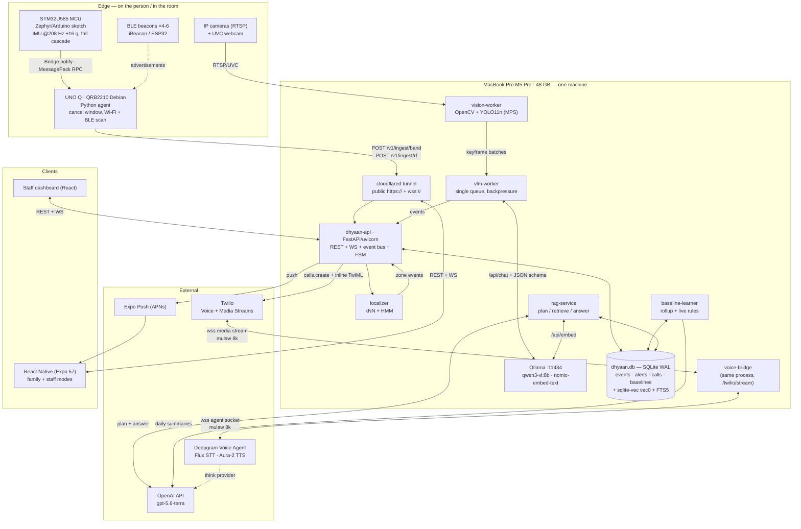
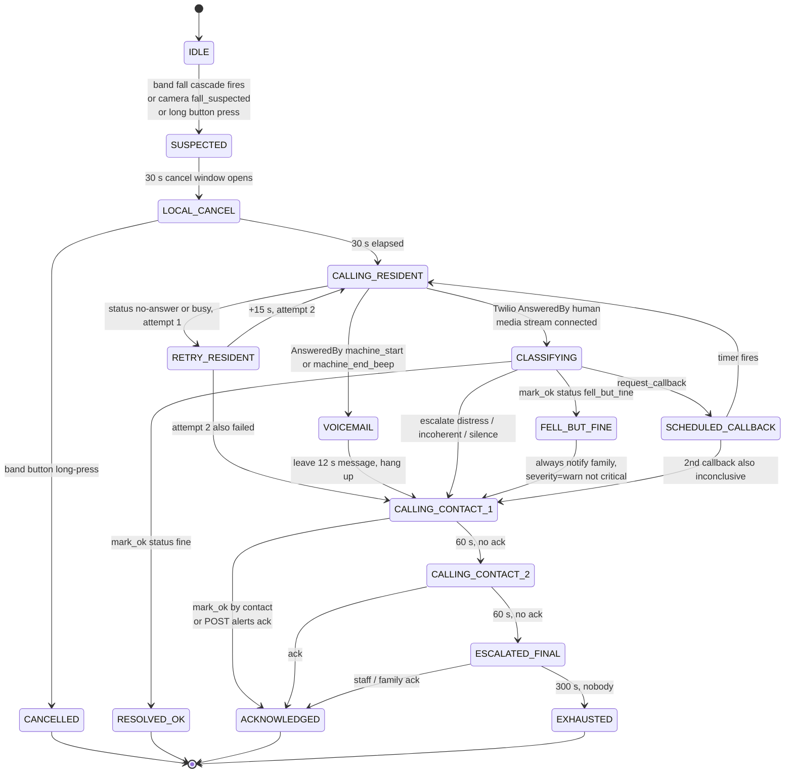

# TECHNICAL PRD — Dhyaan

**Elder-care sensing platform. One codebase, two products.**
HackMIT 2026 · team of 3 · 24 hours · local-first on a MacBook Pro M5 Pro (48 GB unified memory)

> **Verification convention.** Every external API claim below carries a source URL. Anything I could not
> verify against a live doc in the build-up to this PRD is tagged **`[UNVERIFIED]`** and must be
> checked against the vendor console in hour 0–1 before anyone writes code against it.
> Backend language is **Python 3.12** throughout. All code in this doc is Python unless a fence says otherwise.

> **Build status — Saturday 19 Sept, ~17:00 (H6).** This PRD is the original design. Where it and the
> code disagree, the code and [`./backend-README.md`](././backend-README.md) describe what runs, and
> [`backend/fixtures/*.json`](../backend/fixtures/) are the band's wire contract. Design changes made
> since the first draft are logged, with reasons, in [`DECISIONS.md`](./DECISIONS.md) (D-011).
>
> | Area | This PRD describes | What is built |
> |---|---|---|
> | Team | 4 people, roles A–D (§13) | **3 people** — Utsav (band, beacons), Ayush (backend, localization, learner, RAG), Abhinav (voice, app). The todo files supersede §13's split |
> | Data store | One SQLite file + `sqlite-vec` (§2, §3.3, §9.4) | **MongoDB 7 in Docker**; brute-force cosine in numpy; `nomic-embed-text` via Ollama |
> | Auth | JWT with resident IDs taken from the token (§9.7, §10.5) | **None.** The two static shared keys, `X-Band-Key`, `POST /auth/login`, the `users` collection and the `token` query param on `/v1/live` were all removed (`app/deps.py` and `app/auth.py` deleted, `API_KEY`/`BAND_KEY` gone from `config.py`). Every route answers with no headers. The consent gates are not auth and all survive; see §10.5 |
> | Band payloads | §10.5 examples | `backend/fixtures/band_fall.json`, `heartbeat.json`, `rf_scan.json` |
> | Alert FSM + ladder (§4) | — | Built and tested |
> | Voice (§5) | — | Bridge built and tested offline; wired to the real FSM via `backend/app/voice_adapter.py` |
> | Room localization (§7) | k-NN + HMM | k-NN + hysteresis; HMM state is process-local |
> | Baseline learner (§8), RAG (§9) | — | Built |
> | App (§10) | — | Expo app against the live backend by default (`EXPO_PUBLIC_USE_MOCKS=true` opts back into the in-memory mock, whose ladder runs 6× faster than real) |
> | Camera + VLM (§6) | — | **Built**, on a different shape than §6: one webcam, `vision/` worker, Ollama VLM, `backend/app/routers/camera.py`, `app/presence.py` dedup. Contract is [`API_CONTRACT_V3.md`](./API_CONTRACT_V3.md); design is [`VLM_PLAN.md`](./VLM_PLAN.md). §6 below is the original design |
> | Walking profile (§8.7) | — | **Not built** — stretch goal (D-009) |

---

## 1. Problem, users, and the two product surfaces

### The problem

An older adult who falls at home and cannot reach a phone waits, on average, a very long time. The two
existing answers are both bad: a pendant button that requires the person to be conscious and wearing it,
or a 24/7 call centre that costs more per month than most families will pay. In assisted-living
facilities the failure mode is different and quieter — a resident stops eating, stops walking the
corridor, starts getting up at 3 a.m. — and nobody notices for three weeks because the night nurse
covers 40 rooms and the only record is a paper chart.

Both failures are the same engineering problem: **nobody is continuously observing, and nothing knows
what "normal" looks like for this specific person.**

Dhyaan is one sensing-and-reasoning backend with two front doors.

### Personas

| Persona | Name we use | What they actually want | What they will never do |
|---|---|---|---|
| The grandparent | **Eleanor, 81** | To keep living alone and not be surveilled or nagged | Charge a device nightly, press a button during a fall, use an app |
| The adult child | **Priya, 46** | To stop phoning every evening "just to check"; to be told *first*, not last | Watch a video feed of her mother |
| Facility night nurse | **Marcus**, covers 40 rooms 11p–7a | A ranked list of who to check on *now*, not 40 green tiles | Read a dashboard with 200 rows on it |
| Facility director | **Dana** | Documented ADL trends per resident for care plans, family calls and state survey | Deploy anything that needs an IT department |

### Two product surfaces, one backend

| | **B2C — "Dhyaan Home"** | **B2B — "Dhyaan Facility"** |
|---|---|---|
| Sensing | 1 Arduino UNO Q arm band per resident | N bands + M fixed CCTV cameras |
| Primary job | Fall → phone call → escalation to family | ADL tracking → deviation alerts → staff triage |
| Human in the loop | Adult child, by phone + app | Night nurse + director, by dashboard |
| Who the voice agent calls | The resident, then children | Assisted-living residents, then the nurse station. **Memory care goes straight to staff**, and calls to facility room lines are for emergencies only (`PRODUCT_SPEC.md` §4.2, §8.5) |
| Surface | React Native app (iOS first) | React web dashboard + the same RN app in "staff" mode |
| Who pays | Family, ~$25/mo | Facility, per-bed |

**The shared spine** (the actual product): everything either surface observes becomes a row in one
`events` table. Events are summarised into per-resident daily narratives, embedded, and vectorised, so
that *both* Priya and Marcus ask the same natural-language question of the same store:
*"has mum been getting out this week?"*, *"which residents on floor 2 were up after 2 a.m. this month?"*
(Meal questions only have answers in the facility, where a camera can see the dining room — D-010.)

And the baseline learner is per-person, not global: Eleanor gets up at 06:40 ± 25 min and walks once at
10:15; Harold in 214 sleeps until 09:30 and never leaves the room. A global rule ("alert if not up by
8 a.m.") is useless for both. **Dhyaan alerts on deviation from that person's own learned pattern.**

### Explicitly OUT of scope for 24 hours

Write these on the whiteboard. Say them out loud to the judges.

| Out of scope | Why |
|---|---|
| **Any medical inference or diagnosis** | Regulatory, and we would be wrong |
| Real 911 / PSAP integration | Requires carrier + jurisdiction routing; we output *guidance* only |
| HIPAA compliance, BAAs, audit logging | Architecture is designed for it (§12); not certified in 24h |
| Android build, tablet layouts | iOS-only demo build |
| Multi-tenant auth, RBAC, orgs | Single hardcoded facility. Planned as a JWT with a static secret and 4 seeded users; **built with no auth at all** (§10.5) |
| Band firmware OTA, battery optimisation, charging UX | Band runs tethered/on a power bank for the demo |
| Camera calibration, multi-camera re-identification across rooms | Per-camera tracking only; a resident is bound to a camera zone |
| Cloud deployment, autoscaling, Postgres | Everything runs on one Mac; SQLite; Cloudflare Tunnel for phone access |
| Speaker diarisation / voice biometrics on the call | We assume whoever answers the phone is the resident |
| Fall detection ML model trained on a real dataset | Threshold cascade on the band (§4); honest about it. The one adaptive part is the per-wearer walking profile (§8.7): robust statistics learned on the hub that move one threshold within fixed bounds — not a trained classifier |

---

## 2. System architecture

Everything except Twilio, Deepgram and the OpenAI API runs on **one MacBook Pro M5 Pro**. There is no
cloud, no Docker, no Kubernetes, no message broker. One Python process hosts the API, the websocket, the
FSM and the event bus; three sibling worker processes do the things that must not block it.



### Component table

| Service | Language / runtime | Responsibility | Talks to |
|---|---|---|---|
| `band-mcu` | C, Arduino/Zephyr on STM32U585 | 208 Hz ±16 g IMU read, fall cascade (§4.1, `HARDWARE_SPEC.md` §6), step detector (§8.7), buttons | `band-agent` over Bridge (MessagePack RPC via `arduino-router`) |
| `band-agent` | Python 3.11 on QRB2210 Debian | 30 s cancel window, buzzer/LED, BLE `bleak` scan (3 s/20 s), Wi-Fi `iw` scan (60 s), HTTPS POST, 60 s heartbeat | `dhyaan-api` over HTTPS |
| `dhyaan-api` | Python 3.12, FastAPI + uvicorn | REST, client websocket, in-process event bus, **alert FSM**, escalation timers, push fanout, Twilio call placement | SQLite, Twilio, Expo, all workers |
| `voice-bridge` | Python, same process, `/twilio/stream` | Twilio ⇄ Deepgram audio relay, barge-in `clear`, `FunctionCallRequest` → FSM | Twilio Media Streams, Deepgram Voice Agent |
| `vision-worker` | Python, one process **per camera** | RTSP/UVC ingest, MOG2 motion, YOLO11n person detect (MPS), ByteTrack, keyframe selection | `vlm-worker` queue, `dhyaan-api` |
| `vlm-worker` | Python, **exactly one** | Serialised VLM inference, ADL JSON, observation→event dedup (§6.5) | Ollama, `dhyaan-api` |
| `localizer` | Python, in-process asyncio task | k-NN over RSSI fingerprints, HMM over room adjacency, commit hysteresis, camera fusion (§7) | SQLite, `dhyaan-api` |
| `baseline-learner` | Python, APScheduler + live rules | Nightly 03:30 rollup, robust-z / Poisson scoring, live inactivity + bathroom rules, feedback weighting | SQLite, OpenAI (daily narratives) |
| `rag-service` | Python, in-process | Query planning, hybrid retrieval (sqlite-vec + FTS5 + RRF), answer generation, citation check | SQLite, Ollama, OpenAI |
| `ollama` | Go binary, `:11434` | Serves `qwen3-vl:8b` (vision) and `nomic-embed-text` (embeddings), both resident | `vlm-worker`, `rag-service` |
| `dhyaan.db` | SQLite 3.45 WAL + `sqlite-vec` 0.1.9 + FTS5 | **The only persistent state.** Events, alerts, calls, baselines, fingerprints, vectors | everything |
| `cloudflared` | Go binary | Public `https://` + `wss://` for Twilio callbacks, media streams, and the phone | Twilio, RN app |
| `dhyaan-app` | TypeScript, Expo SDK 57 / RN 0.86 | Family + staff app: pairing, status, live alert, timeline, chat | `dhyaan-api` REST + WS, Expo Push |
| `dhyaan-dash` | TypeScript, React + Vite | B2B staff dashboard: triage list, resident grid, zone map, ADL trends | `dhyaan-api` REST + WS |

### Three architectural decisions worth the paragraph

**One SQLite file is the entire data layer, including vectors.** `sqlite-vec` loads as an extension on
the same connection (§9.4), so there is no second store to keep in sync and no moment at 4 a.m. where
the events say one thing and the index says another. WAL mode gives us concurrent readers and one
writer, which is exactly our shape.

**The event bus is an `asyncio.Queue` fan-out inside one process.** Redis and Kafka buy durability
across process restarts, and we do not have process restarts — we have one uvicorn and a 24-hour clock.
Every consumer (FSM, websocket push, learner, embedder) subscribes to the same in-memory bus, and
because every event is already durable in SQLite before `BUS.publish` is called (§3.4), a crash loses
notification, not data.

**The workers are separate OS processes, deliberately.** Python's GIL means a YOLO inference or a
2-second VLM call inside the API process would stall the websocket that the live alert screen depends
on. `vision-worker` and `vlm-worker` are separate processes talking over a Unix socket. The localizer
and learner stay in-process because their per-tick cost is microseconds.

## 3. The event model

**This is the most important section in the document.** Everything else — the state machine, the VLM
pipeline, the baseline learner, RAG, both apps — is a producer or consumer of `Event`. If you build
nothing else correctly, build this correctly. Two rules:

1. **Every observation is an event. There are no other tables of truth.** The VLM does not write to an
   "observations" table; it writes events. The voice agent does not write to a "calls" table; it writes
   events (and a call-detail row that *references* events). The baseline learner reads events and writes
   events.
2. **Every event carries the sentence that will be embedded.** `embedding_text` is written at insert
   time by the producer, in plain English, in the past tense, with the resident's name and a wall-clock
   time. Not at query time. Not derived by a later job. This is what makes §9 a two-hour job instead of
   a ten-hour job.

### 3.1 Canonical `Event` JSON

```json
{
  "id": "evt_01JBQX9K4M2T7Z8N3RQYV5HCWD",
  "schema_version": 1,
  "resident_id": "res_eleanor",
  "source": "camera",
  "source_id": "cam_dining_01",
  "type": "meal_observed",
  "ts": "2026-09-19T12:41:07.482-04:00",
  "ts_end": "2026-09-19T13:02:55.000-04:00",
  "confidence": 0.82,
  "zone": "dining_room",
  "payload": {
    "meal": "lunch",
    "seated_duration_s": 1308,
    "utensil_to_mouth_observed": true,
    "plate_present_frames": 11,
    "vlm_model": "mlx-community/Qwen3-VL-8B-Instruct-4bit",
    "keyframe_ids": ["kf_8841", "kf_8846", "kf_8859"],
    "raw_vlm_json": { "...": "..." }
  },
  "embedding_text": "On Friday 19 September at 12:41 PM, Eleanor was observed eating lunch in the dining room for about 22 minutes, with a plate in front of her and repeated hand-to-mouth movement.",
  "derived_from": ["evt_01JBQX8...", "evt_01JBQX8..."],
  "supersedes": null,
  "review_state": "unreviewed",
  "created_at": "2026-09-19T13:03:01.110-04:00"
}
```

| Field | Type | Notes |
|---|---|---|
| `id` | ULID, prefixed `evt_` | ULIDs sort lexicographically by time — free time-ordered index |
| `schema_version` | int | Bump it; we will change the payload shape at hour 14 and need to not care |
| `resident_id` | FK | `res_unknown` is legal — the VLM sees a person before it knows who |
| `source` | enum | `band` \| `camera` \| `voice` \| `manual` \| `derived` |
| `source_id` | str | `band_a3f2`, `cam_dining_01`, `call_CA9f…`, `staff_marcus`, `baseline_learner` |
| `type` | enum | full taxonomy in §3.2 |
| `ts` | ISO-8601 with offset | **Instant the thing happened**, not the instant we noticed |
| `ts_end` | ISO-8601 or null | Present for interval events (`walk_completed`, `meal_observed`) |
| `confidence` | float 0–1 | Band thresholds → fixed table; VLM → self-reported, recalibrated (§6.5) |
| `zone` | str or null | Camera zone or band-inferred room |
| `payload` | object | Type-specific. Stored as JSON text in SQLite, queried with `json_extract` |
| `embedding_text` | str | Written by the producer. Never null. ≤ 400 chars |
| `derived_from` | array of event ids | The VLM keyframe events a `meal_observed` was rolled up from |
| `supersedes` | event id or null | `fall_cancelled` supersedes `fall_suspected` |
| `review_state` | enum | `unreviewed` \| `confirmed` \| `false_positive` \| `expected` — this is the feedback channel into §8 |
| `created_at` | ISO-8601 | Ingest time. `created_at - ts` is our observability latency metric |

### 3.2 Event taxonomy

Grouped by producer. `⚠` = can trigger an alert. `β` = consumed by the baseline learner as a feature.

**Band (`source: band`)**

| type | ⚠ | β | payload keys |
|---|---|---|---|
| `fall_suspected` | ⚠ | | `peak_g`, `free_fall_ms`, `post_impact_tilt_deg`, `stillness_ms`, `confidence` (no `battery_pct` — the demo band's USB power bank reports no charge level, D-013) |
| `impact_only` | | | `peak_g`, `orient_deg`, `std_g`, `path` — an impact that failed the angle or stillness check. Not embedded. Feeds the walking profile (§8.7) and the demo impact ticker |
| `fall_confirmed` | ⚠ | β | `confirmed_by` (`voice`\|`staff`\|`timeout`), `call_id` |
| `fall_cancelled` | | | `cancelled_by` (`button`\|`voice`\|`family`\|`staff`), `latency_ms` |
| `band_motion_high` | | β | `activity_counts`, `window_s` |
| `band_still` | | β | `still_duration_s` |
| `prolonged_inactivity` | ⚠ | β | `inactive_since`, `duration_s`, `expected_max_s` |
| `band_offline` | ⚠ | | `last_seen`, `reason` |
| `band_low_battery` | | | `battery_pct` — **production band only**; the demo band cannot report a charge level, so it never emits this (liveness comes from `band_offline`) |
| `button_pressed` | ⚠ | | `press_type` (`short`\|`long`) — the manual SOS |

**Location / RF (`source: band`, produced by the localizer — §7)**

These are first-class. In B2C they are the *only* location source; there are no cameras in Eleanor's
home. Every one of them carries `method` so a consumer always knows whether a location came from RF,
a camera, or both.

| type | ⚠ | β | payload keys |
|---|---|---|---|
| `zone_entered` | | β | `zone`, `from_zone`, `method` (`wifi`\|`ble`\|`fused`\|`camera`), `confidence`, `posterior` |
| `zone_exited` | | β | `zone`, `to_zone`, `method`, `dwell_s` |
| `zone_dwell` | ⚠ | β | `zone`, `dwell_s`, `method`, `confidence`, `expected_p95_s` |
| `bathroom_prolonged` | ⚠ | | `dwell_s`, `threshold_s`, `zone` |
| `left_home` | ⚠ | β | `last_zone`, `last_seen_ts`, `n_anchors_lost`, `method` |
| `returned_home` | | β | `away_s`, `first_zone` |
| `location_unknown` | | | `reason` (`no_anchors`\|`unrecognised_vector`\|`low_posterior`), `duration_s`, `best_guess`, `best_posterior` |
| `beacon_offline` | ⚠ | | `beacon_id`, `zone`, `last_seen`, `last_rssi` |
| `rf_scan` | | | `wifi` (BSSID→dBm map), `ble` (beacon→dBm map), `scan_ms` — **not embedded, not indexed**, retained 48 h |

`embedding_text` templates (rendered by the localizer, never by an LLM):

| type | Template |
|---|---|
| `zone_entered` | `"On {day} at {time}, {name} moved from the {from_zone} to the {zone}."` |
| `zone_dwell` | `"On {day} at {time}, {name} spent {mins} minutes in the {zone}."` |
| `bathroom_prolonged` | `"On {day} at {time}, {name} had been in the bathroom for {mins} minutes, longer than her usual maximum of {p95_mins}."` |
| `left_home` | `"On {day} at {time}, {name} left home. The band lost contact with every beacon and home Wi-Fi network."` |
| `returned_home` | `"On {day} at {time}, {name} came back home after {away_mins} minutes out, entering through the {first_zone}."` |
| `location_unknown` | `"On {day} at {time}, Dhyaan could not tell which room {name} was in for {mins} minutes ({reason})."` |
| `beacon_offline` | `"On {day} at {time}, the {zone} beacon stopped responding — room detection there is degraded."` |

`location_unknown` having an `embedding_text` is deliberate: §9.6 rule 3 says absence is an answer, and
the RAG layer can only say *"I don't know where she was between 2 and 3 PM"* if the gap is a row.

**Camera + VLM (`source: camera`)**

| type | ⚠ | β | payload keys |
|---|---|---|---|
| `person_present` | | | `track_id`, `bbox`, `dwell_s` — cheap, pre-VLM, not embedded |
| `meal_observed` | | β | `meal`, `seated_duration_s`, `plate_present_frames`, `utensil_to_mouth_observed` (the VLM schema, §6.4, reports whether a plate is present — not how full it is) |
| `meal_skipped` | ⚠ | β | `meal`, `expected_window`, `last_seen_in_dining` |
| `walk_started` | | β | `zone`, `gait_note` |
| `walk_completed` | | β | `duration_s`, `zones_traversed`, `assistive_device` |
| `bed_exit` | | β | `hour_local`, `returned_within_s` |
| `room_exit` / `room_entry` | | β | `to_zone` / `from_zone` |
| `night_activity` | ⚠ | β | `hour_local`, `duration_s`, `description` |
| `unsteady_gait` | ⚠ | | `description`, `vlm_confidence` — **advisory only, never diagnostic** |
| `fall_suspected` | ⚠ | | `vlm_description`, `keyframe_ids` — camera can also raise a fall |
| `visitor_present` | | β | `n_people`, `duration_s` |
| `medication_taken` | | β | `observed_at_station`, `staff_present` — **roadmap, not emitted in v1**: a pill going into a mouth is not reliably visible from hallway CCTV at 640×360 |
| `assistance_given` | | | `staff_id`, `duration_s` |
| `prolonged_inactivity` | ⚠ | β | `zone`, `duration_s` |

**Voice (`source: voice`)**

| type | ⚠ | β | payload keys |
|---|---|---|---|
| `call_placed` | | | `to`, `role` (`resident`\|`contact_1`\|…\|`staff`), `twilio_call_sid`, `attempt` |
| `call_answered` | | | `answered_by` (`human`\|`machine_start`\|`machine_end_beep`\|`unknown`), `latency_s` |
| `call_no_answer` | ⚠ | | `reason` (`no-answer`\|`busy`\|`failed`\|`voicemail`) |
| `voice_response_classified` | ⚠ | | `classification`, `transcript`, `tool_called`, `agent_confidence` |
| `escalation_started` | ⚠ | | `ladder_step`, `reason` |
| `escalation_acknowledged` | | | `by`, `channel` (`voice`\|`app`\|`sms`), `latency_s` |
| `escalation_exhausted` | ⚠ | | `steps_tried` |

**Derived / manual (`source: derived` \| `manual`)**

| type | ⚠ | β | payload keys |
|---|---|---|---|
| `baseline_deviation` | ⚠ | | `feature`, `observed`, `expected_mu`, `expected_mad`, `robust_z`, `severity` |
| `daily_summary` | | | `narrative`, `n_events`, `model`, `date_local` — **the primary RAG chunk (§9)** |
| `baseline_updated` | | | `feature`, `old_mu`, `new_mu`, `n_obs` |
| `gait_profile_updated` | | | `profile_rev`, `impact_g_soft`, `impact_g_after_ff`, `bounds`, `n_windows`, `mode` (`normal`\|`calibration`) — §8.7. Not embedded |
| `gait_profile_shift` | ⚠ | | `feature` (`step_peak_p95`\|`step_rate_hz`), `change_pct`, `window_days` — **staff-only, advisory, never worded medically**; freezes the profile (§8.7) |
| `staff_note` | | | `text`, `staff_id` |
| `family_note` | | | `text`, `user_id` |
| `feedback_given` | | | `target_event_id`, `verdict`, `reason` — Priya saying "that was fine, she was at her sister's" |

### 3.3 SQL DDL

SQLite 3.45+, WAL mode. One file: `dhyaan.db`.

```sql
PRAGMA journal_mode = WAL;
PRAGMA foreign_keys = ON;
PRAGMA busy_timeout = 5000;

CREATE TABLE residents (
  id              TEXT PRIMARY KEY,              -- res_eleanor
  display_name    TEXT NOT NULL,
  facility_id     TEXT,                          -- NULL for B2C
  room            TEXT,                          -- '214'
  timezone        TEXT NOT NULL DEFAULT 'America/New_York',
  date_of_birth   TEXT,
  consent_camera  INTEGER NOT NULL DEFAULT 0,    -- §12, hard gate
  consent_voice   INTEGER NOT NULL DEFAULT 0,
  consent_signed_by TEXT,
  consent_signed_at TEXT,
  phone_e164      TEXT,
  created_at      TEXT NOT NULL
);

CREATE TABLE contacts (                          -- the escalation ladder, ordered
  id           TEXT PRIMARY KEY,
  resident_id  TEXT NOT NULL REFERENCES residents(id),
  name         TEXT NOT NULL,
  phone_e164   TEXT NOT NULL,
  relationship TEXT,                             -- 'daughter'
  ladder_order INTEGER NOT NULL,                 -- 1, 2, 3...
  push_token   TEXT,                             -- ExponentPushToken[...]
  can_view_video INTEGER NOT NULL DEFAULT 0,     -- §12: always 0 in v1
  UNIQUE(resident_id, ladder_order)
);

-- Bands are physical devices that get paired, swapped and re-paired. The mapping is NOT a column
-- on residents: a band outlives a resident's tenancy in B2B, and a resident may swap bands mid-stay.
CREATE TABLE bands (
  id            TEXT PRIMARY KEY,                -- band_a3f2, printed on the strap
  resident_id   TEXT REFERENCES residents(id),   -- NULL = unpaired, on the shelf
  paired_at     TEXT,
  last_seen_at  TEXT,                            -- updated by every heartbeat; drives band_offline
  battery_pct   INTEGER,                         -- always NULL on the demo band (USB power bank, D-013)
  thresholds_rev INTEGER NOT NULL DEFAULT 1,     -- hub notices a band running stale calibration / walking profile (§8.7)
  firmware      TEXT
);
CREATE INDEX idx_bands_resident ON bands(resident_id) WHERE resident_id IS NOT NULL;

CREATE TABLE events (
  id             TEXT PRIMARY KEY,               -- ULID, evt_...
  schema_version INTEGER NOT NULL DEFAULT 1,
  resident_id    TEXT NOT NULL REFERENCES residents(id),
  source         TEXT NOT NULL CHECK (source IN ('band','camera','voice','manual','derived')),
  source_id      TEXT,
  type           TEXT NOT NULL,
  ts             TEXT NOT NULL,                  -- ISO-8601 with offset
  ts_end         TEXT,
  ts_epoch       INTEGER NOT NULL,               -- unix seconds, for fast range scans
  confidence     REAL NOT NULL DEFAULT 1.0,
  zone           TEXT,
  payload        TEXT NOT NULL DEFAULT '{}',     -- JSON
  embedding_text TEXT NOT NULL,
  derived_from   TEXT NOT NULL DEFAULT '[]',     -- JSON array of event ids
  supersedes     TEXT REFERENCES events(id),
  review_state   TEXT NOT NULL DEFAULT 'unreviewed'
                 CHECK (review_state IN ('unreviewed','confirmed','false_positive','expected')),
  created_at     TEXT NOT NULL
);

CREATE INDEX idx_events_res_time  ON events(resident_id, ts_epoch DESC);
CREATE INDEX idx_events_type_time ON events(type, ts_epoch DESC);
CREATE INDEX idx_events_res_type  ON events(resident_id, type, ts_epoch DESC);
CREATE INDEX idx_events_review    ON events(review_state) WHERE review_state = 'unreviewed';

-- Alerts are a separate lifecycle object. An alert POINTS AT events; it is not one.
CREATE TABLE alerts (
  id            TEXT PRIMARY KEY,                -- alr_...
  resident_id   TEXT NOT NULL REFERENCES residents(id),
  trigger_event TEXT NOT NULL REFERENCES events(id),
  kind          TEXT NOT NULL,                   -- 'fall' | 'baseline_deviation' | 'inactivity' | 'sos'
  severity      TEXT NOT NULL CHECK (severity IN ('info','warn','urgent','critical')),
  state         TEXT NOT NULL,                   -- see §4 state machine
  ladder_step   INTEGER NOT NULL DEFAULT 0,
  opened_at     TEXT NOT NULL,
  state_changed_at TEXT NOT NULL,
  closed_at     TEXT,
  resolution    TEXT,                            -- 'ok'|'fell_ok'|'ems'|'false_positive'|'timeout'
  acked_by      TEXT,                            -- contacts.id or staff id
  acked_at      TEXT
);
CREATE INDEX idx_alerts_open ON alerts(state, opened_at DESC) WHERE closed_at IS NULL;

CREATE TABLE calls (
  id             TEXT PRIMARY KEY,               -- cal_...
  alert_id       TEXT REFERENCES alerts(id),
  resident_id    TEXT NOT NULL,
  to_e164        TEXT NOT NULL,
  role           TEXT NOT NULL,                  -- 'resident'|'contact_1'|'contact_2'|'staff'
  twilio_call_sid TEXT UNIQUE,
  stream_sid     TEXT,
  attempt        INTEGER NOT NULL DEFAULT 1,
  answered_by    TEXT,                           -- Twilio AMD value
  status         TEXT,                           -- queued|ringing|in-progress|completed|no-answer|busy|failed
  classification TEXT,                           -- okay|fell_but_fine|distress|incoherent|no_answer|voicemail
  transcript     TEXT,                           -- full ConversationText log, JSON array
  duration_s     INTEGER,
  started_at     TEXT NOT NULL,
  ended_at       TEXT
);

-- Per-resident, per-feature learned baseline. One row per (resident, feature). §8
CREATE TABLE baselines (
  resident_id  TEXT NOT NULL REFERENCES residents(id),
  feature      TEXT NOT NULL,                    -- 'wake_time_min','walk_count','meal_gap_h',...
  mu           REAL NOT NULL,                    -- robust location (running median est.)
  mad          REAL NOT NULL,                    -- median absolute deviation
  n_obs        INTEGER NOT NULL DEFAULT 0,
  lam          REAL,                             -- Poisson rate, for count features
  last_value   REAL,
  updated_at   TEXT NOT NULL,
  cold_start   INTEGER NOT NULL DEFAULT 1,       -- 1 until n_obs >= 7
  PRIMARY KEY (resident_id, feature)
);

CREATE TABLE baseline_observations (             -- the rolling window, capped at 60 per feature
  resident_id TEXT NOT NULL,
  feature     TEXT NOT NULL,
  date_local  TEXT NOT NULL,                     -- '2026-09-19'
  value       REAL NOT NULL,
  weight      REAL NOT NULL DEFAULT 1.0,         -- downweighted to 0.2 by 'expected' feedback
  PRIMARY KEY (resident_id, feature, date_local)
);

CREATE TABLE zones (                             -- per-camera zone config, §6.6
  id            TEXT PRIMARY KEY,                -- 'dining_room'
  camera_id     TEXT NOT NULL,
  facility_id   TEXT,
  label         TEXT NOT NULL,
  kind          TEXT NOT NULL,                   -- 'dining'|'hallway'|'bedroom'|'common'|'exterior_door'
  polygon       TEXT NOT NULL,                   -- JSON [[x,y],...] normalised 0-1
  default_resident_id TEXT,                      -- bedroom zones bind to one resident
  adl_prompt_hint TEXT,                          -- injected into the VLM prompt, §6.4
  beacon_id     TEXT,                            -- the BLE puck in this room, §7
  adjacent      TEXT NOT NULL DEFAULT '[]'       -- JSON array of zone ids; the adjacency graph, §7.3
);

-- §7: RF localization
CREATE TABLE beacons (
  id          TEXT PRIMARY KEY,                  -- 'bcn_kitchen'
  zone_id     TEXT REFERENCES zones(id),
  resident_id TEXT,                              -- NULL = shared/facility beacon
  mac         TEXT,                              -- BLE address (randomised on iOS advertisers; use UUID+major+minor)
  uuid        TEXT, major INTEGER, minor INTEGER,
  tx_power_1m REAL NOT NULL DEFAULT -59.0,       -- calibrated dBm at 1 m, §7.2
  last_seen   TEXT, last_rssi REAL, battery_pct INTEGER
);

CREATE TABLE fingerprints (                      -- the site survey, §7.2
  id          INTEGER PRIMARY KEY AUTOINCREMENT,
  resident_id TEXT NOT NULL,
  zone_id     TEXT NOT NULL,
  captured_at TEXT NOT NULL,
  vector      TEXT NOT NULL,                     -- JSON {"aa:bb:..": -54, "bcn_kitchen": -71}
  n_anchors   INTEGER NOT NULL
);
CREATE INDEX idx_fp ON fingerprints(resident_id, zone_id);

CREATE TABLE location_state (                    -- one row per resident: the HMM posterior
  resident_id TEXT PRIMARY KEY REFERENCES residents(id),
  zone_id     TEXT,                              -- current committed zone, NULL = unknown
  posterior   TEXT NOT NULL,                     -- JSON {zone_id: prob}
  since       TEXT,                              -- when we committed to zone_id
  method      TEXT,                              -- wifi|ble|fused|camera
  confidence  REAL,
  updated_at  TEXT NOT NULL
);

-- §9: the non-vector half of a chunk, joined to by the FTS5 query
CREATE TABLE chunk_meta (
  chunk_id         TEXT PRIMARY KEY,
  resident_id      TEXT NOT NULL,
  kind             TEXT NOT NULL,
  ts_epoch         INTEGER NOT NULL,
  text             TEXT NOT NULL,
  source_event_ids TEXT NOT NULL DEFAULT '[]'
);
CREATE INDEX idx_chunk_meta ON chunk_meta(resident_id, kind, ts_epoch DESC);
```

**Vector side** (see §9 for the justification of `sqlite-vec` over LanceDB/Chroma/pgvector):

```sql
-- loaded via: import sqlite_vec; db.enable_load_extension(True); sqlite_vec.load(db)
CREATE VIRTUAL TABLE chunks_vec USING vec0(
  chunk_id          TEXT PRIMARY KEY,
  resident_id       TEXT PARTITION KEY,          -- partitions the index; huge win on filtered KNN
  ts_epoch          INTEGER,                     -- auxiliary metadata column, filterable
  kind              TEXT,                        -- 'daily_summary' | 'event' | 'note'
  embedding         FLOAT[768],                  -- nomic-embed-text-v1.5
  +source_event_ids TEXT,                        -- '+' = unindexed auxiliary column (payload)
  +text             TEXT
);

-- Keyword half of hybrid retrieval
CREATE VIRTUAL TABLE chunks_fts USING fts5(
  chunk_id UNINDEXED, resident_id UNINDEXED, text, tokenize='porter unicode61'
);
```

### 3.4 The one API every producer uses

```python
# dhyaan/events.py
import json, sqlite3, ulid
from datetime import datetime, timezone

VALID_TYPES = frozenset(_TAXONOMY)  # from §3.2, loaded from a YAML the whole team edits

def emit(db: sqlite3.Connection, *, resident_id: str, source: str, type: str,
         ts: datetime, embedding_text: str, payload: dict | None = None,
         source_id: str | None = None, confidence: float = 1.0,
         zone: str | None = None, ts_end: datetime | None = None,
         derived_from: list[str] | None = None, supersedes: str | None = None) -> str:
    assert type in VALID_TYPES, f"unknown event type {type!r}"
    assert embedding_text and len(embedding_text) <= 400, "embedding_text is mandatory, <=400 chars"
    eid = f"evt_{ulid.new()}"
    db.execute("""INSERT INTO events (id, resident_id, source, source_id, type, ts, ts_end,
                    ts_epoch, confidence, zone, payload, embedding_text, derived_from,
                    supersedes, created_at)
                  VALUES (?,?,?,?,?,?,?,?,?,?,?,?,?,?,?)""",
        (eid, resident_id, source, source_id, type, ts.isoformat(),
         ts_end.isoformat() if ts_end else None, int(ts.timestamp()), confidence, zone,
         json.dumps(payload or {}), embedding_text, json.dumps(derived_from or []),
         supersedes, datetime.now(timezone.utc).isoformat()))
    db.commit()
    BUS.publish(eid, resident_id, type)   # in-process asyncio fanout -> rules engine + websocket
    return eid
```

`BUS` is an `asyncio.Queue` fan-out inside the single FastAPI process. Not Kafka. Not Redis. We have
24 hours and one machine.

**As built** (`backend/app/events.py`): same keyword signature minus the `db` argument, `async`, `ts`
optional (defaults to now), returns the whole event doc rather than the id, writes to the Mongo
`events` collection, and the bus is a module-level list of subscriber coroutines called after the
insert (`events.subscribe`). Unknown `type` or `source` raises `ValueError`. A subscriber that throws
is logged and skipped; the write already landed. The websocket's `event.new` is one such subscriber.

---

## 4. Fall-alert state machine and escalation ladder

### 4.1 Detection on the band

The Arduino UNO Q is a hybrid board: a quad-core Cortex-A53 **Qualcomm Dragonwing QRB2210 @ 2.0 GHz**
running Debian, plus an **STM32U585 Cortex-M33** real-time MCU, Wi-Fi 5 / BT 5.1, and a Qwiic connector
([docs.arduino.cc/hardware/uno-q](https://docs.arduino.cc/hardware/uno-q/)). **It has no on-board IMU**
— the Arduino docs list no integrated accelerometer — so the band is UNO Q + an **LSM6DSOX 6-DoF IMU
over Qwiic/I²C**. Buy or bring two. This is the #1 hardware risk (§14).

Split of responsibility:

| Runs on | What |
|---|---|
| STM32U585 (Arduino sketch, **208 Hz IMU poll, ±16 g**) | The threshold cascade. Deterministic, no OS jitter. Notifies Linux over the Bridge. |
| QRB2210 Debian (Python, App Lab) | 30 s local cancel window + buzzer/LED, Wi-Fi, HTTPS POST to backend, `band_still` heartbeat every 60 s |

> **Sensor configuration is owned by `HARDWARE_SPEC.md` §6, and it overrides any number in this
> document.** An earlier draft here said 104 Hz / ±8 g with a GPIO interrupt. That is wrong twice over:
> the stock `Arduino_LSM6DSOX` library sets `CTRL1_XL = 0x4A` (±4 g), so a real impact **clips at 4.0 g**
> and the 2.8 g threshold sits under a ceiling that flattens the very signal it is looking for — the fix
> is `CTRL1_XL = 0x56` (208 Hz, ±16 g) with raw-register reads, because `readAcceleration()` hard-codes
> a ÷4 scale. Read the hardware spec before writing firmware; the trap is silent.

The cascade is threshold-based and we say so; we are not shipping a trained fall classifier in 24
hours. Summary of `HARDWARE_SPEC.md` §6.4–6.5 (the source of truth — do not copy numbers from here into
firmware):

| Stage | Rule (starting values, all in `config.json`) |
|---|---|
| Free fall | \|a\| < **0.40 g** for **80–400 ms** (forearm falls bottom out at 0.3–0.6 g, not 0 g) |
| Impact | > **2.8 g** within 400 ms of free fall, **or** > **3.5 g** with jerk > 30 g/s and no free fall |
| Orientation | Gravity vector turns > **45°** — **required** on the no-free-fall path |
| Stillness | For **2 s** after a 200 ms settle: σ(\|a\|) < 0.12 g and \|ω\| < 25 °/s |

Stillness is what kills most false positives: an arm swing, a clap or a slammed forearm is followed by
more movement. **Tunable at the venue** by dropping the band — never a person — per
`HARDWARE_SPEC.md` §7.2. The impact threshold on the no-free-fall path is personalised per wearer by the
walking profile (§8.7), within fixed bounds.

On confirmation the MCU calls `Bridge.notify("fall_event", …)` once, immediately; the Linux side attaches
the latest room fix, POSTs it, and runs the 30 s cancel window (`HARDWARE_SPEC.md` §5.3, §6.7).

### 4.2 The escalation ladder — exact timings

| t | Step | Actor | Action |
|---|---|---|---|
| `T+0` | `SUSPECTED` | Band | Buzzer + red LED. `POST /v1/ingest/band` → `fall_suspected` event, `alerts` row opens. **No person is notified yet** (D-002): the hub knows immediately so a band that breaks on impact still escalates, but the family hears nothing unless the ladder reaches them. Staff and the demo operator screen may show the countdown |
| `T+0…30 s` | `LOCAL_CANCEL` | Resident | Press button A on the band → `fall_cancelled`, alert closes, resolution `false_positive`. **Nothing else happens.** |
| `T+30 s` | `CALLING_RESIDENT` | Backend | Twilio outbound to `residents.phone_e164`, `Timeout=25` (≈4 rings), Deepgram agent on the media stream |
| `T+30…~75 s` | — | Voice agent | Greeting + up to 3 turns. Classifies (§4.4) |
| on `no-answer` | `RETRY_RESIDENT` | Backend | **Exactly one** retry, 15 s after the first attempt ends, `Timeout=25` |
| `T+~120 s` | `CALLING_CONTACT_1` | Backend | Call `contacts` where `ladder_order = 1`. Different agent prompt (§5.5). Simultaneously: push with `interruptionLevel: "timeSensitive"` + full-screen in-app alert |
| `+60 s` unacked | `CALLING_CONTACT_2` | Backend | `ladder_order = 2`. Contact 1 is **not** hung up on — we place a second, parallel call |
| `+60 s` unacked | `ESCALATED_FINAL` | Backend | B2B: ring the nurse station + top of Marcus's triage list. B2C: **voice call** to every remaining contact with **911 guidance** and the resident's address, plus a push (not an SMS — A2P 10DLC gates SMS and will not clear in 24 h; §5.7). **We do not dial 911.** |
| any time | `ACKNOWLEDGED` | Any human | "I called her" / `mark_ok` / staff tap → alert `state_changed_at` set, ladder halts |

Two timing decisions worth defending to a judge:

- **30 s cancel window, not 60.** A conscious person who has just dropped the band knows within 5 s.
  A person who actually fell is not cancelling. 30 s is the longest we are willing to delay the call.
- **60 s per contact, parallel not serial.** Priya's phone is in another room. We do not wait for her
  voicemail to time out before trying her brother.

**As built, every timing is an environment variable** (`backend/app/config.py`): `CANCEL_WINDOW_S` (30),
`CONTACT_WAIT_S` (60), `EXHAUSTED_AFTER_S` (300), `RETRY_WAIT_S` (15), `RESIDENT_RESPONSE_TIMEOUT_S` (90).
The stage config in §13 is set by env, not by editing code, and the live `cancel_window_s` is echoed on
`POST /ingest/band` and on every alert response so the app's countdown ring never disagrees with the
server.

### 4.3 State diagram



Implemented as an explicit table-driven FSM in `backend/app/alerts.py` (`TABLE`) — a dict of
`{(state, trigger): (next_state, action_fn)}` plus one `asyncio` task per pending timer. **Not** a pile of `if`
statements across three files, because at hour 19 someone will need to change one timing constant.
Every transition writes an event; the state machine is replayable from `events`, and
`routers/residents.py::alert_response` does exactly that to build the `ladder` the app renders.

Deviations from the diagram, as built: `SCHEDULED_CALLBACK` is in `STATES` but no `TABLE` row enters or
leaves it (`request_callback` is specified, not built); `ack` is wired from every non-terminal state by
a loop over `STATES`, not drawn per arrow; `FELL_BUT_FINE` is not terminal and chains on to
`CALLING_CONTACT_1` as drawn; and `POST /alerts/{id}/resolve` writes a `MANUALLY_RESOLVED` state that
the table does not know about, straight to the document. A timer still pending for such an alert fires
once, finds no transition, logs and drops. Upgrade: a real `resolve()` in `alerts.py` that also cancels
the timer.

Four more things the diagram cannot show, all of them about the ladder surviving
the real world:

- **One fall is one ladder.** `open_alert` reuses an alert that is already open
  for the same resident and the same `kind` and was opened within `STALE_ALERT_S`
  (3600 s), instead of opening a second one. The band retries its POST and the
  "Simulate a fall" button gets pressed twice; each used to start its own alert
  with its own timers, and a cancel carries a single alert id, so the button
  stopped one ladder while the other kept dialling. The `opened_at` bound is the
  load-bearing half: without it, one alert stuck non-terminal would swallow every
  later fall for that resident forever.
- **A restart re-arms, except when it should close.** Timers are in-memory
  `asyncio` tasks, so a restart used to strand every open alert exactly where it
  stood — and under `uvicorn --reload` that is every file save.
  `_rearm_pending` restores each waiting state's own timeout (the one declared in
  `_pending_timer`, which is also what `_apply` arms on entry, so the two cannot
  disagree), measuring the remaining wait from the alert's `updated_at`. An alert
  more than `STALE_ALERT_S` past its last transition is not an escalation in
  progress, it is one we lost: it is written straight to `EXHAUSTED` rather than
  re-armed, because a past-due timer fires on the next tick and that would be a
  real 3 a.m. call about a fall someone dealt with days ago.
- **`_apply` is a compare-and-swap.** The update is conditional on the state that
  was read. Nothing holds a lock and two triggers really do arrive at once: a
  firing timer pops itself from `_timers` before calling, so an ack landing in
  that gap cancels nothing. Ack wrote `ACKNOWLEDGED`, the timer then wrote
  `CALLING_CONTACT_1` over it, and the family was dialled for an alert a human
  had already taken. Whoever writes first wins; the loser returns the alert as it
  now stands and emits nothing, broadcasts nothing and dials nobody. The next
  rung's clock is armed before the action runs, with no `await` in between, so a
  failing action cannot cost the ladder its timer.
- **`ESCALATED_FINAL` tolerates a bad leg.** `_final_escalation` calls every
  remaining contact with a number; one that raises is logged and the loop moves
  on. It used to abort the whole loop, so a number Twilio rejected meant contact
  2 was never dialled at all on the last rung of a real fall.

### 4.4 The five classifications

The agent does not decide with free text. It decides by calling a tool. If the call ends with **no**
tool call, the classification defaults to `incoherent` and we escalate — **silence escalates.**

| Classification | Trigger | Next state |
|---|---|---|
| `okay` | `mark_ok(status="fine")` | `RESOLVED_OK`, push "Eleanor says she's fine" |
| `fell_but_fine` | `mark_ok(status="fell_but_fine")` | `FELL_BUT_FINE` → still calls contact 1, severity `warn` |
| `no_answer` | Twilio `no-answer`/`busy`/`failed` on both attempts | `CALLING_CONTACT_1` |
| `distress` | `escalate(reason="distress")` — "help", "I can't get up", "my hip" | `CALLING_CONTACT_1`, severity `critical` |
| `incoherent` | `escalate(reason="incoherent")`, or 3 turns with no tool call, or 20 s of silence after greeting | `CALLING_CONTACT_1`, severity `critical` |

### 4.5 What the agent says at each step

**Resident call, attempt 1 — greeting (Aura-2 TTS, spoken immediately on `SettingsApplied`):**

> "Hi Eleanor, this is Dhyaan, an automated safety check. Your band thought you might have fallen.
> I'm recording this call for your log — say 'stop recording' any time. Are you okay?"

**Every call, to every party, opens with the recording and AI disclosure** (D-004). This is the legal
safe harbour in all-party-consent states, and Massachusetts — where we demo — is the strictest
(`PRODUCT_SPEC.md` §8.5). It costs one sentence. Never remove it to save time on stage.

Then, by branch:

| They say | Agent replies | Tool |
|---|---|---|
| "I'm fine" / "false alarm" | "Okay, good. I'll let Priya know everything's fine. Take care." | `mark_ok(status="fine")` |
| "I did fall but I'm up" | "I'm glad you're up. I'm going to let Priya know you had a fall so she can check in. Okay?" | `mark_ok(status="fell_but_fine", detail=…)` |
| "Help" / "I can't get up" | "Okay Eleanor, stay where you are. I'm calling Priya right now. Stay on the line if you can." | `escalate(reason="distress")` |
| Confused / slurred / off-topic ×2 | "Okay, I'm going to call Priya to check on you. Hang tight." | `escalate(reason="incoherent")` |
| "I'm busy, call back" | "No problem. I'll call you back in five minutes." | `request_callback(minutes=5)` |
| Silence ≥ 20 s after greeting | *(repeat greeting once, then)* "I'm not hearing anything, so I'm calling Priya." | `escalate(reason="silence")` |
| "Stop recording" | "Okay — I've stopped recording and deleted what I had. Are you okay?" | `stop_recording()`, then carry on |

**Contact call (Priya):**

> "Hi, this is Dhyaan, an automated call about Eleanor. This call is recorded — say 'stop recording'
> any time. Her band detected a possible fall at 3:42 PM, and she didn't answer when we called her.
> Her band places her in the bathroom. Can you check on her? Just say yes to confirm you're on it."

The room sentence is included only when the band's room fix is under 60 s old. This is the one place
the family ever hears a room name: an emergency escalation, so whoever goes knows where she is (D-001).
The contact call never mentions a room otherwise.

She says yes → `escalate_acknowledged` event, ladder stops, push confirms in her app.

**Final step (B2C) — a voice call to every remaining contact, plus a push. Not an SMS.**

An earlier draft of this section sent an SMS here. It cannot: A2P 10DLC registration gates
application-to-person SMS over a long code and takes days, not hours
([A2P 10DLC](https://www.twilio.com/docs/messaging/compliance/a2p-10dlc)), while outbound **voice** is
unaffected. The ladder is voice-only end to end, and the same text is spoken by Aura-2 and mirrored
into the app as a push + a persistent alert card:

> "This is Dhyaan, an automated call about Eleanor, and this call is recorded. She may have fallen at
> 3:42 PM, and nobody has been able to reach her or acknowledge the alert. If you cannot reach her,
> call 911. Her address is 14 Elm Street, apartment 3B, Cambridge, Massachusetts. Dhyaan does not call
> emergency services."

The address is spoken twice, slowly, and the call does not hang up until it has been said the second
time — a person writing down an address under stress needs the repeat.

### 4.6 Tool definitions given to the voice agent

These go in `agent.think.functions` in the Deepgram `Settings` message (§5.2). All five are
**client-side** (no `endpoint` key), so Deepgram sends us a `FunctionCallRequest` and our bridge
process executes against the FSM
([Function Calling](https://developers.deepgram.com/docs/voice-agents-function-calling)).

```json
[
  {
    "name": "mark_ok",
    "description": "Call this as soon as you are confident the person is not in danger. Use status 'fine' if they say nothing happened, and 'fell_but_fine' if they confirm they fell but are up and not hurt.",
    "parameters": {
      "type": "object",
      "properties": {
        "status": {"type": "string", "enum": ["fine", "fell_but_fine"]},
        "detail": {"type": "string", "description": "One short sentence in their own words."}
      },
      "required": ["status"]
    }
  },
  {
    "name": "escalate",
    "description": "Call this immediately if the person asks for help, says they cannot get up, sounds hurt, sounds confused, or does not respond coherently. When in doubt, escalate. Do not ask more than three questions before escalating.",
    "parameters": {
      "type": "object",
      "properties": {
        "reason": {"type": "string", "enum": ["distress", "incoherent", "silence", "third_party"]},
        "detail": {"type": "string"}
      },
      "required": ["reason"]
    }
  },
  {
    "name": "request_callback",
    "description": "Only if the person is clearly fine and explicitly asks you to call back later.",
    "parameters": {
      "type": "object",
      "properties": {"minutes": {"type": "integer", "minimum": 1, "maximum": 30}},
      "required": ["minutes"]
    }
  },
  {
    "name": "stop_recording",
    "description": "Call this immediately if anyone on the call asks you to stop recording. Then say out loud that recording has stopped and continue the check-in.",
    "parameters": {"type": "object", "properties": {}}
  },
  {
    "name": "end_call",
    "description": "End the conversation after you have called mark_ok or escalate and said goodbye.",
    "parameters": {"type": "object", "properties": {}},
    "defer_until_eot": true
  }
]
```

`stop_recording` (D-004) stops appending `ConversationText` to the call's transcript, deletes what was
captured on this call, and writes a `call_recording_stopped` metadata line on the alert. The incident,
its classification and its timings are still logged. There is no audio to delete: **call audio is never
stored** (§12.3); "recording" in the disclosure means the transcript.

`defer_until_eot: true` on `end_call` is the one that matters: it defers the function's execution until
end-of-turn is confirmed, so the farewell TTS finishes playing before the socket closes — Deepgram's
docs use `end_call` as the canonical example of this flag, and for it the `FunctionCallResponse` is
only sent after `AgentAudioDone`
([Function Calling](https://developers.deepgram.com/docs/voice-agents-function-calling)).
The other four are **not** deferred — we want `escalate` to fire the instant the model decides, while
the agent is still speaking its reassurance line. That parallelism is worth ~2 seconds on the critical
path.

---


## 5. The voice layer in full technical detail

**Path:** Backend places a Twilio call with inline TwiML → Twilio opens a bidirectional Media Stream to
our websocket → our bridge process opens a second websocket to Deepgram's Voice Agent → we relay audio
both ways and intercept the function calls.

### 5.1 Why this shape

Twilio Media Streams are fixed at **`audio/x-mulaw`, 8000 Hz, mono, base64, no headers**
([Media Streams — WebSocket Messages](https://www.twilio.com/docs/voice/media-streams/websocket-messages)).
Deepgram's Voice Agent `Settings` accepts `mulaw` for both `audio.input.encoding` and
`audio.output.encoding` with a plain-integer `sample_rate`
([Voice Agent AsyncAPI reference](https://developers.deepgram.com/reference/voice-agent/voice-agent)).
**So we set Deepgram to mulaw/8000 on both sides and do zero resampling.** The only transform in the
whole path is base64 decode/encode. Anyone who writes an audioop/scipy resample step into this bridge
has misread the docs; delete it.

### 5.2 Deepgram `Settings` — the exact message we send

Sent immediately after the `Welcome` frame arrives; we wait for `SettingsApplied` before relaying any
audio ([Voice Agent getting started](https://developers.deepgram.com/docs/voice-agent)).

```json
{
  "type": "Settings",
  "audio": {
    "input":  { "encoding": "mulaw", "sample_rate": 8000 },
    "output": { "encoding": "mulaw", "sample_rate": 8000, "container": "none" }
  },
  "agent": {
    "greeting": "Hi Eleanor, this is Dhyaan, an automated safety check. Your band thought you might have fallen. I'm recording this call for your log — say 'stop recording' any time. Are you okay?",
    "listen": {
      "provider": { "type": "deepgram", "model": "flux-general-en" }
    },
    "think": {
      "provider": {
        "type": "open_ai",
        "model": "gpt-4.1-mini",
        "temperature": 0.2
      },
      "prompt": "<SYSTEM PROMPT, see 5.5>",
      "functions": [ "<mark_ok, escalate, request_callback, stop_recording, end_call — see 4.6>" ]
    },
    "speak": {
      "provider": { "type": "deepgram", "model": "aura-2-thalia-en" }
    }
  }
}
```

| Choice | Why | Source |
|---|---|---|
| `listen.model: flux-general-en` | Flux is Deepgram's conversational STT with **model-integrated end-of-turn detection (~260 ms)** and native barge-in. On a call with a slow-speaking 81-year-old, VAD-based turn detection cuts her off; Flux is built for exactly this. Fallback to `nova-3` if Flux misbehaves. | [Flux quickstart](https://developers.deepgram.com/docs/flux/quickstart) |
| `think.provider.type: open_ai` | Deepgram supports `open_ai` (underscore — not `openai`) as a first-class, Deepgram-managed think provider: no OpenAI key is sent from our side. Model IDs documented include `gpt-5.6-terra`, `gpt-5.6-luna`, `gpt-5.4-mini`, `gpt-4.1-mini`, `gpt-4.1`, `gpt-4o-mini`. We use `gpt-4.1-mini`: it is a non-reasoning model, so there are no hidden thinking tokens before the first spoken word, and Deepgram exposes no reasoning-effort field to turn that off on the 5.x family. `gpt-5.6-terra` does the prose elsewhere (§11). | [Voice Agent LLM models](https://developers.deepgram.com/docs/voice-agent-llm-models) |
| `speak.model: aura-2-thalia-en` | Aura-2, `aura-2-<voice>-<lang>` naming, mulaw output supported. Thalia is warm and slow-ish. | [Voices and languages](https://developers.deepgram.com/docs/tts-models) |
| `temperature: 0.2` | This agent should be boring and consistent. | — |

**Cost, from [deepgram.com/pricing](https://deepgram.com/pricing):** Voice Agent Standard is **$0.075/min
PAYG** billed on websocket connection time ($0.065/min BYO-TTS). A 45-second resident call ≈ $0.06.
Twilio voice is additional; we did not verify Twilio's per-minute rate — **`[UNVERIFIED]` check
[twilio.com/en-us/voice/pricing](https://www.twilio.com/en-us/voice/pricing) in hour 0.**

> **`[UNVERIFIED]`** The exact auth header for the Voice Agent socket was not quoted verbatim from the
> docs in our research pass. Deepgram's site-wide convention is `Authorization: Token <DEEPGRAM_API_KEY>`.
> Confirm with a 10-line connect script in hour 1 before anyone builds on it.

### 5.3 Placing the call

Inline `Twiml` on the `Calls.json` POST — no webhook needed for call setup, because our `wss://` URL is
known at call-creation time ([Call resource](https://www.twilio.com/docs/voice/api/call-resource)).
One less public endpoint to get wrong at 3 a.m.

```python
# dhyaan/voice/outbound.py
import os
from twilio.rest import Client
from xml.sax.saxutils import escape

twilio = Client(os.environ["TWILIO_ACCOUNT_SID"], os.environ["TWILIO_AUTH_TOKEN"])
PUBLIC_WSS = os.environ["PUBLIC_WSS"]   # wss://dhyaan.<you>.trycloudflare.com/twilio/stream

def place_call(*, to_e164: str, alert_id: str, role: str, call_id: str, attempt: int = 1) -> str:
    twiml = f"""<?xml version="1.0" encoding="UTF-8"?>
<Response>
  <Connect>
    <Stream url="{escape(PUBLIC_WSS)}">
      <Parameter name="alert_id" value="{escape(alert_id)}" />
      <Parameter name="call_id"  value="{escape(call_id)}" />
      <Parameter name="role"     value="{escape(role)}" />
    </Stream>
  </Connect>
</Response>"""

    call = twilio.calls.create(
        to=to_e164,
        from_=os.environ["TWILIO_FROM_E164"],
        twiml=twiml,
        timeout=25,                                   # seconds of ringing ≈ 4 rings
        machine_detection="Enable",                   # human | machine_start | fax | unknown
        async_amd="true",                             # don't block TwiML on AMD
        async_amd_status_callback=f"{os.environ['PUBLIC_HTTPS']}/twilio/amd",
        status_callback=f"{os.environ['PUBLIC_HTTPS']}/twilio/status",
        status_callback_event=["initiated", "ringing", "answered", "completed"],
    )
    return call.sid
```

Key facts behind those params:

- **`timeout`** is *seconds of ringing*, not a ring count. Default/max 60 s (hard cap 600 s), and Twilio
  may add ~5 s of buffer. 25 s ≈ 4 rings on a US landline. Same source as above.
- **`<Connect><Stream>` is bidirectional and blocks further TwiML** until the socket closes; `<Start><Stream>`
  is receive-only and non-blocking. We need bidirectional, so `<Connect>`
  ([TwiML `<Stream>`](https://www.twilio.com/docs/voice/twiml/stream)).
- **`<Parameter>` values come back** inside the `start` message's `customParameters` — that is how the
  bridge learns which alert this socket belongs to. Same source.
- **AMD:** `MachineDetection="Enable"` returns `AnsweredBy` as soon as a determination is made;
  `"DetectMessageEnd"` waits for the beep. Values: `human`, `machine_start`, `machine_end_beep`,
  `machine_end_silence`, `machine_end_other`, `fax`, `unknown`. `AsyncAmd=true` means TwiML (and
  therefore our stream) starts immediately and the verdict arrives on a callback
  ([Answering Machine Detection](https://www.twilio.com/docs/voice/answering-machine-detection)).
- **Python SDK call shape `client.calls.create(...)` is `[UNVERIFIED]`** — our research pass did not
  quote a literal SDK sample. The REST params are verified; confirm the Python binding against the code
  tabs on the Call resource page in hour 1.

### 5.4 The bridge

One FastAPI websocket route. Full loop, both directions, barge-in handled.

```python
# dhyaan/voice/bridge.py
import asyncio, base64, json, os, websockets
from fastapi import APIRouter, WebSocket

router = APIRouter()
DG_URL = "wss://agent.deepgram.com/v1/agent/converse"
DG_HDRS = {"Authorization": f"Token {os.environ['DEEPGRAM_API_KEY']}"}   # [UNVERIFIED] confirm hour 1

@router.websocket("/twilio/stream")
async def twilio_stream(tw: WebSocket):
    await tw.accept()
    stream_sid: str | None = None
    ctx: dict = {}

    async with websockets.connect(DG_URL, additional_headers=DG_HDRS) as dg:

        async def twilio_to_deepgram():
            nonlocal stream_sid, ctx
            async for raw in tw.iter_text():
                m = json.loads(raw)
                ev = m.get("event")
                if ev == "start":
                    stream_sid = m["start"]["streamSid"]
                    ctx = m["start"].get("customParameters", {})   # alert_id, call_id, role
                    await db_bind_call(ctx["call_id"], m["start"]["callSid"], stream_sid)
                    await dg.send(json.dumps(build_settings(ctx)))  # §5.2, prompt chosen by role
                elif ev == "media":
                    # base64 mulaw/8k in -> RAW BINARY frame to Deepgram. Not JSON-wrapped.
                    await dg.send(base64.b64decode(m["media"]["payload"]))
                elif ev == "stop":
                    break

        async def deepgram_to_twilio():
            async for msg in dg:
                if isinstance(msg, bytes):
                    # Deepgram agent audio, already mulaw/8k because of Settings. Re-encode, wrap.
                    await tw.send_text(json.dumps({
                        "event": "media", "streamSid": stream_sid,
                        "media": {"payload": base64.b64encode(msg).decode()},
                    }))
                    continue

                e = json.loads(msg)
                t = e.get("type")

                if t == "UserStartedSpeaking":
                    # BARGE-IN: flush everything Twilio has buffered for playback, right now.
                    await tw.send_text(json.dumps({"event": "clear", "streamSid": stream_sid}))

                elif t == "ConversationText":
                    await append_transcript(ctx["call_id"], e["role"], e["content"])

                elif t == "FunctionCallRequest":
                    for fn in e["functions"]:
                        args = json.loads(fn["arguments"]) if fn.get("arguments") else {}
                        result = await FSM.handle_voice_tool(ctx["alert_id"], ctx["role"],
                                                             fn["name"], args)
                        await dg.send(json.dumps({
                            "type": "FunctionCallResponse",
                            "id": fn["id"], "name": fn["name"],
                            "content": json.dumps(result),
                        }))

                elif t == "FunctionCallCancelled":
                    pass   # user spoke again; the FSM action was already idempotent

                elif t == "AgentAudioDone":
                    if ctx.get("pending_hangup"):
                        await hangup(ctx["call_id"])

                elif t in ("Error", "Warning"):
                    log.error("deepgram %s: %s %s", t, e.get("code"), e.get("description"))

        async def keepalive():
            while True:
                await asyncio.sleep(8)
                await dg.send(json.dumps({"type": "KeepAlive"}))

        await asyncio.gather(twilio_to_deepgram(), deepgram_to_twilio(), keepalive())
```

Three things in there that people get wrong:

1. **Twilio → Deepgram is raw binary.** You base64-*decode* Twilio's payload and send the bytes as a
   binary websocket frame. You do **not** re-wrap it in a JSON `Media` message. Deepgram → you is also
   raw binary. ([Twilio + Deepgram Voice Agent](https://developers.deepgram.com/docs/twilio-and-deepgram-voice-agent))
2. **`streamSid` must be on every frame you send to Twilio**, including `clear` and `mark`. Captured
   from `start`.
3. **`clear` on `UserStartedSpeaking` is the entire barge-in implementation.** Twilio buffers audio you
   have already sent; without the flush, the agent keeps talking over the resident for a second or two
   after she interrupts, which on this product reads as "the robot ignored grandma."
   **`[UNVERIFIED]`:** whether Deepgram *also* stops generating audio server-side at that instant is not
   stated verbatim in the docs. Assume it does not and always send `clear`.

### 5.5 Prompts

Role-dependent, selected by `customParameters.role`. The resident prompt:

```text
You are Dhyaan, an automated safety check-in. You are on a phone call with Eleanor Hayes, 81,
because her wearable band detected a possible fall at 3:42 PM. Her daughter Priya is contact #1.

Your only job is to find out if she is okay and then call a tool. You are not a doctor, a
companion, or an assistant. Do not offer medical advice. Do not diagnose. Do not discuss anything
other than whether she is okay.

Rules:
- Speak in short sentences. One question at a time. Wait for her to finish.
- Never ask more than THREE questions before calling a tool.
- If she says she is fine and sounds coherent: mark_ok(status="fine").
- If she confirms she fell but is up and uninjured: mark_ok(status="fell_but_fine").
- If she asks for help, says she cannot get up, mentions pain, sounds confused, slurred, or
  answers questions that were not asked: escalate immediately. Do not seek confirmation.
- If you are unsure, escalate. A false escalation costs a phone call. A missed one does not.
- After calling mark_ok or escalate, say one short closing line, then call end_call.
- If anyone asks you to stop recording, call stop_recording at once, say that you have stopped, and
  carry on.
- If asked who you are, say you are Dhyaan, an automated safety system. Never claim to be a person.
- Never say the words "emergency services", "ambulance" or "911". You do not call them.
```

The contact prompt swaps the goal: confirm a human is going to physically check on Eleanor, then
`escalate(reason="third_party")` if they say they cannot. Contact calls **may** say "if you can't reach
her, call 911" and may name the room (see the contact greeting in §4.5); the resident call never does.

### 5.6 Voicemail

`AsyncAmd` means the stream is already live when the AMD verdict lands on `/twilio/amd`. On
`AnsweredBy ∈ {machine_start, machine_end_beep, machine_end_silence, machine_end_other, fax}`:

1. Write `call_answered` with `answered_by`, set `calls.classification = "voicemail"`.
2. Send Deepgram an `InjectAgentMessage` with the 12-second voicemail script, so Aura speaks it:
   `{"type": "InjectAgentMessage", "message": "This is Dhyaan calling about Eleanor Hayes. Her fall
   sensor went off at 3:42 PM and we could not reach her. Please check on her and open the Dhyaan app."}`
3. On `AgentAudioDone`, hang up the Twilio call.
4. Advance the FSM exactly as if it were `no_answer`. **A voicemail is not an answer.** This is the
   single most important behavioural rule in the voice layer and it is one `if`.

On `AnsweredBy = unknown` (AMD timed out) we treat it as human and let the agent talk — worst case we
leave a slightly odd voicemail, which is strictly better than not escalating.

### 5.7 Hackathon friction, in priority order

| Friction | Reality | Mitigation (hour 0–1, before any code) |
|---|---|---|
| Trial account verified caller IDs | A Twilio trial can only call **verified numbers, max 5 recipients**; the signup number is auto-verified ([Trial accounts](https://www.twilio.com/docs/usage/trials)) | Verify all 4 team phones **in hour 0**. Console → Phone Numbers → Verified Caller IDs, SMS/voice PIN, ~2 min each |
| Trial preamble | Trial calls play a Twilio message before your TwiML. `[UNVERIFIED]` exact wording | Upgrade with $20 of credit. Do this in hour 0; it also removes the recipient cap |
| **A2P 10DLC** | **Does not apply to voice.** Twilio scopes A2P 10DLC to SMS/MMS over long codes ([A2P 10DLC](https://www.twilio.com/docs/messaging/compliance/a2p-10dlc)). No multi-day registration blocker for outbound voice | If you want the §4.2 final-step **SMS**, that leg *does* hit A2P — so make the final step a **voice call to contact 3 + a push**, not an SMS |
| Trial 10-min call cap | `[UNVERIFIED]`, corroborated only by search synthesis | Irrelevant: our calls are 45 s |
| Public `wss://` for the media stream | Twilio must reach your Mac | `cloudflared tunnel --url http://localhost:8000`. Pin the hostname; a tunnel restart mid-demo changes the URL and silently breaks every call |

---


## 6. CCTV + VLM pipeline (B2B only)

**The whole design is one sentence: a VLM must never see a frame that a 2 ms function could have
rejected.** A camera at 15 fps produces 1.3 M frames a day. At an optimistic 3 frames/second of VLM
throughput that is 5 days of compute per camera-day. The cascade exists to get the VLM's input down
from 1.3 M frames to about **1,200 keyframe batches per camera-day**, a 99.9% reduction, and everything
that follows is detail.

### 6.1 Ingest

RTSP for fixed cameras, UVC for the webcam we will actually demo with.

```python
# dhyaan/vision/ingest.py
import cv2, threading, time

class Camera:
    """Always serves the NEWEST frame. OpenCV's FFMPEG backend buffers and will happily
    hand you 8-second-old frames; CAP_PROP_BUFFERSIZE is widely reported not to take
    effect on that backend (opencv#28638, #23430, #22007). A grab-always thread is the fix."""
    def __init__(self, url: str | int, cam_id: str):
        self.cap = (cv2.VideoCapture(url, cv2.CAP_FFMPEG) if isinstance(url, str)
                    else cv2.VideoCapture(url, cv2.CAP_AVFOUNDATION))   # macOS native backend
        self.cap.set(cv2.CAP_PROP_BUFFERSIZE, 1)          # may be a no-op; set it anyway
        self.cam_id, self.frame, self.ts, self.lock = cam_id, None, 0.0, threading.Lock()
        threading.Thread(target=self._pump, daemon=True).start()

    def _pump(self):
        while True:
            ok = self.cap.grab()                           # decode-free; drains the backlog
            if not ok:
                time.sleep(0.5); self.cap.open(self.url); continue    # reconnect, never block forever
            ok, f = self.cap.retrieve()
            if ok:
                with self.lock:
                    self.frame, self.ts = f, time.time()

    def latest(self):
        with self.lock:
            return (None, 0.0) if self.frame is None else (self.frame.copy(), self.ts)
```

Notes that will save an hour each:

- OpenCV's FFMPEG backend **already defaults to `rtsp_flags=prefer_tcp`** — you do not need to set
  `OPENCV_FFMPEG_CAPTURE_OPTIONS` unless you are overriding it
  ([cap_ffmpeg_impl.hpp](https://github.com/opencv/opencv/blob/4.x/modules/videoio/src/cap_ffmpeg_impl.hpp)).
  Half the RTSP blog posts on the internet are wrong about this.
- `VideoCapture` **blocks forever on a stalled stream** ([opencv#4506](https://github.com/opencv/opencv/issues/4506),
  [#21434](https://github.com/opencv/opencv/issues/21434)). The daemon thread + reconnect above is the
  mitigation; a watchdog marks the camera offline if `now - ts > 10 s` and emits a `camera_offline` ops event.
- If this fights back, drop in **VidGear's `CamGear`** ([repo](https://github.com/abhiTronix/vidgear)) —
  a maintained threaded wrapper that solves exactly this. Budget 10 minutes, not an hour.
- macOS UVC index is not name-stable; enumerate with `system_profiler SPCameraDataType` and try 0/1/2.
  `[UNVERIFIED — community knowledge, no primary doc.]`

### 6.2 The cascade

Five stages. Each stage's budget is what it is allowed to cost per frame.

| # | Stage | Runs at | Budget | Pass rate | Tech |
|---|---|---|---|---|---|
| 0 | Sample | 15 fps → **3 fps** | — | 20% | every 5th frame; nothing needs 15 fps for ADL |
| 1 | **Motion** | 3 fps, every frame | < 3 ms | ~10% | `cv2.createBackgroundSubtractorMOG2`, 640×360 grey, foreground-pixel ratio > 0.8% |
| 2 | **Person detect** | only on motion | < 40 ms | ~70% of stage 1 | Ultralytics YOLO, `classes=[0]`, `imgsz=640`, `conf=0.4` |
| 3 | **Track** | only on person | < 5 ms | 100% | `model.track(persist=True, tracker="bytetrack.yaml")` — stable `track_id` |
| 4 | **Keyframe select** | per track | < 1 ms | ~2% | §6.3 |
| 5 | **VLM** | per keyframe batch | 1.5–6 s | — | 4-frame batch → structured JSON |

Stage 1 throughput is not published — `docs.opencv.org` blocks automated fetch — but MOG2 is a per-pixel
op at 640×360 and is not the bottleneck. **`[UNVERIFIED, no source. Measure it in hour 6; if it is not
> 300 fps single-threaded, something is wrong with your build.]`**

**Detector choice.** Ultralytics' current flagship is **YOLO26** (Jan 2026, NMS-free end-to-end);
**YOLO11 remains documented and stable** ([models](https://docs.ultralytics.com/models/)). We ship
`yolo11n.pt` on `device="mps"` — confirmed supported in Ultralytics source
([torch_utils.py](https://github.com/ultralytics/ultralytics/blob/main/ultralytics/utils/torch_utils.py))
— and keep `yolo26n` as a one-line swap. If MPS disappoints, export CoreML:

```python
model.export(format="coreml", quantize=8, imgsz=640)   # -> .mlpackage, runs on the ANE
```

**No Mac-specific FPS numbers exist in Ultralytics' docs for any of this.** The only published
Apple-silicon figures are **iPhone 17 Pro**: YOLO26n INT8 detect 9.2 ms CPU-only → **3.2 ms with the
Neural Engine** ([CoreML integration](https://docs.ultralytics.com/integrations/coreml/)). That is a
phone's ANE, not an M5 Pro's. **Benchmark it yourself in hour 6** — this is an explicit task in §13.

**Apple Vision** (`VNDetectHumanRectanglesRequest`, `VNDetectHumanBodyPoseRequest`) is real and
ANE-backed ([Apple docs](https://developer.apple.com/documentation/vision/detecting-human-body-poses-in-images)),
and `pyobjc-framework-Vision` 12.2.2 exists ([PyPI](https://pypi.org/project/pyobjc-framework-Vision/)) —
but it ships **no usage documentation and no discoverable Python examples**. Reverse-engineering
PyObjC calling conventions from Swift docs is not a 24-hour activity. **Rejected. YOLO + MPS.**

### 6.3 Keyframe selection — the part that actually saves the compute

Motion + a person is still far too much. A resident sitting in the dining room for 25 minutes produces
4,500 person-positive frames and **we need four of them**. The selector is per `(camera, track_id)`:

```python
KEYFRAME_RULES = dict(
    min_gap_s          = 20,     # never two keyframes from one track inside 20 s
    on_zone_change     = True,   # track's foot-point crosses a zone polygon -> keyframe
    on_posture_change  = True,   # bbox aspect ratio flips >0.35 (standing <-> sitting/on-floor)
    on_dwell_s         = 90,     # a long stationary dwell -> one keyframe every 90 s
    on_track_start     = True,
    on_track_end       = True,
    batch_size         = 4,      # 4 frames spanning up to 60 s go to the VLM in ONE call
    max_batch_wait_s   = 60,
)
```

**The batch is temporal context, and it is what makes the VLM answers good.** A single frame of a woman
at a table cannot distinguish "eating lunch" from "sitting at an empty table". Four frames spanning a
minute can, and it costs one inference instead of four. Both mlx-vlm and Qwen3-VL take native
multi-image input ([mlx-vlm README](https://github.com/Blaizzy/mlx-vlm),
[Qwen3-VL cookbooks](https://github.com/QwenLM/Qwen3-VL/tree/main/cookbooks)).

The `bbox aspect ratio flips` rule is doing double duty: a person whose bounding box goes from tall to
wide and *stays* wide is either lying down or on the floor, and that is a camera-side `fall_suspected`
candidate that jumps the queue (§6.7).

### 6.4 The VLM call

**Model: `mlx-community/Qwen3-VL-8B-Instruct-4bit`** (~5.8 GB), served by `mlx_vlm.server` 0.7.1
([PyPI](https://pypi.org/project/mlx-vlm/)), whose OpenAI-compatible `/v1/chat/completions` accepts
`response_format: {"type": "json_schema", ...}` — **real constrained decoding, not prompt-and-hope**.
The plain `generate()` path has no constraint, which is the reason we run the server rather than call
the library ([README](https://github.com/Blaizzy/mlx-vlm)).

**Fallback, and honestly the lower-friction path: Ollama `qwen3-vl:8b`** (4.9 GB class), which takes
`images: [base64,…]` on `/api/chat` and a **full JSON Schema in `format`**
([API docs](https://github.com/ollama/ollama/blob/main/docs/api.md),
[structured outputs](https://ollama.com/blog/structured-outputs)). Ollama's own worked example is a
vision model extracting `{objects, scene, colors, time_of_day, setting}` into a Pydantic schema — the
same shape as our task. Set `keep_alive: -1` so the model stays resident across the 24 hours, and
`options: {temperature: 0}`.

**We build against Ollama first and keep mlx-vlm behind the same interface**, because `ollama pull` is
one command and standing up `mlx_vlm.server` is not. `VLM_BACKEND=ollama|mlx` env var, one adapter file.

The prompt. Terse, zone-conditioned, closed vocabulary, explicitly permitted to say it does not know:

```text
You are watching {n} still frames from a fixed camera in the {zone_label} of an assisted-living
facility. They were captured over {span_seconds} seconds, in order, at {times_local}.

{zone_prompt_hint}      # zones.adl_prompt_hint, e.g. "This is the dining room. Residents eat at
                        #  the tables. A meal involves a plate and repeated hand-to-mouth motion."

Report ONLY what is visible in these frames. Do not guess, do not infer intent, do not describe
appearance, clothing, race, or age. Do not speculate about health.

Pick the single activity that best describes what the tracked person is doing across the frames.
If the frames do not support any activity confidently, use "unclear" and set confidence below 0.4.
```

Schema (Pydantic → `format` / `response_format`):

```python
from pydantic import BaseModel, Field
from typing import Literal

class ADLObservation(BaseModel):
    activity: Literal[
        "eating", "drinking", "walking", "standing", "sitting", "lying_down",
        "on_floor", "using_walker", "using_wheelchair", "interacting_with_staff",
        "interacting_with_visitor", "taking_medication", "sleeping",
        "entering_room", "exiting_room", "unclear",
    ]
    person_count: int = Field(ge=0, le=12)
    posture: Literal["upright", "seated", "reclined", "on_floor", "unclear"]
    movement: Literal["stationary", "slow", "normal", "unsteady", "unclear"]
    assistive_device: Literal["none", "cane", "walker", "wheelchair", "staff_assist", "unclear"]
    utensil_to_mouth_observed: bool
    plate_present: bool
    changed_between_frames: bool          # did anything change across the batch at all
    confidence: float = Field(ge=0.0, le=1.0)
    evidence: str = Field(max_length=180) # one sentence, what in the frames supports this
```

`movement: "unsteady"` is the closest this system comes to a clinical observation, and §12 constrains
what may be done with it: it produces an advisory `unsteady_gait` event visible to **staff only**, never
to family, and never worded as a medical finding.

```python
# dhyaan/vision/vlm.py
import base64, httpx
from typing import Sequence

def observe(frames: Sequence[bytes], zone, times, span_s) -> ADLObservation:
    r = httpx.post("http://localhost:11434/api/chat", timeout=90, json={
        "model": "qwen3-vl:8b",
        "format": ADLObservation.model_json_schema(),        # constrained decoding
        "keep_alive": -1,
        "options": {"temperature": 0, "num_ctx": 8192},
        "messages": [{
            "role": "user",
            "content": build_prompt(zone, times, span_s, n=len(frames)),
            "images": [base64.b64encode(f).decode() for f in frames],
        }],
    })
    return ADLObservation.model_validate_json(r.json()["message"]["content"])
```

### 6.5 Observation → event deduplication

The VLM emits an observation every keyframe batch. A 25-minute lunch produces ~15 `eating`
observations. **Writing 15 `meal_observed` events would destroy the baseline learner** (§8), which counts
meals. Dedup is a per-`(resident, zone, activity)` interval accumulator, not an LLM job:

```python
# dhyaan/vision/dedup.py
GAP_S = {"eating": 600, "walking": 120, "sleeping": 1800, "_default": 300}
MIN_DURATION_S = {"eating": 240, "walking": 20, "_default": 0}
MIN_OBS        = {"eating": 3,   "walking": 2,  "_default": 1}

def absorb(open_iv, obs, ts, resident_id, zone) -> Event | None:
    key = (resident_id, zone, ACTIVITY_TO_TYPE[obs.activity])
    iv = open_iv.get(key)
    if iv and ts - iv.last_ts <= GAP_S.get(obs.activity, GAP_S["_default"]):
        iv.last_ts, iv.n = ts, iv.n + 1                       # extend, do not emit
        iv.conf_sum += obs.confidence
        iv.evidence.append(obs.evidence)
        iv.raw_ids.append(obs.keyframe_id)
        return None
    closed = close(iv) if iv else None
    open_iv[key] = Interval(start=ts, last_ts=ts, n=1, conf_sum=obs.confidence, …)
    return closed

def close(iv) -> Event | None:
    dur = iv.last_ts - iv.start
    if iv.n < MIN_OBS.get(iv.activity, 1) or dur < MIN_DURATION_S.get(iv.activity, 0):
        return None                                            # too thin; drop it silently
    return events.emit(
        resident_id=iv.resident_id, source="camera", source_id=iv.camera_id,
        type=ACTIVITY_TO_TYPE[iv.activity], ts=iv.start_dt, ts_end=iv.last_dt, zone=iv.zone,
        confidence=calibrate(iv.conf_sum / iv.n, iv.n),        # see below
        payload={"n_observations": iv.n, "seated_duration_s": dur,
                 "evidence": iv.evidence[:3], "keyframe_ids": iv.raw_ids,
                 "vlm_model": "qwen3-vl:8b"},
        derived_from=iv.raw_ids,
        embedding_text=render_template(iv),
    )
```

Three properties that matter:

1. **One event per episode.** 15 observations → 1 `meal_observed` with `n_observations: 15`.
2. **Intervals close on gap or on end-of-zone, not on a timer**, so `ts`/`ts_end` are the real episode
   bounds and the learner's `seated_duration_s` is meaningful.
3. **Confidence recalibration.** A VLM's self-reported confidence is not a probability. We use
   `calibrate(mean_conf, n) = clip(mean_conf · (1 − 0.5^n), 0.05, 0.95)` — agreement across n
   independent observations of the same episode is real evidence; one 0.95 from one batch is not.
   `[UNVERIFIED heuristic. The honest version needs the `review_state` label store from §3 and more
   than 24 hours; we say so.]`

`meal_skipped` is the inverse and it is **not** a VLM output — it is emitted by a scheduled job at the
close of each of that resident's learned meal windows (§8) when no `meal_observed` overlaps it.
Absences are computed, never observed.

### 6.6 Zone configuration

One `zones` row per polygon (§3.3), drawn once per camera in a 30-line HTML canvas tool (`/admin/zones`)
that writes normalised 0–1 coordinates. A track belongs to a zone when its bbox **foot-point**
(`x_center, y_bottom`) is inside the polygon — foot-point, not centroid, because a standing person's
centroid is on the wall behind them.

```json
[
  {"id": "dining_room", "camera_id": "cam_dining_01", "kind": "dining",
   "polygon": [[0.05,0.55],[0.95,0.50],[0.98,0.99],[0.02,0.99]],
   "adl_prompt_hint": "Dining room. Residents eat at tables. A meal means a plate and repeated hand-to-mouth motion. Staff wear dark blue.",
   "beacon_id": "bcn_dining", "adjacent": ["hallway_2"]},

  {"id": "hallway_2", "camera_id": "cam_hall_02", "kind": "hallway",
   "polygon": [[0.0,0.35],[1.0,0.35],[1.0,1.0],[0.0,1.0]],
   "adl_prompt_hint": "Second-floor hallway. Residents walk laps here. Note walkers and canes. A completed walk is passing through and out of frame.",
   "beacon_id": "bcn_hall2", "adjacent": ["dining_room","room_214","common_2"]},

  {"id": "room_214", "camera_id": "cam_hall_02", "kind": "bedroom",
   "polygon": [[0.62,0.36],[0.78,0.36],[0.78,0.64],[0.62,0.64]],
   "adl_prompt_hint": "DOORWAY ONLY of room 214. Never describe anything inside the room.",
   "default_resident_id": "res_harold", "beacon_id": "bcn_214", "adjacent": ["hallway_2"]}
]
```

**`room_214` is a doorway polygon, not a room.** There is no camera inside any bedroom or bathroom.
`bed_exit` is inferred from the doorway crossing plus the RF localizer (§7), not from watching a bed.
That is a §12 constraint expressed in the zone config, and it is the design, not a limitation.

### 6.7 Honest numbers at 48 GB

**Nobody has published a VLM benchmark on M5 or M5 Pro.** This is confirmed, not an absence of
searching: an open MLX maintainer discussion asks exactly what M5's Neural Accelerator does to VLM
throughput and has no answer ([ml-explore/mlx#3829](https://github.com/ml-explore/mlx/discussions/3829)).
Everything below is extrapolated from other silicon and **must be re-measured in hour 6**.

Published figures we are extrapolating from:

| Model | Quant | Hardware | Gen tok/s | Peak mem | Source |
|---|---|---|---|---|---|
| Qwen2.5-VL-32B-Instruct | 4-bit | 64 GB Mac (chip unstated) | 17.3 | 21.1 GB | [Willison](https://simonwillison.net/2025/Mar/24/qwen25-vl-32b/) |
| SmolVLM-Instruct | bf16 | M2 MBP 64 GB | 74.8 | — | [Willison](https://simonwillison.net/2024/Nov/28/smolvlm/) |
| MTP drafter vs AR | bf16 | M4 Pro | 25.4 vs 14.6 | — | [mlx-vlm#1931](https://github.com/Blaizzy/mlx-vlm/issues/1931) |

The most useful number for us is not tok/s at all. On M3 Max, **vision encoding is roughly constant at
~73–75 ms/frame regardless of model size, while LM prefill scales with model size and dominates**:
FastVLM-0.5B 74.6 ms encode / 27.5 ms prefill; FastVLM-7B ~73 / 309; Idefics3-8B 72.8 / 244
([mlx#3829](https://github.com/ml-explore/mlx/discussions/3829)). **Our output is a ~120-token JSON
blob, so we are prefill-bound, not decode-bound** — which is why a 4-frame batch is nearly as cheap as
a 1-frame call and why shrinking the schema is worth more than shrinking the model.

M5 Pro has ~307 GB/s memory bandwidth vs M4 Pro's 273 ([Apple M5](https://en.wikipedia.org/wiki/Apple_M5)).
Decode is bandwidth-bound, so a naive ratio suggests **1.1–1.2× M4 Pro** for dense 4-bit, ignoring the
Neural Accelerator. **`[UNVERIFIED extrapolation.]`**

Our working budget, to be replaced with measurements:

| Quantity | Estimate | Confidence |
|---|---|---|
| Qwen3-VL-8B-4bit resident memory | ~6 GB weights, ~9–11 GB working set | med |
| Vision encode, 4 frames @ 640×360 | ~0.3 s | med |
| LM prefill, 4 images + ~400 tok prompt | ~1.0–2.5 s | **low** |
| Decode ~120 tok JSON | ~0.6–1.2 s | med |
| **End-to-end per keyframe batch** | **~2–4 s** | **low** |
| Sustained throughput, 1 VLM worker | ~15–25 batches/min | low |
| Cameras supported at 3 fps sample, real occupancy | **3–4**, one worker | low |

**48 GB budget on the demo machine, all at once:**

| Component | GB |
|---|---|
| macOS + browser + Xcode/Metal | 10 |
| Qwen3-VL-8B-4bit (Ollama, `keep_alive: -1`) | 11 |
| nomic-embed-text (§9) | 1 |
| YOLO11n ×2 camera workers (MPS) | 2 |
| OpenCV frame buffers, 4 cameras | 2 |
| Python backend + SQLite page cache | 3 |
| **Headroom** | **19** |

That headroom is deliberate and it is what lets us say yes at hour 20 to Qwen3-VL-30B-A3B-4bit
(MoE, ~3B active/token, ~20–36 GB) if the 8B's ADL labels are too noisy. We do not plan on it.

**Two hard operational rules:**

1. **One VLM worker process, one queue, `asyncio` backpressure.** Two concurrent Ollama vision requests
   on one Mac do not go twice as fast; they thrash unified memory and make both slow. `maxsize=32`;
   on overflow, **drop the lowest-priority keyframe batch and count the drop** as a metric — never block
   the camera thread.
2. **`fall_suspected` from the posture rule jumps the queue** and goes to a separate high-priority path
   with `n=2` frames. Everything else waits.

## 7. RF indoor localization — where the person is, all day

> **Verification note for this section.** The Linux/BlueZ/`iw` command surface and the `bleak` API are
> stable, widely-documented tooling and are cited below. The **RF propagation constants and accuracy
> figures are textbook values, not vendor-verified measurements** — they are marked. Every number here
> must be re-measured at the venue in hour 3; that is a scheduled task in §13.

### 7.0 Why this is a first-class modality, not a feature

**In B2C there are no cameras.** Eleanor will not accept a camera in her kitchen, and that is the
correct instinct. So the only thing that knows she has not left the bathroom in 40 minutes, or that she
has not been in the kitchen since Tuesday, is the radio in the band she is already wearing for fall
detection. The UNO Q has **Wi-Fi 5 dual-band and Bluetooth 5.1**
([UNO Q hardware](https://docs.arduino.cc/hardware/uno-q/)) and we are otherwise using neither for
anything but an HTTPS POST every 60 seconds.

The architectural statement, in one line:

> **B2C location = RF only. B2B location = RF fused with camera zones, RF winning on identity and the
> camera winning on activity.**

This is also what quietly retires the "multi-camera re-identification" problem we declared out of scope
in §1 — see §7.5.

### 7.1 Sensing mechanics on the UNO Q

Both radios are read from the **Linux side** (QRB2210, Debian), not the STM32. The MCU owns the IMU and
the 208 Hz fall cascade; the A53 owns the radios, the network, and the scan scheduler. They do not
contend.

**Wi-Fi RSSI scan.** Three interchangeable commands; we use `nmcli` because its output parses without
regex gymnastics and it does not require root:

```bash
# preferred — one line per AP, tab separated, no root
nmcli -t -f SSID,BSSID,SIGNAL,FREQ dev wifi list --rescan yes
# equivalent, needs CAP_NET_ADMIN
sudo iw dev wlan0 scan | grep -E 'BSS|signal:|SSID:'
# if wpa_supplicant owns the interface and nmcli is absent
wpa_cli -i wlan0 scan && sleep 2 && wpa_cli -i wlan0 scan_results
```

`nmcli` reports `SIGNAL` as 0–100 quality, not dBm; `iw` and `wpa_cli` report true dBm. **Use dBm.**
Convert nmcli's quality with `dBm ≈ (quality / 2) - 100` if you must, but prefer `iw`
([nmcli man page](https://networkmanager.dev/docs/api/latest/nmcli.html),
[iw wiki](https://wireless.wiki.kernel.org/en/users/documentation/iw)).

In an apartment building the scan returns the neighbours' APs as well as Eleanor's own router. **That is
the point.** A single home router gives you one anchor and no discrimination; eleven APs at different
RSSIs through different walls give you a vector that differs measurably between the kitchen and the
bedroom. More anchors is strictly better and they are free.

**Can it scan while associated? Yes, but it costs.** A station scanning other channels must leave its
operating channel; the AP buffers frames for it (or drops them). A full dual-band active scan is on the
order of **1–3 s of degraded link**, a single-channel scan tens of milliseconds. `[UNVERIFIED — textbook
802.11 behaviour, not a vendor spec; measure it.]` The practical consequence for us is not throughput,
it is that **a Wi-Fi scan must never overlap a fall alert.** The scheduler takes a lock:

```python
# band/scan.py (runs on the QRB2210)
WIFI_PERIOD_S, BLE_PERIOD_S, BLE_WINDOW_S = 60, 20, 3

async def scan_loop(alert_lock: asyncio.Lock):
    while True:
        await asyncio.sleep(BLE_PERIOD_S)
        ble = await scan_ble(BLE_WINDOW_S)        # passive, does NOT disturb the Wi-Fi link
        wifi = None
        if time.monotonic() - last_wifi > WIFI_PERIOD_S and not alert_lock.locked():
            wifi = await scan_wifi()              # 1-3 s of degraded link — never during an alert
        await post_rf_scan(wifi=wifi, ble=ble)
```

| Radio | Window | Period | Duty | Why |
|---|---|---|---|---|
| BLE passive scan | 3 s | 20 s | 15% | Room changes must be caught in < 30 s for the bathroom alert to mean anything |
| Wi-Fi scan | ~2 s | 60 s | ~3% | Slow, link-disruptive, and only needed to disambiguate rooms BLE cannot separate + to detect `left_home` |

**Power.** `[UNVERIFIED]` — a Cortex-A53 SoC running Debian with Wi-Fi associated is a watt-class device,
not a coin-cell device. At this duty cycle the radios are a minority of the draw; the A53 being awake is
the cost. **We are not solving band battery life in 24 hours** (§1, out of scope): the demo band runs
off a USB-C power bank on an armband. Say so.

**BLE beacon ranging.** Four to six pucks — iBeacon/Eddystone battery beacons, or ESP32/nRF52 dev boards
flashed as beacons, which is what a hackathon team will actually have. Kitchen, bathroom, bedroom,
living room, front door.

`bleak` is the cross-platform Python BLE library and its scanner surfaces the raw advertisement
([bleak docs](https://bleak.readthedocs.io/en/latest/),
[repo](https://github.com/hbldh/bleak)):

```python
# band/ble.py
from bleak import BleakScanner
import struct

APPLE_CID = 0x004C          # iBeacon rides in Apple's manufacturer-specific data
EDDYSTONE_UUID = "0000feaa-0000-1000-8000-00805f9b34fb"

def parse_ibeacon(mfg: dict[int, bytes]) -> tuple[str, int, int, int] | None:
    data = mfg.get(APPLE_CID)
    # iBeacon payload: 0x02 0x15 | 16-byte proximity UUID | major(BE) | minor(BE) | measured power(int8)
    if not data or len(data) < 23 or data[0] != 0x02 or data[1] != 0x15:
        return None
    uuid = data[2:18].hex()
    major, minor = struct.unpack(">HH", data[18:22])
    tx_power = struct.unpack("b", data[22:23])[0]
    return uuid, major, minor, tx_power

async def scan_ble(window_s: float = 3.0) -> dict[str, dict]:
    seen: dict[str, list[int]] = {}
    meta: dict[str, dict] = {}

    def cb(device, adv):
        ib = parse_ibeacon(adv.manufacturer_data)
        if ib:
            uuid, major, minor, txp = ib
            bid = f"{uuid[:8]}-{major}-{minor}"
            meta[bid] = {"kind": "ibeacon", "tx_power_1m": txp}
        elif EDDYSTONE_UUID in adv.service_data:              # Eddystone-UID
            bid = adv.service_data[EDDYSTONE_UUID][2:18].hex()
            meta[bid] = {"kind": "eddystone"}
        else:
            return
        seen.setdefault(bid, []).append(adv.rssi)

    async with BleakScanner(cb):                              # passive scan for `window_s`
        await asyncio.sleep(window_s)

    # median of the samples in the window — RSSI is noisy and the mean chases outliers
    return {b: {"rssi": statistics.median(v), "n": len(v), **meta[b]} for b, v in seen.items()}
```

The median over a 3 s window is doing real work: single-packet RSSI on a 2.4 GHz channel in a room with
a human body in it swings ±8 dB. A 3 s window at a typical 100 ms advertising interval gives ~30
samples per beacon; the median of 30 is stable to about ±2 dB. `[UNVERIFIED — textbook; measure.]`

The band POSTs `{wifi: {bssid: dbm}, ble: {beacon_id: dbm}}` to `POST /v1/ingest/rf`. **All localization
maths runs on the Mac, not on the band** — the band is a sensor, the Mac is the brain, and that means we
can change the classifier without reflashing anything.

### 7.2 Calibration: the site survey

Onboarding (§10.1 screen 3) asks the family to walk the band around the house. Thirty seconds per room.

```
POST /v1/residents/{id}/fingerprint/start   { "zone_id": "kitchen", "label": "Kitchen" }
   ... band posts /v1/ingest/rf every 3 s for 30 s (≈ 10 BLE scans, 1 Wi-Fi scan) ...
POST /v1/residents/{id}/fingerprint/stop
```

Each scan becomes one row in `fingerprints` (§3.3):

```json
{
  "zone_id": "kitchen",
  "captured_at": "2026-09-19T09:14:03-04:00",
  "vector": { "bcn_kitchen": -58, "bcn_living": -79, "bcn_bath": -91,
              "a4:2b:8c:11:02:9f": -47, "e8:de:27:aa:31:07": -74 },
  "n_anchors": 5
}
```

Ten vectors per room × 5 rooms = 50 labelled points. That is enough for k-NN and it is not enough for
anything with parameters to fit — which is the honest reason we are not training a model here.

BLE `tx_power_1m` is read from the iBeacon payload byte when present, else calibrated once: hold the
band 1 m from the puck, take the median RSSI, write it to `beacons.tx_power_1m`. Default −59 dBm.

### 7.3 The algorithm

Three layers. Each is boring on its own; the combination is what makes the room estimate stop flapping.

**Layer 1 — weighted k-NN in signal space.** For a live scan vector `s` and each fingerprint `f`:

```
common = anchors present in both s and f
d(s,f) = sqrt( Σ_{a ∈ common} (s[a] - f[a])²  +  Σ_{a ∈ s △ f} PENALTY² )   /  sqrt(|s ∪ f|)
PENALTY = 20 dB          # cost of an anchor appearing in one vector and not the other
```

The symmetric-difference penalty is the part people leave out and then wonder why the bathroom and the
bedroom are indistinguishable. *Not seeing* the kitchen beacon is one of the strongest pieces of
evidence you have about where you are, and a distance that only compares shared anchors throws it away.
Normalising by `sqrt(|s ∪ f|)` stops vectors with many anchors from looking systematically far apart.

Then k = 3, inverse-distance weights, producing a **likelihood over zones**, not a hard label:

```
w_i     = 1 / (d_i + ε)                    ε = 1.0
L(zone) = Σ_{i ∈ top-3, zone(f_i) = zone} w_i   /   Σ_{i ∈ top-3} w_i
```

**Layer 2 — BLE path loss, as a sanity channel.** The log-distance model:

```
RSSI(d) = TxPower_1m − 10 · n · log₁₀(d)
      →   d = 10 ^ ((TxPower_1m − RSSI) / (10 · n))
```

Indoor path-loss exponent `n`: ~2.0 free space, **2.7–3.5 typical indoor residential with partitions**,
4–6 through multiple walls or floors. We ship **n = 3.0**. `[UNVERIFIED — standard textbook range
(Rappaport, *Wireless Communications*, ch. 4); not a vendor figure. Re-fit n from the site survey in
hour 6 if time allows: you have labelled (zone, RSSI) pairs and known beacon placements.]`

**We do not trilaterate.** Trilateration needs ≥3 beacons in range with metre-accurate known positions,
a floor plan with a coordinate frame, and an `n` that is actually constant across the house. None of
those three survive contact with a real apartment, and debugging a least-squares solve that returns a
point inside a wall at 4 a.m. is how a team loses a hackathon. What we ship is **nearest-beacon with
hysteresis**: the beacon with the highest median RSSI, and it must beat the incumbent by **≥ 6 dB** to
take over. Path-loss distance is used only to (a) reject beacons estimated further than 8 m as
out-of-room and (b) render a "≈2 m from the kitchen beacon" debug string. The estimate we *show* is a
room name. It was always going to be a room name.

**Layer 3 — discrete Bayes filter (HMM) over the room adjacency graph.** Raw per-scan predictions flap:
kitchen, kitchen, living room, kitchen, kitchen. The fix is that rooms are not independent draws — **you
cannot get from the bedroom to the kitchen without passing through the hallway.**

Adjacency lives in `zones.adjacent` (§3.3) and is drawn by the installer in 60 seconds:

```json
{ "bedroom":  ["hallway"],
  "bathroom": ["hallway"],
  "hallway":  ["bedroom", "bathroom", "living_room", "kitchen"],
  "kitchen":  ["hallway", "living_room"],
  "living_room": ["hallway", "kitchen", "front_door"],
  "front_door":  ["living_room", "OUTSIDE"],
  "OUTSIDE":  ["front_door"] }
```

Transition matrix, built from the graph with one tunable, the self-transition probability:

```
P(z_t = j | z_{t-1} = i) =
    p_stay                        if j == i                    p_stay = 0.80  (at a 20 s tick)
    (1 - p_stay) / |adj(i)|       if j ∈ adj(i)
    ζ                             otherwise                    ζ = 1e-4  (teleport floor)
```

`p_stay = 0.80` per 20 s tick means the prior expected dwell in a room is ~100 s before the evidence has
to fight the prior — right for a bathroom, slightly impatient for a bedroom. We set `p_stay` **per zone
kind**: bedroom 0.95, living room 0.90, bathroom 0.85, hallway 0.50 (a hallway is a place you pass
through, and encoding that in one number removes an entire class of error).

The `ζ` floor is not decoration: without it, one bad scan can drive a zone's posterior to exactly zero
and the filter can never recover to it. Ask anyone who has shipped an HMM.

Emission model = the k-NN likelihood from Layer 1, tempered:

```
P(s_t | z = j) ∝ L(j)^β + η          β = 1.5 (sharpens), η = 0.02 (floor)
```

Forward recursion, executed every scan tick:

```
bel⁻(j) = Σ_i  P(j | i) · bel_{t-1}(i)            # predict
bel(j)  = normalise( bel⁻(j) · P(s_t | z = j) )   # update
```

**Commit with dwell hysteresis.** The posterior argmax is *not* the reported room. We commit a change
only when the challenger has held the argmax for `N = 2` consecutive ticks (≈ 40 s) **and** its
posterior ≥ 0.6. Below 0.45 for 3 consecutive ticks → `location_unknown`, which we emit rather than
guess.

```python
# dhyaan/location/hmm.py
ZETA, BETA, ETA = 1e-4, 1.5, 0.02
COMMIT_TICKS, COMMIT_P, UNKNOWN_P, UNKNOWN_TICKS = 2, 0.60, 0.45, 3

def step(state: LocState, scan: dict, zones: Zones, fps: Fingerprints) -> LocState:
    lik = knn_likelihood(scan, fps, k=3, penalty=20.0)          # Layer 1 -> {zone: L}
    lik = {z: lik.get(z, 0.0) ** BETA + ETA for z in zones.ids}

    bel = {}
    for j in zones.ids:                                          # predict
        bel[j] = sum(transition(i, j, zones) * state.posterior.get(i, ZETA)
                     for i in zones.ids)
    for j in zones.ids:                                          # update
        bel[j] *= lik[j]
    Z = sum(bel.values()) or 1.0
    bel = {j: v / Z for j, v in bel.items()}

    top = max(bel, key=bel.get)
    if top == state.zone_id:
        state.challenger, state.challenger_ticks = None, 0
    elif top == state.challenger:
        state.challenger_ticks += 1
    else:
        state.challenger, state.challenger_ticks = top, 1

    if state.challenger_ticks >= COMMIT_TICKS and bel[top] >= COMMIT_P:
        emit_zone_exited(state.resident_id, state.zone_id, to_zone=top,
                         dwell_s=now() - state.since)
        emit_zone_entered(state.resident_id, top, from_zone=state.zone_id,
                          method=scan_method(scan), confidence=bel[top], posterior=bel)
        state.zone_id, state.since = top, now()
        state.challenger, state.challenger_ticks = None, 0

    if bel[top] < UNKNOWN_P:
        state.low_ticks += 1
        if state.low_ticks >= UNKNOWN_TICKS and state.zone_id is not None:
            emit_location_unknown(state.resident_id, reason="low_posterior",
                                  best_guess=top, best_posterior=bel[top])
            state.zone_id = None
    else:
        state.low_ticks = 0

    state.posterior = bel
    return state
```

`left_home` / `returned_home` is a separate, simpler rule that does not go through the HMM, because the
signal is categorical rather than comparative:

```
if (no beacon in `beacons` for this resident seen for > 120 s)
   AND (no BSSID from the resident's home-AP allowlist seen in the last 2 Wi-Fi scans):
       -> left_home(last_zone = last committed zone, n_anchors_lost = …)
reacquisition of ANY home anchor -> returned_home(away_s = …)
```

The home-AP allowlist is learned automatically: any BSSID seen in ≥ 80% of scans over the first 24 h.
In memory care this is the **elopement** signal and it is the one alert in the whole system that is
`critical` on the *first* occurrence with no baseline required.

### 7.4 Honest accuracy

**Room-level. Not metre-level.** Expect:

| Condition | Expectation |
|---|---|
| Walled rooms, one beacon each, post-survey | correct room ~85–95% of committed estimates |
| Open-plan kitchen/living room | **poor** — these are one RF room. Merge them into one zone and say so |
| Adjacent rooms, thin wall, no beacon in one | flapping; the HMM hides it as a dwell in the wrong room |
| Latency to a committed room change | 20–60 s (scan period × commit ticks) |
| Nominal spatial resolution | ~1–3 m |

`[UNVERIFIED — these are the figures the published BLE/Wi-Fi fingerprinting literature converges on and
what we expect to reproduce; we have measured none of them. They are to be replaced with measured
numbers from hour 6.]`

Two rules that follow from this and that are in the product, not just the docs:

1. **Never show a map or a dot.** On staff and ops screens, show a room name and a confidence. A dot on
   a floor plan is a promise of metre accuracy that we cannot keep, and the first time it is in the
   wrong room the staff stop believing everything else. **The family never sees a room at all** —
   only home/out, counts and deviations (§12.4, D-001).
2. **Merge zones that RF cannot separate.** If the survey shows two rooms whose fingerprint centroids
   are < 6 dB apart, the onboarding flow tells the family to merge them. One correct "downstairs" beats
   two rooms that are right 55% of the time.

### 7.5 Fusion with camera zones (B2B) — and the identity trick

In the facility the same physical room has a `zones` row (camera polygon, §6.6) **and** a beacon. Two
estimates arrive for the same resident. They are not symmetric, and the reconciliation rule follows
from what each sensor is actually good at:

| Question | Winner | Why |
|---|---|---|
| **Which room is this resident in?** | Camera, when a track is confidently bound; RF otherwise | The camera sees the room directly; RF infers it |
| **Which resident is this person the camera is looking at?** | **RF, always** | The camera cannot tell Eleanor from Harold. The band knows which band it is |
| **What is this person doing?** | Camera + VLM, always | RF has no idea what eating looks like |
| Resident not in any camera zone (own room, bathroom) | RF, only source | Cameras are not in bedrooms or bathrooms (§12) |
| Camera says dining room, RF says bedroom | **RF wins for `resident_id`; the camera observation is re-attributed or dropped** | See below |

```python
def fuse(rf: LocState, cam: CameraObservation) -> Location:
    if cam is None:
        return Location(rf.zone_id, method="ble" if rf.ble_only else "wifi",
                        confidence=rf.posterior[rf.zone_id])
    if rf.zone_id == cam.zone_id:
        return Location(cam.zone_id, method="fused",
                        confidence=min(0.99, rf.confidence + 0.15))   # agreement is evidence
    if rf.confidence >= 0.75:
        # The band says she is elsewhere. This camera track is SOMEONE ELSE.
        reassign_or_drop(cam)
        return Location(rf.zone_id, method="ble", confidence=rf.confidence)
    return Location(cam.zone_id, method="camera", confidence=cam.confidence)
```

**This is the strongest architectural point in the document, so say it to the judges in one sentence:**

> Every camera-only ADL system has the same unsolved problem — it can see that *a* person ate lunch, but
> not *which* person, so it needs face recognition, which is exactly the thing a facility's residents
> and their families will not consent to. When one resident is in view, Dhyaan already knows who it is,
> because the band she is wearing told us. **We solve re-identification with a radio instead of a face —
> for one person at a time.**

Say the last clause out loud; a judge will find it anyway. So the B2B attribution rule is: the VLM
produces an *unattributed* observation bound to a camera zone and a track; the localizer produces an
authoritative `(resident_id → zone)` map; the joiner attributes the observation **only when exactly one
resident's band is in that zone at that instant** (D-012). With two or more residents in the zone —
the dining room at lunch — room-level RF cannot say which track is which, so the observation is written
with `resident_id = "res_unknown"` and never attributed. (An earlier draft attributed when the counts
matched; matching counts still cannot tell two people apart.) **An unattributed observation is better
than a wrong one**, because a wrong one poisons a baseline. Per-resident meal tracking in a shared
dining room is therefore a roadmap item, not a demo claim.

### 7.6 What this buys the product

Location converts every inactivity signal from a vague one into an actionable one. *"She hasn't moved in
four hours"* is ambiguous. *"She has been in the bathroom for 40 minutes and she normally takes 6"* is
worth a phone call to her right now, and the bathroom is the single most common place an older adult
falls. Same sensor, same band, same day of engineering — the difference is entirely that we know which
room. **The system knows the room; the family does not see it** (D-001): the bathroom rule calls the
resident, and the family hears a room name only if the ladder escalates to them.

**The `bathroom_prolonged` rule**, evaluated live on every scan tick, not at the nightly rollup:

```
threshold_s = max( 900,  p95(bathroom dwell over this resident's last 30 days) × 2 )
              # floor of 15 min so a cold-start resident is never alerted at 3 minutes

dwell_s > threshold_s                    -> alert severity 'warn',
                                            voice call to the resident (§4/§5 ladder, resident step only)
dwell_s > threshold_s × 2  OR
dwell_s > threshold_s AND a fall_suspected in the last 10 min
                                         -> severity 'urgent', full escalation ladder
```

The voice-agent greeting for this path differs and it matters:
*"Hi Eleanor, it's Dhyaan, an automated safety check — I'm recording this call for your log. Just
checking in — are you doing alright in there?"* — not *"we think you fell in the bathroom."* The
`warn` step notifies nobody but her. In a facility this is a room-line call, so it runs only under the
health-and-safety exemption (`PRODUCT_SPEC.md` §8.5) and never for memory-care residents, whose alerts
go straight to staff.

Same shape, different thresholds, for `zone_dwell` in any zone: `expected_p95_s` is carried in the
payload so the **staff** app can show "40 min (usual max 6 min)" without a second query.

### 7.7 Calibration, drift and failure modes

RF fingerprints rot. Named failure modes and what each one does:

| Failure | Symptom | Response |
|---|---|---|
| **Beacon battery dies** | A beacon stops appearing in every scan | Not seen for **30 min while other beacons are seen** → `beacon_offline` event, `warn` to staff/family, that zone's fingerprints are **down-weighted by 0.3**, not deleted. The HMM keeps working on the remaining anchors with a wider posterior |
| **AP replaced / moved** (the router gets swapped) | A high-weight BSSID vanishes everywhere at once | Detected as "anchor present in > 60% of fingerprints, absent from 10 consecutive scans" → drop the anchor from all fingerprint vectors (the union/penalty term handles it), emit an ops warning, trigger re-survey prompt |
| **Body shadowing** | RSSI drops 6–10 dB when the resident's torso is between band and beacon | Handled by the 3 s median + the HMM's `p_stay`. This is the main reason we do not use a single-scan argmax |
| **Furniture / doors move** | Slow drift, rooms confused | **Rolling re-fingerprinting:** any 10-minute window where the posterior stays > 0.9 on one zone contributes its scans as new (weight 0.25) fingerprints for that zone. The survey keeps itself fresh with no human involvement |
| **Unrecognised vector** (a room that was never surveyed, e.g. the garage) | All k-NN distances large | If `min_distance > 25 dB` → `location_unknown(reason="unrecognised_vector")`. **Never** snap to the nearest of five wrong rooms |
| **Zero anchors** | Band indoors with dead BLE + Wi-Fi off | `location_unknown(reason="no_anchors")`, and if it persists > 120 s with no home APs → `left_home` |
| **The venue** | See §14 | Prefer beacons we control over Wi-Fi fingerprinting |

`location_unknown_frac` (§8.1) is our own data-quality alarm: if a resident spends > 25% of the day
unlocalised, the **ops** dashboard flags the install, and the family's daily narrative says
*"Dhyaan couldn't determine Eleanor's room for about three hours today"* — because the alternative
(silently reporting less activity) would make a broken install look like a declining resident, which is
the worst failure this product can have.

### 7.8 How we actually demo this in 24 hours

**Real:** the BLE advertisement parsing, the RSSI capture, the fingerprint store, the k-NN, the HMM, the
adjacency graph, the hysteresis, every event that comes out, the bathroom rule, the baseline features.

**Faked:** the house. "Eleanor's home" is a **taped-out floor plan** — 3–4 zones, beacons **3–8 m
apart at chest height** on chair backs or stands (`HARDWARE_SPEC.md` §3.2, §10.4). An earlier draft put
four beacons on a 2 m table; the hardware spec's own placement rules say beacons closer than 3 m give
indistinguishable readings, so that cannot work. We survey it in the demo space like a real install, and
we say all of this out loud.

This beat does **not** fit in the 3-minute pitch: every committed room change takes 20–60 s (§7.4), so
bedroom → hallway → bathroom is roughly 80 s before the bathroom rule even starts counting. It runs at
the **expo table** instead (`PRODUCT_SPEC.md` §10.2, D-007), on the **staff** screen:

1. Split screen: raw per-scan k-NN argmax on the left, HMM-committed room on the right.
2. Walk the band from `bedroom` past `hallway` to `bathroom`.
3. **The left side flaps** — bedroom, hallway, bedroom, bathroom, hallway. The right side goes bedroom →
   hallway → bathroom, cleanly, ~40 s behind each change. Point at the left side. *"That is why there
   is a filter."*
4. Leave the band in `bathroom`. At the demo threshold (`threshold_s` forced to 45 s at the table) the
   `bathroom_prolonged` alert fires, the phone rings, and the Deepgram agent asks
   *"are you doing alright in there?"* Total: about two minutes.

Beacon batteries are checked at hour 20 and spares are in the bag. Two of the four beacons will be
ESP32 boards flashed with an iBeacon sketch because that is what is in the hardware bin; they advertise
identically and the parser does not care.


## 8. The per-resident baseline learner

The pitch is "we learn *her* normal." That sentence is worthless unless this section is concrete, so
here is the whole thing: features, estimator, update equations, cold start, feedback, thresholds.

**Design constraint that drives everything:** we have, at demo time, between 1 and 14 days of data per
resident, and most of it is synthetic. Any method that needs 1000 samples, gradient descent, or a
training loop is wrong for this build *and* wrong for the product — a real resident's baseline must be
usable after a week and must survive a two-day hospital stay without being poisoned. So: **robust
per-resident online statistics, not ML.** Median and MAD, not mean and σ, because a single 4 a.m.
bathroom trip must not move the wake-time baseline.

### 8.1 Features

Computed once per resident per local day by `baseline/rollup.py` at 03:30 local (and on demand in the
demo via `POST /admin/rollup`). Each is a scalar; each maps to one row in `baselines`.

**Which product can compute which feature (D-010).** The home product has a band and beacons and no
camera. Rows marked *facility* need a camera and are simply absent at home — the family app never shows
an "ate" tile or answers "has she been eating?" with anything but "I don't have observations for that".
Walking at home comes from the band's step detector (`steps_day`), not from camera walks.

| Feature key | Units | Derived from | Estimator |
|---|---|---|---|
| `wake_time_min` | minutes after local midnight | first `bed_exit` (facility) or `band_motion_high` after 04:00 | median/MAD |
| `sleep_time_min` | minutes after local midnight (can exceed 1440) | last motion before a ≥90 min still block | median/MAD |
| `steps_day` | count/day | band step detector (§8.7), summed from heartbeat walking summaries | median/MAD, direction **low** — **both products** |
| `meal_count` | count/day | `meal_observed` | Poisson λ — *facility* |
| `breakfast_min`,`lunch_min`,`dinner_min` | minutes after midnight | `meal_observed` by meal slot | median/MAD — *facility* |
| `max_meal_gap_h` | hours | max gap between consecutive `meal_observed` | median/MAD — *facility* |
| `walk_count` | count/day | `walk_completed` | Poisson λ — *facility* |
| `walk_total_s` | seconds | Σ `walk_completed.duration_s` | median/MAD — *facility* |
| `first_walk_min` | minutes after midnight | first `walk_started` | median/MAD — *facility* |
| `time_out_of_room_s` | seconds | Σ intervals where zone ≠ bedroom | median/MAD |
| `night_activity_min` | minutes between 00:00–05:00 | `night_activity`, `bed_exit` | median/MAD |
| `night_bed_exits` | count | `bed_exit` where 00:00 ≤ hour < 05:00 | Poisson λ |
| `longest_inactivity_s` | seconds | max gap between any two motion-bearing events, 08:00–22:00 | median/MAD |
| `visitor_minutes` | minutes | `visitor_present` | median/MAD (context only, never alerts) |

**Location-derived features (§7).** These exist in both products because they come from the band's
radios, not from cameras. They are the highest-signal features in the whole table.

| Feature key | Units | Derived from | Estimator | Direction |
|---|---|---|---|---|
| `time_in_kitchen_s` | seconds | Σ `zone_dwell` where zone kind = kitchen | median/MAD | low |
| `time_in_bedroom_s` | seconds | Σ `zone_dwell`, 08:00–22:00 only | median/MAD | high |
| `bathroom_visits_day` | count, 05:00–23:00 | `zone_entered` (bathroom) | **Poisson λ** | both |
| `bathroom_visits_night` | count, 23:00–05:00 | `zone_entered` (bathroom) | **Poisson λ** | high |
| `n_room_transitions` | count/day | `zone_entered` | **Poisson λ** | **low** |
| `time_outside_home_s` | seconds | Σ `left_home`→`returned_home` | median/MAD | low |
| `first_kitchen_visit_min` | min after midnight | first kitchen `zone_entered` after 04:00 | median/MAD | high |
| `door_events` | count/day | `zone_entered` where kind = `exterior_door` | Poisson λ | both |
| `location_unknown_frac` | 0–1 | Σ `location_unknown` duration ÷ day | median/MAD | high (**data-quality feature, never alerts a human — it alerts *us*, §7.7**) |

**The two that a geriatrician would actually care about**, and we say this to the judges:

1. **`bathroom_visits_night` rising.** A jump from λ=1.0 to 4 in a week is one of the earliest
   observable correlates of a UTI, a new diuretic, or worsening continence — and it is invisible to a
   family who does not sleep in the house. We report the count and the change. **We do not name a
   cause** (§9.7, §12).
2. **`n_room_transitions` collapsing.** Total steps and room-to-room movement falling off is the
   earliest, quietest signal of decline, and it is the one thing a fall-detector-only product can never
   see, because nothing has gone wrong yet. It is a **low**-direction Poisson feature: we alert when
   she moves *less* than she normally does, which is the inverse of every alarm product on the market.

`first_kitchen_visit_min` is a proxy for *"did she make breakfast"* that costs one $8 BLE puck and no
camera in the kitchen. That tradeoff is most of the B2C privacy story (§12).

Two estimator families, because the features are two different kinds of thing:

- **Continuous-time features** (wake time, meal time, durations) → robust location/scale: running
  median `μ` and median absolute deviation `MAD`, scored with a robust z.
- **Cadence / count features** (meals per day, walks per day, night bed exits) → **Poisson rate `λ`**,
  scored with the Poisson tail probability. "She walked 0 times today" when λ=3.1 is a *much* stronger
  signal than a z-score on a count with MAD=1 would tell you.

### 8.2 The update equations

We never store the full history — we store a 60-day weighted rolling window in
`baseline_observations` and recompute μ/MAD from it, because n ≤ 60 makes exact weighted median
trivially cheap (sort 60 floats) and exactness beats clever streaming approximations at this scale.
`baselines` is the materialised cache.

**Weighted median / MAD, with recency decay.** For feature *f*, resident *r*, observations
`(vᵢ, dateᵢ, wᵢ)` where `wᵢ ∈ (0,1]` is the feedback weight from §8.4:

```
ageᵢ      = (today - dateᵢ) in days
w̃ᵢ       = wᵢ · γ^ageᵢ                        γ = 0.97   (half-life ≈ 23 days)
μ         = weighted_median({vᵢ}, {w̃ᵢ})
MAD       = weighted_median({|vᵢ - μ|}, {w̃ᵢ})
σ̂        = 1.4826 · MAD                       # consistency constant for a normal dist
σ̂        = max(σ̂, floor_f)                    # per-feature floor, §8.5 — prevents divide-by-zero tyranny
robust_z  = (v_today - μ) / σ̂
```

`1.4826 = 1/Φ⁻¹(0.75)` makes `1.4826·MAD` a consistent estimator of σ for Gaussian data — the standard
robust-scale constant (Rousseeuw & Croux, *Alternatives to the MAD*, JASA 1993).

**Poisson rate**, exponentially weighted so it tracks drift:

```
λ ← (1-α)·λ + α·k_today        α = 0.15        # ≈ 6-day effective window
p_low  = P(K ≤ k_today | λ) = Σ_{j=0..k} e^-λ λ^j / j!
p_high = P(K ≥ k_today | λ) = 1 - P(K ≤ k_today-1 | λ)
surprise = -log10( max(min(p_low, p_high), 1e-12) )
```

**Worked example, corrected (D-015).** Zero walks against λ = 3.1: `p_low = e^-3.1 ≈ 0.045`, so
`surprise ≈ 1.35` — a **warn**, not urgent. Zero reaches urgent (`surprise ≥ 2.0`, `p ≤ 0.01`) only when
`λ ≥ ln 100 ≈ 4.6`. The seed script gives Eleanor λ ≈ 4.7 walks/day, which is why "no walk today" lands
as urgent in the demo; a resident who walks three times a day would get a warn for the same day.

`surprise ≥ 1.3` (p ≤ 0.05) is a warn; `≥ 2.0` (p ≤ 0.01) is urgent.

**Circular features.** `wake_time_min` near midnight wraps. For the three features that can cross
midnight (`sleep_time_min`, `wake_time_min`, `first_walk_min`) we unwrap to the interval
`[μ_prev − 720, μ_prev + 720)` before computing, using yesterday's μ as the anchor. If `n_obs < 3` we
anchor at 06:00 for wake and 22:00 for sleep.

### 8.3 Pseudocode

```python
# dhyaan/baseline/learner.py
GAMMA, ALPHA, WINDOW_DAYS = 0.97, 0.15, 60

def weighted_median(values, weights):
    pairs = sorted(zip(values, weights))
    total = sum(weights); acc = 0.0
    for v, w in pairs:
        acc += w
        if acc >= total / 2.0:
            return v
    return pairs[-1][0]

def update_feature(db, resident_id: str, feature: str, value: float, date_local: str) -> dict:
    db.execute("""INSERT INTO baseline_observations (resident_id, feature, date_local, value, weight)
                  VALUES (?,?,?,?,1.0)
                  ON CONFLICT(resident_id, feature, date_local) DO UPDATE SET value = excluded.value""",
               (resident_id, feature, date_local, value))
    db.execute("""DELETE FROM baseline_observations
                  WHERE resident_id=? AND feature=? AND date_local <
                        date(?, ?)""", (resident_id, feature, date_local, f'-{WINDOW_DAYS} days'))

    rows = db.execute("""SELECT value, weight, julianday(?) - julianday(date_local)
                         FROM baseline_observations WHERE resident_id=? AND feature=?""",
                      (date_local, resident_id, feature)).fetchall()
    vals = [r[0] for r in rows]
    wts  = [r[1] * (GAMMA ** max(r[2], 0)) for r in rows]

    if feature in CIRCULAR_FEATURES:
        anchor = _prev_mu(db, resident_id, feature, default=CIRCULAR_ANCHOR[feature])
        vals = [_unwrap(v, anchor) for v in vals]

    mu  = weighted_median(vals, wts)
    mad = weighted_median([abs(v - mu) for v in vals], wts)
    sigma = max(1.4826 * mad, SIGMA_FLOOR[feature])

    lam = None
    if feature in COUNT_FEATURES:
        prev = _prev_lam(db, resident_id, feature)
        lam = value if prev is None else (1 - ALPHA) * prev + ALPHA * value

    n = len(vals)
    db.execute("""INSERT INTO baselines (resident_id, feature, mu, mad, n_obs, lam, last_value,
                                         updated_at, cold_start)
                  VALUES (?,?,?,?,?,?,?,?,?)
                  ON CONFLICT(resident_id, feature) DO UPDATE SET
                    mu=excluded.mu, mad=excluded.mad, n_obs=excluded.n_obs, lam=excluded.lam,
                    last_value=excluded.last_value, updated_at=excluded.updated_at,
                    cold_start=excluded.cold_start""",
               (resident_id, feature, mu, mad, n, lam, value, now_iso(), 1 if n < 7 else 0))
    return {"mu": mu, "sigma": sigma, "lam": lam, "n": n, "cold_start": n < 7}


def score_today(db, resident_id, feature, value, state) -> dict | None:
    if state["cold_start"]:
        return _cold_start_score(db, resident_id, feature, value, state)
    if feature in COUNT_FEATURES:
        p = min(poisson_cdf(value, state["lam"]), 1 - poisson_cdf(value - 1, state["lam"]))
        surprise = -math.log10(max(p, 1e-12))
        severity = "urgent" if surprise >= 2.0 else "warn" if surprise >= 1.3 else None
        return {"kind": "poisson", "surprise": surprise, "severity": severity} if severity else None
    z = (value - state["mu"]) / state["sigma"]
    d = DIRECTION[feature]                    # 'high' | 'low' | 'both'
    if d == "high" and z < 0: return None
    if d == "low"  and z > 0: return None
    severity = "urgent" if abs(z) >= 4.5 else "warn" if abs(z) >= 3.0 else None
    return {"kind": "robust_z", "z": z, "severity": severity} if severity else None
```

When `score_today` returns non-None, the learner calls `events.emit(type="baseline_deviation", ...)`
which the rules engine (§4) turns into an `alerts` row. The `embedding_text` is generated from a
template, *not* an LLM call, so the learner stays synchronous and cheap:

```
"On Saturday 19 September, Eleanor did not walk at all. She normally walks about 3 times a day
 (last 14 days). This is unusual for her."
```

Two things the pseudocode does not say, both as built in `backend/app/baseline.py`:

- **A day with no events at all scores nothing.** `rollup` returns `{}` before
  deriving a single feature. A day we saw nothing is an outage, not a day she did
  not eat: `meal_count = 0` against λ = 3 scores warn, and then sits in the
  60-day window as if it were a real observation and drags her normal down.
- **Room time is read from `dwell_s`.** That is the key `location.py` puts on a
  `zone_dwell` payload; `_derive_features` used to read `duration_s` alone, so
  `time_in_kitchen_s`, `time_in_bedroom_s` and `time_out_of_room_s` summed to
  zero every day — three features that looked learned and could never deviate.

### 8.4 Cold start

Three phases. A resident moves through them automatically.

| Phase | Condition | Behaviour |
|---|---|---|
| **P0 — Observation only** | `n_obs < 3` | No deviation alerts at all from the learner. Hard safety events (`fall_suspected`, `button_pressed`, `band_offline`) still fire — they are rules, not baselines. UI says "Learning Eleanor's pattern — 3 of 7 days." |
| **P1 — Prior-blended** | `3 ≤ n_obs < 7` | Blend with a **cohort prior** using a pseudo-count: `μ_eff = (n·μ + κ·μ_prior)/(n+κ)`, `κ = 4`. Same for σ̂. Alert thresholds are raised one notch: only `urgent` fires (z ≥ 4.5 / surprise ≥ 2.0), and it is labelled *"low-confidence — still learning."* |
| **P2 — Personal** | `n_obs ≥ 7` | Pure personal baseline, `cold_start = 0`, full threshold table (§8.5). |

The cohort prior is not learned — it is a hardcoded table in `baseline/priors.yaml`, seeded from
published ADL norms and adjusted by an intake questionnaire the family fills in during onboarding
(§10.1 screen 3: "What time does she usually get up? Does she take a daily walk? Does she go outside?").
**The onboarding answers ARE the prior.** This is the honest and the good design: we ask the family
three questions, and that beats cohort statistics for a week.

```yaml
# baseline/priors.yaml  — μ_prior, σ_prior, κ=4
independent_senior:                               # the home product: band + beacons, no camera (D-010)
  wake_time_min:      {mu: 420,  sigma: 60}     # 07:00 ± 1h
  steps_day:          {mu: 4000, sigma: 1500}   # band step detector, §8.7
  night_bed_exits:    {lam: 1.0}
  longest_inactivity_s: {mu: 7200, sigma: 3600}
assisted_living_mobile:
  wake_time_min:      {mu: 450,  sigma: 75}
  meal_count:         {lam: 3.0}
  walk_count:         {lam: 3.0}
  night_bed_exits:    {lam: 1.5}
assisted_living_limited_mobility:
  walk_count:         {lam: 0.5}
  time_out_of_room_s: {mu: 3600, sigma: 2400}
```

### 8.5 Thresholds and directions

| Feature | Direction | warn | urgent | σ̂ floor | Rate limit |
|---|---|---|---|---|---|
| `wake_time_min` | high (late) | z ≥ 3.0 | z ≥ 4.5 | 20 min | 1/day |
| `steps_day` | low | z ≤ −3.0 | z ≤ −4.0 | 500 steps | 1/day |
| `meal_count` | low | p ≤ 0.05 | p ≤ 0.01 | — | 1/day |
| `max_meal_gap_h` | high | z ≥ 3.0 | z ≥ 4.0 | 1.0 h | 1/day |
| `walk_count` | low | p ≤ 0.05 | p ≤ 0.01 | — | 1/day |
| `time_out_of_room_s` | low | z ≤ −3.0 | z ≤ −4.5 | 900 s | 1/day |
| `night_bed_exits` | high | p ≤ 0.05 | p ≤ 0.01 | — | 1/night |
| `night_activity_min` | high | z ≥ 3.0 | z ≥ 4.0 | 10 min | 1/night |
| `longest_inactivity_s` | high | z ≥ 3.0 | **z ≥ 4.0 → real-time, not daily** | 1800 s | 1/4h |
| `bathroom_visits_night` | high | p ≤ 0.05 | p ≤ 0.01 | — | 1/night |
| `n_room_transitions` | **low** | p ≤ 0.05 | p ≤ 0.01 | — | 1/day |
| `time_in_bedroom_s` | high | z ≥ 3.0 | z ≥ 4.0 | 1800 s | 1/day |
| `first_kitchen_visit_min` | high | z ≥ 3.0 | z ≥ 4.5 | 30 min | 1/day |
| `time_in_kitchen_s` | low | z ≤ −3.0 | z ≤ −4.0 | 300 s | 1/day |
| `time_outside_home_s` | low | z ≤ −3.0 | — (warn only) | 600 s | 1/day |
| `bathroom_dwell_s` (live) | high | — | **real-time, §7.6** | 300 s | 1/2h |

**Two features are evaluated in real time**, not at the nightly rollup: `longest_inactivity_s` and
`bathroom_dwell_s` (§7.6). Everything else is a next-morning signal and we say so.

`longest_inactivity_s` is a
running "time since last motion-bearing event" checked every 60 s against that resident's own μ+3σ̂.
This is what catches "she has not moved in four hours and her personal maximum is 95 minutes" *today*,
which is the only baseline alert that matters inside a 24-hour demo window. Every other feature is a
next-morning signal, and we say so.

**Global damper:** at most **2 baseline alerts per resident per 24 h**, and at most
**1 per feature per day**. A deviation that is suppressed is still written as a `baseline_deviation`
event with `severity: info` so the timeline shows it and the daily summary can mention it. Alert
fatigue is the #1 way this product dies in a real facility; the damper is not optional.

### 8.6 Feedback: how "that was fine, she was visiting her sister" updates the model

Priya taps **"This was expected"** on an alert card. Marcus taps **"Expected — hospital visit"**.

```
POST /v1/alerts/{alert_id}/feedback
{ "verdict": "expected", "reason": "visiting her sister", "scope": "day" }
```

Three things happen, in order:

1. A `feedback_given` event is written, `review_state` on the triggering event → `expected`.
2. **The observation is downweighted, not deleted.** For every feature that contributed to the alert,
   `baseline_observations.weight` for that `date_local` is set to `0.2`. It still nudges the median
   (she *did* stay in all day), but it will not define normal. `scope: "day"` downweights every feature for
   that date; `scope: "feature"` downweights only the alerting one.
3. The (feature, resident) pair enters a **7-day cooldown** at the `warn` level. Only `urgent` fires.
   Stored as `baselines.updated_at` + a `suppress_until` column. If the same feature is marked
   `expected` **three times in 14 days**, the learner emits a `baseline_updated` event with
   `reason: "repeated_expected"` and the app shows Priya: *"Eleanor's normal seems to have changed —
   she's been going out less on weekdays. Update her baseline?"* — which just clears all weights back
   to 1.0 and lets the median move.

Verdict `false_positive` (the sensor was wrong, not the behaviour) does the opposite: weight → `0.0`
(the observation is excluded entirely) and the event's `review_state` → `false_positive`, which is also
the label store we would use to recalibrate VLM confidence (§6.5) if we had more than 24 hours.

**What we will fake in the demo:** the 14 days of history are seeded by `scripts/seed_history.py`,
which generates plausible per-resident event streams with a known injected anomaly on "today". We say
this out loud. The learner code running on it is real; the history is synthetic.

### 8.7 Per-wearer walking profile (stretch goal — D-009)

**Why.** A fixed impact threshold has to sit above the hardest *normal* impact of the heaviest walker —
which is above what a soft forearm fall produces. A per-wearer profile lets the no-free-fall impact
threshold (`IMPACT_G_SOFT`, `HARDWARE_SPEC.md` §6.4) sit low for a light walker and rise, within fixed
bounds, for a heavy one. It also cuts `impact_only` noise from heavy steps. And it is the honest
"it learns *her*" story for the Arduino track.

**Where it runs.** **The hub learns; the band applies.** The backend fits the profile from walking
summaries the band sends; the band enforces it on every 208 Hz sample and keeps the last profile when
Wi-Fi drops. Say *"personalized on-device detection — learned on the hub, applied on the band"*. Never
say "on-device learning"; it isn't.

**What it learns from.**

| Source | Used as | Rule |
|---|---|---|
| Walking summaries on each heartbeat | Her normal step impacts and step rate | Only windows that are worn, have ≥ 8 steps, and have no fall or impact event within ±60 s |
| The onboarding 20-step walk (`PRODUCT_SPEC.md` §5.2) | The seed profile | Runs in **calibration mode** |
| `fall_cancelled` (button) and voice `mark_ok(status="fine")` | "Not a fall" impacts | Their `peak_g`. **Never** `fell_but_fine`, never an escalated alert |
| `impact_only` events | "Not a fall" impacts | Their `peak_g` |

**What it may change — and what it may not.** It sets exactly one number, `IMPACT_G_SOFT`, and derives
`IMPACT_G_AFTER_FF = IMPACT_G_SOFT − 0.7` (the `HARDWARE_SPEC.md` §7.2 relation). It never touches the
free-fall threshold, the orientation check, the stillness check or the cancel button.

```
# per heartbeat window w that passes the filter above
weight(w)  = 0.5 ** (age_days(w) / 14)                 # 14-day half-life
walk_bar   = weighted_quantile(w.step_peak_g_max, 0.995) + 0.5 g
cancel_bar = quantile(negative peak_g, 0.90) + 0.2 g    # only once ≥ 3 negatives exist
target     = max(walk_bar, cancel_bar)
target     = clamp(target, FLOOR = 2.5 g, CEIL = F_min − 0.3 g)
soft       = prev_soft + clamp(target − prev_soft, −0.1 g, +0.1 g)   # per local day
             # calibration mode: no daily cap, windows every 5 s, weight 1
after_ff   = soft − 0.7 g
```

| Guarantee | How |
|---|---|
| Every calibrated fall still fires | `CEIL = F_min − 0.3 g`, where `F_min` is the softest drop in the `HARDWARE_SPEC.md` §7.2 calibration |
| A hard sit-down is still not an impact | `FLOOR = 2.5 g`, just above the 1.5–2.5 g sit-down-hard band (`HARDWARE_SPEC.md` §10.2) |
| A real fall while walking is still caught | The free-fall path, orientation and stillness checks are untouched |
| It cannot drift silently | If the 7-day median of `step_peak_g_p95` or `step_rate_hz` moves more than 20 % from the prior 14 days, the profile **freezes** and emits `gait_profile_shift` — staff-only, advisory, never worded medically. A human unfreezes it (re-run the calibration walk). The family-facing signal for walking less is `steps_day` (§8.1), not this |
| Offline | The band keeps its last profile; with none, it runs the §6.4 defaults |

**Walk-then-stop.** Cancelled and "fine" impacts raise `cancel_bar`, so repeated couch plops push this
wearer's bar up — never past the ceiling. And a `gait_match` term (the share of the 3 s before an event
that looked like her normal walking) enters the confidence score (`HARDWARE_SPEC.md` §6.5). Confidence
orders the dashboard and routing only; **it never blocks or cancels an alert.**

**Wire contract** — extends `backend/fixtures/heartbeat.json` (no `battery_pct`; D-013):

```json
POST /v1/ingest/heartbeat
{
  "band_id": "band_a3f2",
  "uptime_s": 38210,
  "profile_rev": 3,
  "activity": {
    "mode": "normal", "window_s": 30, "worn": true,
    "steps": 22, "step_rate_hz": 1.85,
    "step_peak_g_p50": 1.21, "step_peak_g_p95": 1.58, "step_peak_g_max": 1.92,
    "jerk_p95_g_per_s": 24.0, "swing_dps_p95": 142.0,
    "impacts_only": 0
  }
}
→ 200 {"profile_rev": 4, "profile": {"impact_g_soft": 2.9, "impact_g_after_ff": 2.2,
                                     "floor_g": 2.5, "ceiling_g": 3.7, "mode": "normal"}}
→ 204 when the band's profile_rev is already current
```

The Linux side of the band compares `profile_rev` and calls `Bridge.call("set_thresholds", …)` only
when it changes. Every change also writes a `gait_profile_updated` event. Today the backend requires
`battery_pct` and always returns 204 — follow-ups F-09 and F-11 in `DECISIONS.md`.

**Demo — Arduino expo table, about 90 s** (`PRODUCT_SPEC.md` §10.2). Staff screen shows an impact
ticker and a live readout of `impact_g_soft` with its floor and ceiling.
1. Start from a reset profile at the floor (2.5 g) with the demo-only chirp on (`HARDWARE_SPEC.md` §9).
2. Heavy-walk with the band on: impacts register — ticker ticks, band chirps.
3. Switch to calibration mode and walk for 60 s: the readout climbs above her step peaks.
4. Heavy-walk again: silence. Then unstrap and drop the band 0.5 m onto the firm cushion: it still fires.

Rehearse step 2: forearm step peaks may not reach 2.5 g. If they don't, show the before/after as the
readout and the step-peak trace rather than chirps — don't lower the floor to make it chirp.

**Owners and budget (~3 h, stretch).** Utsav: step detector, walking summary, applying pushed
thresholds, demo chirp (~45 min, `HARDWARE_SPEC.md` §6.9). Ayush: learner, heartbeat response, events
(~2 h). Abhinav: the readout and ticker (~30 min). If it is not working by the H18 integration freeze,
the band runs the §6.4 defaults and nothing else changes.

---

## 9. RAG layer

### 9.1 What gets embedded — and why not raw rows

**We embed LLM-written daily narratives, not raw event rows.** This is the single biggest quality
decision in the RAG layer and it is worth defending.

A raw event row embeds as *"On Friday 19 September at 12:41 PM, Eleanor was observed eating lunch in
the dining room for about 22 minutes."* Now ask *"has mum been eating this week?"* Vector search over
raw rows returns the seven `meal_observed` events it happens to rank highest and, critically, **cannot
retrieve the absences** — the three days where no `meal_observed` exists have no row to embed, and
absence is exactly what the question is about. You get a confidently wrong "yes, she ate lunch on
Tuesday" from a store that has no idea she skipped Wednesday and Thursday.

(This is a **facility** example — a dining-room camera is what produces `meal_observed`. At home there
is no meal sensor, so the honest answer to "has mum been eating?" is rule 3's "I don't have
observations for that" — D-010. The same absence problem applies to home questions like "has she been
out this week?")

So we add a second layer. Once per day (and on demand in the demo), a `gpt-5.6-terra` call reads **all**
of a resident's events for that local day plus her baseline state and writes a 120–200 word narrative
that explicitly states what happened *and what did not*:

> *"Friday 19 September — Eleanor got up at 6:50 AM, about her usual time. She ate breakfast around
> 7:30 and lunch at 12:41, but there is no record of dinner; the kitchen camera saw her in the dining
> room at 5:10 PM for four minutes, which is much shorter than her usual 25. She walked the hallway
> twice (10:15, 3:40), which is normal for her. She was up once at 2:10 AM for eleven minutes. Her
> band detected a possible fall at 3:42 PM; she answered the call and said she had dropped the band
> on the counter."*

That paragraph embeds well, answers "has she been eating", contains the negative information, and is
citable back to the events that produced it. Raw rows stay in the index too — they are the precision
layer for "when exactly did dad last go outside?" — but narratives carry the recall.

| Chunk kind | Source | Cardinality | Answers |
|---|---|---|---|
| `daily_summary` | `gpt-5.6-terra` over one resident-day of events | 1/resident/day | trends, absences, "how has she been" |
| `event` | `events.embedding_text`, written at insert time (§3) | ~50–300/resident/day; **only alertable + β types indexed** | precise "when did X happen" |
| `note` | `staff_note`, `family_note` | rare | human context |
| `baseline` | one sentence per feature, regenerated on change | ~13/resident | "what's normal for her" |

We deliberately do **not** index `person_present`, `band_motion_high`, or `band_still` — high-cardinality
telemetry that would drown the index. They live in `events` and are reachable by SQL.

### 9.2 Chunking

Barely any, on purpose. Daily summaries are 120–200 words = one chunk. Event `embedding_text` is capped
at 400 chars by the `emit()` assertion = one chunk. **We never split a chunk across a time boundary**,
because every chunk must carry exactly one `ts_epoch` for the time-range filter to be meaningful.

Weekly rollups (`kind: 'weekly_summary'`, 7 daily narratives → one paragraph) are a stretch goal for
hour 18 if the demo needs "over the last month" questions.

### 9.3 Embeddings

`nomic-embed-text-v1.5`, 768 dims, via Ollama's `POST /api/embed`
([Ollama API](https://github.com/ollama/ollama/blob/main/docs/api.md)). Chosen because: 768 native dims
with **Matryoshka** truncation to 512/256 if the index gets slow (MTEB 62.28 → 61.96 → 61.04, so
truncation is nearly free), **8192-token context** so a whole daily narrative fits with room to spare,
and one `ollama pull nomic-embed-text` (274 MB) instead of a Python model-loading dance
([model card](https://huggingface.co/nomic-ai/nomic-embed-text-v1.5),
[Ollama library](https://ollama.com/library/nomic-embed-text)).

```python
# dhyaan/rag/embed.py
import httpx
OLLAMA = "http://localhost:11434"

def embed(texts: list[str]) -> list[list[float]]:
    # /api/embed is the current batched endpoint; /api/embeddings is the older singular one.
    r = httpx.post(f"{OLLAMA}/api/embed",
                   json={"model": "nomic-embed-text", "input": texts}, timeout=60)
    r.raise_for_status()
    return r.json()["embeddings"]     # same order as input
```

Batch the whole backlog. At hackathon scale (a few thousand chunks) embedding is not the bottleneck and
should not be optimised — `qwen3-embeddings-mlx` reports 44K tok/s for a 0.6B model on an M2 Max
([repo](https://github.com/jakedahn/qwen3-embeddings-mlx)), and our corpus is ~1M tokens total.
**`[UNVERIFIED]`** — no first-party Apple-Silicon throughput benchmark for nomic-embed via Ollama was
found; treat that as an order-of-magnitude argument, not a spec.

### 9.4 Store: sqlite-vec, and why

The primary store is already SQLite. `sqlite-vec` loads as an extension **into the same connection and
the same file** — no second engine, no sync problem between "the app DB" and "the vector DB", no
`.lance` directory that is three commits out of date with `dhyaan.db`.

The decisive feature is that our query shape is natively supported. `vec0` has three column classes
([metadata release post](https://alexgarcia.xyz/blog/2024/sqlite-vec-metadata-release/index.html)):

- **Partition key** — shards the index by value; the docs name per-user IDs as the intended use.
  → `resident_id`. Filtering to one resident skips the rest of the index entirely.
- **Metadata columns** — typed, indexed, usable in `WHERE` alongside `MATCH`. → `ts_epoch`, `kind`.
- **Auxiliary `+columns`** — stored, returned, not filterable. → `text`, `source_event_ids`.

So *"has mum been eating this week"* is **one SQL statement**, no join, no post-filter:

```sql
SELECT chunk_id, kind, ts_epoch, text, source_event_ids, distance
FROM chunks_vec
WHERE embedding MATCH :qvec
  AND k = 12                       -- MUST be a literal, see below
  AND resident_id = :rid
  AND ts_epoch BETWEEN :t0 AND :t1
  AND kind IN ('daily_summary','note');
```

| Alternative | Why not |
|---|---|
| **LanceDB** 0.39.0 | Genuinely better at scale — mature ANN, `.where(..., prefilter=True)`, built-in `RRFReranker()`. But it is a second storage engine and a second file format next to the SQLite source of truth. At 100K+ vectors it would win; we have ~5K. |
| **Chroma** 1.5.9 | `PersistentClient` is fine, but its dense+sparse hybrid `Search()`/`Rrf()` API is announced for **Chroma Cloud** and **`[UNVERIFIED]` for the local embedded client** ([announcement](https://www.trychroma.com/project/sparse-vector-search)). We would end up hand-rolling RRF anyway — so hand-roll it in SQLite. |
| **pgvector** | Best in production. Requires installing and running Postgres, `CREATE EXTENSION vector`, connection pooling, a service that can die. Highest setup cost of the four on a 24-hour clock. |

**Two sqlite-vec landmines, both real:**

1. **`k = N` must be a SQL literal, not a bound `?`.** Parameterising it "will silently return an
   unbounded scan" ([KNN docs](https://alexgarcia.xyz/sqlite-vec/features/knn.html)). Build that
   fragment with an f-string over an `int()`-cast integer and put a comment on it.
2. **Stable `sqlite-vec` is 0.1.9 and is brute-force KNN only** — ANN indexes (IVF, DiskANN) are in the
   `0.1.10-alpha` line ([releases](https://github.com/asg017/sqlite-vec/releases)). Pin `0.1.9`.
   Linear scan over ~5K × 768 float32 is sub-millisecond; we do not need ANN and should not install a
   pre-release to get it.

Also: default distance is L2; we declare `distance_metric=cosine` in the DDL (§3.3).

### 9.5 Retrieval: hybrid, time-aware

Three stages. The model does the query planning because "has she been eating *this week*" requires
resolving a relative date against the resident's timezone, and a regex will get that wrong.

**Stage 1 — plan.** One `gpt-5.6-terra` call with structured output turns the question into a retrieval plan (sketch against the `openai` SDK; the shipped client is the plain-httpx `backend/app/llm.py`):

```python
# dhyaan/rag/plan.py
from pydantic import BaseModel
from typing import Literal
import openai, datetime as dt

class RetrievalPlan(BaseModel):
    search_text: str                       # rewritten, self-contained query
    t0_iso: str                            # resolved absolute window start
    t1_iso: str
    kinds: list[Literal["daily_summary", "event", "note", "baseline"]]
    event_types: list[str]                 # optional SQL prefilter, e.g. ["meal_observed"]
    needs_aggregate: bool                  # "how many times" -> run SQL COUNT, not vector search
    refuses: bool                          # medical / out-of-scope -> short-circuit, see 8.7

client = openai.OpenAI()

def plan(question: str, resident, now: dt.datetime) -> RetrievalPlan:
    return client.chat.completions.parse(
        model="gpt-5.6-terra",
        max_completion_tokens=2000,
        reasoning_effort="low",                    # this is a cheap, well-specified task
        messages=[
            # stable prefix first -> OpenAI's automatic prompt cache hits every turn
            {"role": "system", "content": PLANNER_SYSTEM + TAXONOMY_DOC},
            {"role": "user", "content":
                f"Resident: {resident.display_name} (tz {resident.timezone})\n"
                f"Local now: {now.isoformat()}\nQuestion: {question}"},
        ],
        response_format=RetrievalPlan,
    ).choices[0].message.parsed
```

**Stage 2 — retrieve, hybrid.** Vector KNN (sqlite-vec) ∪ BM25 (FTS5), merged with **Reciprocal Rank
Fusion**, `k = 60`:

```
RRF(d) = Σ_i  1 / (60 + rank_i(d))
```

Cormack, Clarke & Büttcher, SIGIR 2009 ([PDF](https://cormack.uwaterloo.ca/cormacksigir09-rrf.pdf)) —
the same formula LanceDB's `RRFReranker()` and Chroma's `Rrf()` implement, which is the argument for
writing the six lines ourselves rather than adopting a dependency for them. FTS5 exposes BM25 through
its hidden `rank` column, lower-is-better ([SQLite FTS5](https://www.sqlite.org/fts5.html)).

```python
def retrieve(db, p: RetrievalPlan, rid: str, qvec: bytes, n: int = 12) -> list[dict]:
    K = 30                                  # literal, not a bound param — sqlite-vec landmine #1
    vec_rows = db.execute(f"""
        SELECT chunk_id, kind, ts_epoch, text, source_event_ids
        FROM chunks_vec
        WHERE embedding MATCH ? AND k = {K}
          AND resident_id = ? AND ts_epoch BETWEEN ? AND ?
    """, (qvec, rid, p.t0, p.t1)).fetchall()

    fts_rows = db.execute("""
        SELECT c.chunk_id, c.kind, c.ts_epoch, c.text, c.source_event_ids
        FROM chunks_fts f JOIN chunk_meta c ON c.chunk_id = f.chunk_id
        WHERE chunks_fts MATCH ? AND c.resident_id = ?
          AND c.ts_epoch BETWEEN ? AND ?
        ORDER BY f.rank LIMIT 30
    """, (fts_query(p.search_text), rid, p.t0, p.t1)).fetchall()

    scores, by_id = {}, {}
    for rank, r in enumerate(vec_rows):
        scores[r[0]] = scores.get(r[0], 0) + 1 / (60 + rank); by_id[r[0]] = r
    for rank, r in enumerate(fts_rows):
        scores[r[0]] = scores.get(r[0], 0) + 1 / (60 + rank); by_id[r[0]] = r

    top = sorted(scores, key=scores.get, reverse=True)[:n]
    return [dict(zip(COLS, by_id[c])) for c in top]
```

**Stage 2b — the deterministic channel.** If `needs_aggregate`, we *also* run plain SQL and hand the
answer prompt a computed table alongside the retrieved chunks:

```sql
SELECT date(ts, 'localtime') AS d, COUNT(*) AS n
FROM events
WHERE resident_id = ? AND type = 'meal_observed' AND ts_epoch BETWEEN ? AND ?
GROUP BY d ORDER BY d;
```

**An LLM must never count things by reading retrieved chunks.** "How many times did she walk last week"
is a `GROUP BY`, and the day it is answered from vector search is the day the product becomes a liar.

**Stage 3 — answer.**

```python
def answer(question, chunks, agg_table, resident):
    ctx = "\n\n".join(
        f"[{c['chunk_id']}] ({c['kind']}, {fmt_local(c['ts_epoch'], resident.timezone)})\n{c['text']}"
        for c in chunks)
    return client.chat.completions.create(
        model="gpt-5.6-terra",
        max_completion_tokens=1200,
        reasoning_effort="none",
        messages=[
            {"role": "system", "content": ANSWER_SYSTEM},
            {"role": "user", "content":
                f"Question: {question}\n\nComputed counts:\n{agg_table}\n\nObservations:\n{ctx}"},
        ],
        stream=False,
    ).choices[0].message.content
```

### 9.6 The answer prompt

```text
You answer questions for the family and care staff of {resident_name} using ONLY the observations
below. Each observation has an id in square brackets and a timestamp.

Rules, in order of priority:
1. Cite. Every factual statement ends with the id(s) it came from, like [chunk_8f2a]. A sentence
   with no citation is not allowed.
2. Say when. Every fact carries a wall-clock time or date in the resident's local timezone.
3. Absence is an answer, and it is not the same as "no". If the observations do not cover a day or
   a topic, say "I don't have observations for Thursday" — never infer that nothing happened. The
   cameras and the band have gaps and the family must know where they are.
4. Use the computed counts for any number. Do not count observations yourself.
5. NEVER give medical advice, interpretation, diagnosis or prognosis. Do not say a pattern is
   "concerning", "a sign of", "consistent with" any condition, or suggest seeing a doctor for a
   specific reason. Describe what was observed and stop. If the question is medical, reply exactly:
   "I can only tell you what was observed. For anything about {resident_name}'s health, please talk
   to her doctor or the care team." and then, if relevant, give the raw observations.
6. Two to five sentences. No preamble, no bullet lists unless asked.
7. If asked what someone looked like, what they were wearing, or for video or images, refuse:
   "Dhyaan doesn't share video or images. I can tell you what activity was recorded."
```

Sample output, with the citations the UI turns into tappable chips that deep-link to the timeline:

> *"Eleanor ate 14 recorded meals over the last 7 days, down from her usual 21 [counts]. She ate
> breakfast and lunch every day, but dinner was only recorded on Monday and Tuesday
> [chunk_d_0915, chunk_d_0916]. On Wednesday and Thursday she was in the dining room at around 5 PM
> for under 5 minutes each time [chunk_d_0917, chunk_d_0918]. I don't have observations for Sunday —
> the dining-room camera was offline [chunk_sys_0914]."*

**As built, the answer is a chain of three and the first two are optional.**
`rag.answer_family` tries `app/llm.py` (OpenAI `gpt-5.6-terra`, §11), then a local
Ollama chat call when `CHAT_FALLBACK_MODEL` is set, then `_template_answer` — the
retrieved sentences grouped and labelled by kind. That order is what makes the
demo answer a question with no API key at all, and every link is reached by the
one before it returning `None` rather than raising. The same applies to the
daily narrative (`rag._template_narrative`). There is one LLM client for the
whole app and it is `app/llm.py`: one `complete()` that POSTs to
`/v1/chat/completions` over raw `httpx`, no vendor SDK, no agent framework, no
prompt-template library, fails closed to `None` on anything — no key, timeout,
rate limit, malformed reply. The embedder (`nomic-embed-text`, §9.3) and the
camera lane's VLM (`qwen2.5vl:3b`) are local through Ollama and share none of
that path. There is no planner call: `rag.time_window` resolves "this week" with
a regex over the resident's timezone, so the planner's `refuses` short-circuit in
§9.7 below is a pair of compiled patterns (`MEDICAL_PATTERN`, `hard_refusal`)
that run before any retrieval, which is the behaviour that mattered.

### 9.7 Guardrails

| Guardrail | Mechanism | Fails how |
|---|---|---|
| Never answer medical questions | Planner sets `refuses: true` → short-circuit **before retrieval**; answer prompt rule 5 is the second line of defence | Belt and braces. Both must be in place; neither alone is trustworthy |
| Always cite with timestamps | Answer prompt rules 1–2 + a **post-hoc regex** over the response: if a sentence contains a digit or a day name and no `[chunk_…]`, we append *"(I can't source that — ask me again)"* and log it | Crude. It is 15 lines and it catches the demo-killing case |
| Never leak another resident | `resident_id` is a **partition key** on the vector table and is bound server-side from the JWT, never from the request body | The one query that forgets it returns nothing, not someone else's data — partition keys fail closed. **Build status:** there is no JWT and no auth of any kind (§10.5). `resident_id` is the path parameter of `POST /residents/{id}/chat` and `rag.search` filters on it, so one resident's chunks never rank against another's; but any caller can name any resident. The partition holds; the binding does not exist |
| Never tell the family which room she is in (D-001) | Family-scoped retrieval excludes `zone_*`, `bathroom_prolonged`, `location_unknown` and `rf_scan` chunks; daily narratives are written without room names ("she was up twice in the night", not "she went to the bathroom twice"); the answer prompt forbids room names for the family role | A narrative that slips a room name through. The prompt rule is the backstop; the exclusion list is the real control |
| Never surface video/images | No image or frame path is ever in a chunk; frames are not in the DB at all (§12) | Structural, not prompt-based |
| Never fabricate absence of data | Answer prompt rule 3 + we pass the retrieval window explicitly so the model can see what it was given | Weakest link. Watch for it in eval |
| Rate limit | 20 questions/user/hour, in-process token bucket | — |

**Cost.** Planner at `reasoning_effort: low` ≈ 1.5K in / 200 out. Answer ≈ 4K in / 300 out. At
gpt-5.6-terra's $2/MTok in, $12/MTok out ([pricing](https://developers.openai.com/api/docs/pricing))
that is **≈ $0.02 per question**. The stable system prefix is the same bytes every turn, so repeat
questions in a session hit OpenAI's automatic prompt cache (no opt-in field on chat completions).
Daily summaries are the real spend: one terra call per resident per day over ~200 events ≈ 8K in /
400 out ≈ $0.02. Ten residents × 14 days of backfill ≈ **$3**. Budget $40 for the whole hackathon.

---

## 10. React Native app spec

### 10.0 Platform decisions, made once

| Decision | Choice | Why | Source |
|---|---|---|---|
| SDK | **Expo SDK 57** (RN 0.86). Not SDK 58 beta. | 58 shipped four days ago; a hackathon is not where you find its bugs | [expo.dev/changelog](https://expo.dev/changelog) |
| Runtime | **EAS development build, not Expo Go** | Remote push is **not supported in Expo Go** on either platform: *"You must use a development build to use push notifications since the capability is not built into Expo Go."* This forces a **build in hour 0** — iOS builds take 15–25 min and cannot be discovered at hour 20 | [push notifications: what you need to know](https://docs.expo.dev/push-notifications/what-you-need-to-know/) |
| Architecture | New Architecture, unconditionally | Legacy was dropped in SDK 55 | [expo.dev/changelog/sdk-54](https://expo.dev/changelog/sdk-54) |
| Navigation | **expo-router 57** (file-based) | Expo's own docs: *"if you are building a new app, we recommend using Expo Router."* Routes are files; no navigator boilerplate | [router intro](https://docs.expo.dev/router/introduction/) |
| State | **Zustand 5.0.15** + TanStack Query | Zustand for the websocket-fed live state; TanStack Query for server reads. `[UNVERIFIED]` — no 2026 consensus source; this is a judgement call | [npm](https://www.npmjs.com/package/zustand), [TanStack RN guide](https://tanstack.com/query/latest/docs/framework/react/react-native) |
| Audio | **expo-audio**. `expo-av` was **removed in SDK 55** — it will not install | Ringtone loop on the live alert screen | [expo-audio](https://docs.expo.dev/versions/latest/sdk/audio/) |
| Dev networking | LAN first, **cloudflared tunnel** as the standing fallback | Expo's own docs name restrictive public Wi-Fi as the failure case for LAN mode. A hackathon venue with AP isolation is the canonical example | [expo-cli](https://docs.expo.dev/more/expo-cli/) |

**The push-urgency finding, up front, because it shapes the product:**
`interruptionLevel: "critical"` bypasses silent mode and Focus but needs Apple's
`com.apple.developer.usernotifications.critical-alerts` entitlement, which is **manually reviewed and
takes days to weeks** ([Apple](https://developer.apple.com/documentation/bundleresources/entitlements/com.apple.developer.usernotifications.critical-alerts)).
**Not obtainable in 24 hours.** So we ship `interruptionLevel: "timeSensitive"` (breaks through Focus,
no entitlement) + a loud custom sound + a full-screen in-app takeover — **and the phone call is the real
escalation channel, not the push.** That is not a workaround; a phone call is more reliable than a push
for a 46-year-old's mother having fallen, and it is why the product is built around voice.

Equally: **a websocket cannot stay alive in the background on iOS.** The process is suspended, the
socket freezes without a close event, and on resume JS may still believe it is connected
([react-native#26731](https://github.com/facebook/react-native/issues/26731),
[Apple forums](https://developer.apple.com/forums/thread/750136)). And `expo-background-task`
(which replaced the deprecated `expo-background-fetch`) runs on `BGTaskScheduler` with a **15-minute
minimum, inexact, OS-scheduled** interval and does not work in the Simulator
([background-task](https://docs.expo.dev/versions/latest/sdk/background-task/)). So: **websocket in
foreground, push in background, and reconnect-and-resync on `AppState → active`.** Anything else is a
lie to the user.

### 10.1 Screens

**Family app (B2C).**

| # | Route | Screen | Key content | Actions |
|---|---|---|---|---|
| 1 | `/onboard/welcome` | Welcome | Two sentences + the research-prototype notice (§12.1: not FDA-cleared, cannot detect all falls, does not call 911) | Continue |
| 2 | `/onboard/consent` | **Consent** | Who is being monitored, what is sensed, what is stored, what Priya can and cannot see. **The resident's name is typed in by the person giving consent** | Cannot skip |
| 3 | `/onboard/baseline` | "Tell us about her" | Wake time, daily walk?, goes outside?, mobility. **These answers become the cold-start prior** (§8.4) | Continue |
| 4 | `/onboard/pair` | **Pair the band** | 6-digit code **printed on a sticker on the band** → typed in (the band has no screen or speaker — D-013). Live RSSI bar proves the band is talking. Then the 20-step walk that seeds the walking profile (§8.7) | `POST /v1/bands/pair` |
| 5 | `/onboard/survey` | **Room survey** (§7.2) | "Take the band to the kitchen and press Start. Walk around for 30 s." Per-room card, live anchor count, a merge prompt if two rooms are < 6 dB apart | `.../fingerprint/start|stop` |
| 6 | `/onboard/contacts` | Escalation ladder | Ordered, drag-to-reorder list. Names + numbers. **Minimum 1, we push for 2** | `POST /v1/residents/{id}/contacts` |
| 7 | `/` | **Home / status** | One big status card: *"Eleanor is OK"* + **"At home · active this morning"** (home/out only — **never a room**, D-001) + band last seen. Below: today's 4 tiles (walked [band steps] / up at night / out of the house / active) each green/amber/grey-unknown. No "ate" tile at home — nothing observes meals (D-010) | Pull to refresh |
| 8 | `/alert/[id]` | **LIVE ALERT** | Full-screen red takeover, ringtone looping, a **live step timeline** of the ladder (*called Eleanor… no answer… calling you…*), what the voice agent heard. **For the family role it opens when the ladder reaches the family (`CALLING_CONTACT_1`), not at `SUSPECTED`** (D-002); if Eleanor resolves it herself, the family gets one quiet timeline line instead | **"I've got her"** (ack), "Call Eleanor", "Call 911" (dials, does not auto-dial) |
| 9 | `/timeline` | Timeline | Reverse-chron day sections. Event rows with icons. Amber ring = deviation. **No room-time bar and no room names for the family** (D-001) — that bar lives on the staff resident screen (S3) | Tap → detail; "This was expected" |
| 10 | `/timeline/[eventId]` | Event detail | What was observed, when, by which sensor, confidence, the evidence sentence. **Never an image** | Feedback verdict |
| 11 | `/chat` | **Ask about Eleanor** | RAG chat. Suggested chips: *"Has she been out this week?"*, *"How were her nights?"*, *"Anything unusual this week?"* — questions the band and beacons can actually answer (D-010). Answers never name a room (§9.7). Citations render as tappable chips → deep-link to `/timeline/[eventId]` | Send |
| 12 | `/settings` | Settings | Contacts, quiet hours, **which alert types are on**, consent review + revoke, export, delete | — |

**Staff app (B2B) — same binary, `role: staff` in the JWT flips the root layout.** (Specified, not
built: there is no JWT, so nothing server-side tells the app which role it is. `POST /push/register`
and `POST /residents/{id}/notes` take a `role` field on trust.)

| # | Route | Screen | Key content |
|---|---|---|---|
| S1 | `/staff` | **Triage** | Residents **ranked by need**, not a grid. Row = name, room, one-line reason, age of signal. Marcus covers 40 rooms; the top of this list is the product |
| S2 | `/staff/floor` | Floor view | Room tiles by floor, colour = state, the RF-located resident shown per room |
| S3 | `/staff/resident/[id]` | Resident detail | Today + 14-day ADL sparklines, baseline μ/σ per feature, the per-day room-time bar, timeline, RAG chat scoped to this resident. **Walking profile panel** (§8.7): current `impact_g_soft` against its floor and ceiling, recent step peaks, impact ticker — the Arduino expo demo runs off this panel |
| S4 | `/staff/alert/[id]` | Alert | Same as #8 + "Assign to me", "Resolved — checked", "False alarm" |
| S5 | `/staff/rounds` | Night rounds | 23:00–07:00 mode: only residents with night deviations, sorted by severity. Dark UI |

### 10.2 Navigation map

```
app/
├─ _layout.tsx                 # root: auth gate, WS provider, notification handler,
│                              # global <AlertTakeover/> that mounts over ANY route
├─ onboard/
│   ├─ welcome | consent | baseline | pair | survey | contacts
├─ (family)/_layout.tsx        # tabs: Home · Timeline · Ask · Settings
│   ├─ index.tsx               # /
│   ├─ timeline/index.tsx | timeline/[eventId].tsx
│   ├─ chat.tsx | settings.tsx
├─ (staff)/_layout.tsx         # tabs: Triage · Floor · Rounds
│   ├─ index.tsx | floor.tsx | rounds.tsx | resident/[id].tsx
└─ alert/[id].tsx              # presentation: 'fullScreenModal' — reachable from anywhere
```

`alert/[id]` is a **root-level full-screen modal**, not a tab child, so a push tap from a cold start,
a websocket event during chat, and a deep link all land in the same place.

### 10.3 State

```ts
// store/live.ts — Zustand: everything the websocket owns
type LiveState = {
  status: 'connecting' | 'open' | 'closed';
  residents: Record<string, {
    state: 'ok' | 'learning' | 'attention' | 'alerting' | 'offline';
    location: { zone: string; label: string; since: string;
                confidence: number; method: 'wifi'|'ble'|'fused'|'camera' } | null;
    lastSeen: string; bandBattery: number | null;
  }>;
  activeAlert: Alert | null;
  ladder: LadderStep[];                       // live, appended by ws
  connect(token: string): void;
  applyEvent(e: WsEnvelope): void;
};
```

TanStack Query owns `/timeline`, `/summary`, `/contacts` — anything cacheable. Zustand owns anything
the websocket mutates. **The two never share a key.** On `AppState → 'active'` we call
`focusManager.setFocused(true)` (refetches everything) **and** force a websocket reconnect **and** call
`GET /v1/alerts?state=open` — because the socket was dead the whole time the app was backgrounded and
we must assume we missed every message.

### 10.4 Push payloads

`POST https://exp.host/--/api/v2/push/send` ([sending notifications](https://docs.expo.dev/push-notifications/sending-notifications/)),
up to 100 messages per request, 4096-byte APNs payload cap.

```jsonc
// FALL — the one that matters. Sent to a family contact only when the ladder reaches them
// (CALLING_CONTACT_1), never during the cancel window or while Eleanor is being called (D-002)
{
  "to": "ExponentPushToken[xxxxxxxxxxxxxxxxxxxxxx]",
  "title": "Possible fall — Eleanor",
  "body": "Her band detected a fall at 3:42 PM and she didn't answer. We're calling you now.",
  "sound": "dhyaan-urgent.wav",
  "priority": "high",
  "interruptionLevel": "timeSensitive",      // "critical" needs an Apple entitlement we can't get
  "categoryId": "dhyaan_alert",             // -> "I've got her" / "Call her" action buttons
  "channelId": "alerts",
  "badge": 1,
  "data": { "v": 1, "kind": "alert", "alert_id": "alr_01JB…", "resident_id": "res_eleanor",
            "severity": "critical", "deeplink": "dhyaan://alert/alr_01JB…",
            "opened_at": "2026-09-19T15:42:10-04:00" }
}
```

```jsonc
// BASELINE DEVIATION — quiet, next-morning
{ "to": "…", "title": "Eleanor walked much less yesterday",
  "body": "About 900 steps, against her usual 4,000. Tap to see her timeline.",
  "sound": "default", "priority": "normal", "interruptionLevel": "active",
  "data": { "v": 1, "kind": "deviation", "event_id": "evt_…", "feature": "steps_day",
            "deeplink": "dhyaan://timeline/evt_…" } }

// LADDER PROGRESS — silent, updates an already-open screen
{ "to": "…", "_contentAvailable": true,
  "data": { "v": 1, "kind": "ladder", "alert_id": "alr_…", "step": "calling_contact_2" } }

// BATHROOM (§7.6) — STAFF ONLY. The family never gets this push: it names a room (D-001), and the
// warn step only calls the resident. If the ladder escalates, the family gets the FALL-style push above.
{ "to": "…", "title": "214 · 40 min in the bathroom",
  "body": "Her usual is about 6. We're calling to check on her.",
  "interruptionLevel": "timeSensitive", "priority": "high",
  "data": { "v": 1, "kind": "alert", "alert_id": "alr_…", "severity": "warn", "role": "staff" } }
```

Receipts are checked ~15 min later via `POST https://exp.host/--/api/v2/push/getReceipts`
(`{"ids": [...]}`, max 1000). A `DeviceNotRegistered` receipt nulls `contacts.push_token` — otherwise
the ladder silently believes it notified someone it did not.

```ts
// app/_layout.tsx
Notifications.setNotificationHandler({
  handleNotification: async (n) => ({
    shouldShowBanner: n.request.content.data?.kind !== 'ladder',   // not shouldShowAlert (renamed)
    shouldShowList: true,
    shouldPlaySound: n.request.content.data?.severity === 'critical',
    shouldSetBadge: true,
  }),
});
const token = (await Notifications.getExpoPushTokenAsync({ projectId: EXPO_PROJECT_ID })).data;
```

### 10.5 API contract

**This section is the route census of the API as built** (`backend/app/routers/*.py`, 340 tests in
`backend/tests/`, `cd backend && .venv/bin/python -m pytest -q`). The original design for this
section, with its JWT, its `/events` and `/summary` names and its role-scoped websocket, is kept
below it under *Specified, not built*, because knowing what was planned and dropped is worth more
than a clean page. Where the two disagree, this table and the code win.

Base `http://<host>:8000/v1` (the tunnel is a deployment detail the code does not know about).
Errors are FastAPI's default `{"detail": "..."}` (a string for `HTTPException`, a list for `422`),
not the `{"error": {code, message, detail}}` envelope specified below. Ids come back as `id`, never
`_id`; every id is a string ULID with a type prefix (`evt_`, `alt_`, `con_`, `srv_`). Timestamps are
ISO-8601 strings with an offset.

#### There is no authentication and no authorization

Quoted from the top of `backend/app/main.py`, which is the authority on this:

> THIS API HAS NO AUTHENTICATION AND NO AUTHORIZATION.
>
> There is no login, no API key, no band key, no token on the websocket. Any process that can reach
> the port can read every resident's history, write observations as any camera or band, pause and
> resume cameras, open and resolve alerts, and delete a resident's memory (the DELETE still asks for
> her name in the body, which is a confirmation, not a credential). CORS is wide open too.
>
> This is a demo build for one laptop on one LAN. It must not be exposed to the internet, and it must
> not be mistaken for a service that protects anyone's data. The consent gates (camera consent, pause,
> the family response filter) are still enforced: they protect the resident from the system, not the
> server from the network. Put real auth back before this leaves the LAN.

What was removed: `POST /v1/auth/login`, the `users` collection, the `Authorization: Bearer <API_KEY>`
guard on app routes, the `X-Band-Key` guard on device routes, the `token` query param on `WS /v1/live`,
`backend/app/deps.py`, `backend/app/auth.py`, and `API_KEY` / `BAND_KEY` in `config.py`. There is no
`401` anywhere in the test suite. The JWT design below was never built; the shared keys were built and
then deleted.

**Consent gates are not auth. All of them survive, and the next reader must not confuse the two.**

| Gate | Route | Behaviour |
|---|---|---|
| Camera ingest fails closed | `POST /ingest/camera`, `POST /ingest/camera/monitor` | `404` unknown `camera_id`, `404` camera not registered to that `resident_id`, `403` `consent_camera` off, `403` camera paused. Nothing is written on any of these (`routers/camera.py::_live_camera`) |
| Her pause wins | `POST /cameras/{id}/resume` | `403` when `paused_by == "resident"` (`PRODUCT_SPEC.md` §8.3 rule 1 as a status code) |
| Memory needs consent | `POST /residents/{id}/profile/facts`, `GET /camera/config` | `403` when `consent_memory` is off; config withholds `appearance` and `spots_line` |
| Deleting is deliberate | `DELETE /residents/{id}/memory` | `422` unless `confirm` equals `display_name` exactly |
| The family never sees a room | `/activity`, `/presence`, `/chat`, `camera.monitor` | `routers/camera.py::_family_item`, `rag.search(family=True)`, `rag.FAMILY_EXCLUDED_TYPES`, `rag.scrub_rooms`, `MonitorIn`. Unconditional, server-side, because there is no role to condition on |
| Unknown devices are rejected, never auto-created | every `/ingest/*` route | `404` unknown `band_id` / `camera_id`. A stray band cannot create data for a resident |

These are per-resident consent, enforced on the data. They are not a substitute for knowing who the
caller is, and nothing knows that.

#### Ingest (band and camera to backend)

The band's wire contract is the docstring at the top of `backend/app/routers/ingest.py` and
`backend/fixtures/*.json`; they win over any example elsewhere in this document (D-011). The body is
flat (`type`, `beacons`, `wifi`), not nested under `payload` as the original example had it.
`battery_pct` is a **required** field on `/ingest/band` and `/ingest/heartbeat` in the code and the
fixtures, which contradicts D-013 ("no payload carries `battery_pct`"); the hardware docs own that
conflict, this document only reports it. Every ingest model accepts `simulated: bool` (default false)
and persists it onto the event, so a seeded fall is never mistaken for a wrist.

| Method | Path | Request | Response |
|---|---|---|---|
| POST | `/ingest/band` | `{band_id, type, ts, peak_g?, free_fall_ms?, post_impact_tilt_deg?, stillness_ms?, battery_pct, simulated?}`; `type` in `fall_suspected fall_confirmed fall_cancelled button_pressed band_motion_high band_still prolonged_inactivity` | `201 {event_id}`, plus `alert_id` and `cancel_window_s` when `type == fall_suspected` (opens a `fall`/`critical` alert) |
| POST | `/ingest/band/cancel` | `{band_id, alert_id, by: "button"\|"voice"\|"staff"}` | `200` the raw alert doc (`_id`, `state: "CANCELLED"`, ...); only valid from `LOCAL_CANCEL`, any other state raises inside `alerts.cancel` and surfaces as a `500`, not a `409`. Demo-grade; upgrade: catch `ValueError` and return `409` |
| POST | `/ingest/heartbeat` | `{band_id, battery_pct, uptime_s?, gait?, activity_label?, simulated?}` | `204`. **Edge-triggered, not level-triggered**: `band_low_battery` fires on the crossing below 15%, not on every heartbeat under it — a band at 14% beats every 60 s and a level test wrote ~480 identical events (and ~480 embedding tasks) by morning. `activity_classified` is edge-triggered the same way, off the pre-update doc `find_one_and_update` returns. Never returns a walking profile (§8.7 is not built) |
| POST | `/ingest/rf` | `{band_id, ts, beacons: [{uuid?, major?, minor?, rssi}], wifi: [{bssid, rssi}], simulated?}`, `rssi` in -100..0 | `200 {zone, confidence, posterior, committed}` from `location.observe`, which takes the **scan's own `ts`**, not the server's clock. A band that buffered an hour offline and replays it in one burst would otherwise have every scan stamped `now`, collapsing the gap into a single zone with near-zero dwell — which both invents and misses `bathroom_prolonged` |
| POST | `/ingest/camera` | see `API_CONTRACT_V3.md` | `201 {observation_id, presence, event_ids}` |
| POST | `/ingest/camera/monitor` | the ~3 Hz console tick, V3.1 | `204`; kept in RAM only |
| POST | `/ingest/camera/frame?camera_id=` | one annotated JPEG, `image/jpeg` | `204`; one frame per camera in RAM, never on disk and never in Mongo. `400` empty, `413` over 512 KB. V3.1 |
| POST | `/ingest/camera/heartbeat` | `{camera_id, state, paused_until?, fps, dropped_batches}` | `204`; a state change emits `camera_online` / `camera_paused` / `camera_offline`. It reports what the hub is doing and never overrides who owns the pause: `state: "paused"` records `paused_by: "resident"` only when the camera is not already `"family"`, and `state: "watching"` clears the pause only when it is not `"family"` either (V3.1) |
| GET | `/camera/config?camera_id=` | — | what the worker polls every 10 s, V3 |

#### Residents, location, timeline (`routers/residents.py`, `routers/camera.py`)

| Method | Path | Request → Response |
|---|---|---|
| GET | `/residents` | → `[{id, display_name, phone_e164, room, state: "ok"\|"alerting", battery_pct, activity_label, last_seen, location: {zone, since, confidence, method} \| null, open_alert: <raw alert> \| null}]`. Bulk queries, not N+1. `activity_label` is the pendant's own on-device classifier (`walking`/`sitting`/`standing`/`lying`), off the band doc. **Names a room** and carries her own phone number: a staff/operator shape, not a family one |
| GET | `/residents/{id}` | → the resident doc plus `consent: {camera, voice}` and `contacts` sorted by `ladder_order` |
| GET | `/residents/{id}/timeline?since=&limit=50&types=` | → `[{id, ts, ts_end, type, sentence, kind, confidence}]` newest first, `since` is epoch seconds, `types` comma-separated and validated against `EVENT_TYPES` (`422` otherwise), `limit` 1..200. **Family-shaped** through the same `_family_item` as `/activity`: no `zone`, and `FAMILY_EXCLUDED_TYPES` are dropped entirely. It used to return the raw rows, and 183 of 200 seeded rows carried a room (`evidence` is never on an event; it stays on `observations`) |
| GET | `/residents/{id}/location` | → `{zone, since, confidence, method}` from the newest zone-bearing event, or all-null. **Open to any caller**; the "staff only" below is not enforced |
| GET | `/residents/{id}/location/history?date=` | → `[{zone, from, to, seconds, method, confidence}]` from `zone_entered`/`zone_exited` boundaries only; a day that starts mid-visit drops that first stretch |
| GET | `/residents/{id}/day?date=` | → `{date, meal_count, walk_count, night_bed_exits, room_time_s: {zone: s}}` in her timezone; `room_time_s` is "time until the next zone-bearing event", a one-pass approximation |
| GET | `/residents/{id}/baselines` | → `[{feature, mu, mad, lam, n_obs, cold_start, last_value, updated_at, unit, direction}]` (`API_CONTRACT_V2.md`) |
| GET | `/residents/{id}/summaries?days=7` | → `[{date, narrative, deviations: [{feature, severity, text}]}]`, one story per day, sorted by the day described (`payload.date_local`), newest per day when the rollup ran twice |
| GET | `/residents/{id}/presence` | → family-safe presence, V3 |
| GET | `/residents/{id}/activity?date=` | → `{date, tiles, items}`, V3. `daily_summary` / `baseline_deviation` are selected by `payload.date_local`, not timestamp, and collapsed to the newest per subject |
| GET / PUT | `/residents/{id}/profile` | V3 |
| POST / PUT / DELETE | `/residents/{id}/profile/facts[/{fact_id}]` | V3 |
| DELETE | `/residents/{id}/memory` | `{scope, confirm}`, V3 |
| POST | `/residents/{id}/notes` | `{text, author, role}` → the new `family_note` / `staff_note` event |
| PUT | `/residents/{id}/contacts` | replaces the ladder, V2 |
| POST | `/residents/{id}/survey/start\|sample\|stop` | RF site survey, V2 (the `/fingerprint/*` names below were renamed) |
| GET | `/events/{event_id}` | → the event **shaped for the family**: `zone` and `derived_from` dropped, `embedding_text` through `rag.scrub_rooms`. The app opens this route from a notification deep link (`timeline/[eventId].tsx`), and its own `scrubRooms` is no longer the control — it only ever knew seven room names, and the raw record was reaching the phone either way |

**The family/staff split is by route, not by role, and it has shrunk.** Four routes still name rooms:
`/location`, `/location/history`, `/day` and `GET /residents`. Everything the app actually renders is
now shaped on the server — `/activity`, `/presence`, `/chat`, `/timeline`, `GET /events/{id}` and the
`event.new` socket message all go through `_family_item` / `rag.scrub_rooms` / `FAMILY_EXCLUDED_TYPES`,
so a row cannot be safe on one path and leaky on another. Nothing stops a family client calling the
four that remain, so for those four D-001 is still enforced by which routes the app chooses to call,
which is exactly the client-side filter §12.4 says is not a privacy control. Upgrade path unchanged:
put a role back on the caller and 403 the room-bearing routes for `family`.

#### Alerts

| Method | Path | Request → Response |
|---|---|---|
| GET | `/alerts?state=open` | → `[{...alert, resident_name, room, closed_at}]` sorted critical first then oldest first. `open` means "not terminal"; any other value is matched against `state` exactly |
| GET | `/alerts/{id}` | → `{...alert, closed_at, cancel_window_s, trigger_event, calls, ladder: [{step, at, detail, outcome, from_state, state}]}`; `ladder` is projected on read from the `source: "derived"` transition events, never stored (§4.3). Shape in `API_CONTRACT_V3.md` V3.1 |
| POST | `/alerts/{id}/ack` | `{by, channel}` → the same shape. Idempotent: acking a terminal alert is a no-op, not an error. No `note` field |
| POST | `/alerts/{id}/resolve` | `{resolution: "ok"\|"fell_ok"\|"ems"\|"false_positive"\|"timeout"}` → the same shape; writes `MANUALLY_RESOLVED` directly (§4.3). No `note` field |
| POST | `/alerts/{id}/feedback` | `{verdict: "expected"\|"false_positive"\|"confirmed", reason?, scope: "day"\|"feature"}` → `{ok, feedback_event_id}`. The path id may be an alert id, a trigger event id, or a bare event id (a baseline deviation has no alert); writes `feedback_given` and stamps `review_state` on the event. **Does not return `downweighted` / `suppress_until`**; whether the learner consumes the event is `baseline.py`'s business (§8.6) |

#### Chat / RAG (`routers/chat.py`)

| Method | Path | Request → Response |
|---|---|---|
| POST | `/residents/{id}/chat` | `{question}` → `{answer, citations: [{id, kind: "observed"\|"told"\|"pattern", ts, text}], retrieved_count, refused, refusal_kind}` via `rag.answer_family` (the guard runs before any retrieval) |
| POST | `/admin/rollup` | `{resident_id, date}`, both required → `{resident_id, date, features, deviations, narrative}`. Runs the learner and the daily narrative now |

No `session_id`, no `GET /chat/{session_id}`, no `counts` series, no `window`, no `latency_ms`, no
rate limit. `resident_id` is the path, not the body.

#### Devices / admin (`routers/setup.py`, `routers/camera.py`)

| Method | Path | Notes |
|---|---|---|
| POST | `/bands/pair` | `{band_id, resident_id, force?}` → `{ok, band}`; `409` if paired elsewhere without `force`. There is no `pair_code` and no `band_key` |
| POST | `/push/register` | `{token, resident_id?, role}` → `{ok}`; upserts into `push_tokens`. Nothing sends a push |
| POST | `/admin/simulate` | `{resident_id, kind: fall\|bathroom\|walk\|meal\|visitor\|out_of_view, script?}`, V2. **The demo trigger. Named `simulate`, not `test`, because we tell the judges it exists.** `deviation` was specified and is not a kind; use `/admin/rollup` on a seeded day |
| GET | `/cameras?resident_id=` | → `[{id, resident_id, state, consent, paused_until, last_heartbeat_at, online}]`, V3.1 |
| GET | `/cameras/{id}/monitor` | → `{camera, online, tick}`, V3.1 |
| POST | `/cameras/{id}/pause` | `{hours}` → `{paused_until, paused_by: "family", presence}` |
| POST | `/cameras/{id}/resume` | → `{paused_until: null, presence}`; `403` if she paused it |
| GET | `/health` | (no `/v1` prefix) → `{ok: true}` after a Mongo ping. That is the whole health check; the per-service `/admin/health` below is not built |

Only when `TWILIO_ACCOUNT_SID` and `DEEPGRAM_API_KEY` are both set, `main.py` also mounts the voice
bridge from `dhyaan/voice/bridge.py`: `WS /twilio/stream`, `POST /twilio/status`, `POST /twilio/amd`,
`POST /demo/force_ack`. Without them the FSM's calls go through the scripted stub in `app/voice.py`.

#### Websocket

`ws://<host>:8000/v1/live?resident_id=` (optional; without it the socket receives every resident).
No token. Server to client only; the server sends `{"t":"ping"}` after 25 s of client silence and
discards anything the client sends. One process, one dict of sockets; Redis pub/sub the day there is
a second worker.

```jsonc
{"t":"event.new","event":{...}}                 // every emit() whose type is not in FAMILY_EXCLUDED_TYPES, family-shaped
{"t":"alert.update","alert":{...}}              // every FSM transition, ack, resolve; same shape as GET /alerts/{id}
{"t":"presence.update","resident_id":"…","presence":{...}}   // observation, heartbeat change, pause, resume, memory delete — only when it changed
{"t":"camera.monitor","camera_id":"…","resident_id":"…", ...tick}   // flat: the tick's fields spread into the envelope
{"t":"ping"}
```

`event.new` carries the `_family_item` shape plus `resident_id`, not the raw Mongo doc: pushing the raw
doc put `zone` and the raw `embedding_text` on every client on the LAN, which is the D-001 leak
`/timeline` had. `alert.update` is skipped entirely when no socket is connected, so the ladder never
pays for shaping a message nobody reads. `presence.update` is dropped when nothing a person could see
changed, because a live camera posts two or three observations a second and the home screen re-rendered
at that rate. There is no coalescing beyond that; the PRD's "throttle `location.changed` to one per
resident per 10 s" has nothing to throttle because that message does not exist.

The fan-out is parallel with a **2 s per-socket deadline**, and a socket that misses it is dropped and
left to reconnect on its own backoff. `events.emit()` awaits its subscribers, so `broadcast` sits on the
fall-ingest path: one phone on bad venue wifi that never finished its send used to block every other
client's event and, behind the per-socket lock, queue the next one behind it.

#### Specified, not built

Kept so the gap is visible. None of the following is in the code:

- **Auth of any kind.** `Authorization: Bearer <JWT>` with `{sub, role, resident_ids}`; "`resident_id`
  is always taken from the JWT, never trusted from the body"; `X-Band-Key` HMAC on ingest; a `token`
  on the websocket. The path parameter is the only binding.
- **Role-scoped responses.** "For `role: family`, no response contains a room identifier"; `/location`
  routes "staff-only (403 for family)"; `/events` blanking `zone` for family; staff access to location
  "is logged". The split is by route (above); nothing is logged.
- **Family sockets get `presence.changed` (home/out), staff get `location.changed`.** One socket, one
  message set, no role. `presence.update` is the camera lane's in-view/out-of-view, not home/out.
- **`alert.opened`, `alert.ladder`, `alert.voice`, `alert.closed`, `location.dwell`, `profile.updated`,
  `resident.state`** as websocket messages. Everything alert-shaped is one `alert.update` carrying the
  full document; there is no live transcript push.
- `GET /residents/{id}/events` with `cursor` pagination (`/timeline` with `since`+`limit` instead);
  `GET /residents/{id}/summary` with tiles and `source_event_ids` (`/day` + `/summaries` + `/activity`
  instead); `GET /residents/{id}/zones`; `POST /residents/{id}/fingerprint/start|stop` (renamed
  `/survey/start|sample|stop`); `POST /residents/{id}/contacts` (`PUT`, replaces).
- `POST /alerts/{id}/escalate_now`; `note` on ack/resolve; `downweighted` / `suppress_until` on feedback.
- `POST /chat` with `session_id`, `GET /chat/{session_id}`, `counts`, `window`, the 20/hour rate limit.
- `pair_code` on `/bands/pair`; `POST /devices/push-token` (`/push/register` instead);
  `GET /admin/health` with per-service status; `/ingest/heartbeat` returning a walking profile (§8.7).
- The `{"error": {code, message, detail}}` error envelope.
- `DELETE /residents/{id}` cascading everything (§12.3); only `/memory` exists.

---

## 11. Local vs cloud inference decision table

The principle: **anything that touches a video frame stays on the Mac, permanently and by design
(§12). Anything that requires judgement, prose, or being right about a nuance goes to OpenAI.**
Latency-critical speech is a third case — it goes to Deepgram because a 1.5-second round trip to a
local LLM makes an 81-year-old think the line has gone dead.

| Task | Local option | Cloud option | **We ship** | Why |
|---|---|---|---|---|
| Fall detection from IMU | Threshold cascade on STM32 | — | **Local (MCU)** | Must work with the Wi-Fi down. 208 Hz, sub-ms. No model needed; the per-wearer threshold arrives from the hub (§8.7) and the band keeps the last one offline |
| Motion gate | OpenCV MOG2 | — | **Local** | Per-pixel op, 1.3 M frames/day. Cloud is absurd |
| Person detect + track | YOLO11n (MPS) / CoreML ANE | Cloud detection API | **Local** | Privacy (§12) + cost. Frames never leave the LAN, and inference never leaves the Mac |
| **ADL understanding from frames** | **Qwen3-VL-8B-4bit** via Ollama, schema-constrained | gpt-5.6-terra vision | **Local** | **Non-negotiable.** Uploading video of elderly residents is the thing that makes this product unsellable. ~2–4 s/batch (§6.7) is fast enough for ADL, which is not a real-time problem |
| Room localization | k-NN + HMM, numpy | — | **Local** | 50 fingerprints, microseconds. There is nothing to send |
| Baseline statistics | median/MAD, Poisson, pure Python | — | **Local** | 60 floats. An LLM here would be strictly worse and non-deterministic |
| Embeddings | `nomic-embed-text` via Ollama | Voyage / OpenAI embeddings | **Local** | Free, 768-d, 8192 ctx, offline-capable. Embeddings are a solved commodity |
| Vector search | sqlite-vec brute force | Managed vector DB | **Local** | ~5K vectors. Linear scan is sub-ms (§9.4) |
| **STT on the call** | whisper.cpp on the Mac | **Deepgram Flux** | **Cloud (Deepgram)** | Flux has model-integrated end-of-turn at ~260 ms and native barge-in ([Flux](https://developers.deepgram.com/docs/flux/quickstart)). Local Whisper + a VAD would cut Eleanor off mid-sentence. This is a UX cliff, not a preference |
| **TTS on the call** | Piper / Kokoro locally | **Deepgram Aura-2** | **Cloud (Deepgram)** | Must be mulaw/8k, streaming, low first-byte. Already in the Voice Agent socket at no extra integration cost |
| **Conversation logic on the call** | Local 8B | **`gpt-4.1-mini` via Deepgram's `open_ai` think provider** | **Cloud** | Deepgram routes it through its managed LLM ([LLM models](https://developers.deepgram.com/docs/voice-agent-llm-models)). A non-reasoning mini model's latency is right for a phone turn, and the decision is constrained to four tools |
| **Daily narrative summarization** | Local 8B text | **`gpt-5.6-terra`** | **Cloud** | This prose is read by a worried daughter. It must correctly say *what did not happen* (§9.1), which is the hardest thing to get from a small model. ~$0.05/resident-day |
| **RAG query planning** | Regex + dateparser | **`gpt-5.6-terra`**, `reasoning_effort: low`, structured output | **Cloud** | "this week" in her timezone, plus mapping to event types. A regex gets it wrong in a way nobody notices until a judge asks |
| **RAG answering + citation** | Local 8B | **`gpt-5.6-terra`** | **Cloud** | Citation discipline and refusing medical questions (§9.7) are exactly where small models fail |
| Alert copy / push text | Templates | An LLM | **Local templates** | Deterministic, instant, reviewable. An LLM writing an alert headline is a liability |
| Voice transcript classification | — | Tool call from the agent | **Cloud (tool call)** | The classification *is* the tool call (§4.4). No second pass |

**Cost of the cloud column for the whole hackathon:** Deepgram ~$0.075/min × ~60 demo-minutes ≈ **$5**;
OpenAI ≈ **$40** (§9.7); Twilio `[UNVERIFIED — check pricing in hour 0]`, budget **$20**. Under $70.

**The one-line version for the judges:** *"No frame of video ever leaves this LAN. Nothing that
could identify what someone's home looks like ever goes to a server. What goes to OpenAI is sentences."*
The earlier wording was "stays on this laptop", and as built that is one word too strong: the hub
pushes an annotated frame to the API and the phone can display it (§12.3, point 2). No frame reaches a
server, a disk or the database — but it does cross the room.

---

## 12. Privacy, consent and safety

We are pointing cameras and radios at old people in the places they live. Most of this section is not
negotiable and several parts of it are deliberately expensive.

### 12.1 The statement that goes in the app, the README, and the pitch

> **Dhyaan is a research prototype.** It is not FDA-cleared or FDA-approved and has not been evaluated
> by the FDA or any regulator. It is not intended to diagnose, treat, cure, prevent or mitigate any
> disease or condition. **It cannot detect all falls**, and it will sometimes alert when nobody fell.
> Nothing it says is medical advice.
>
> **Dhyaan does not call emergency services.** If someone needs help, **call 911**. Dhyaan calls
> people you have chosen and tells them what it observed. It can fail: the band's battery dies, Wi-Fi
> drops, a phone is on silent, a camera is offline, a fall is not detected. **Do not rely on Dhyaan as
> anyone's only safety net.**

This is on `/onboard/welcome`, in the settings footer, on the staff dashboard header, and it is spoken
in the first fifteen seconds of the pitch. A judge who has to ask us about it means we failed. **Do not
say "not a medical device"** — `PRODUCT_SPEC.md` §8.7 concludes the automatic-alert path is probably a
device, so that sentence is the one claim a regulatory-minded judge can take apart (D-003).

### 12.2 Consent

Consent is a **hard gate in the schema**, not a checkbox in a UI (§3.3):

```sql
consent_camera INTEGER NOT NULL DEFAULT 0,
consent_voice  INTEGER NOT NULL DEFAULT 0,
```

```python
# dhyaan/vision/worker.py — top of the keyframe handler, no exceptions
if not resident.consent_camera:
    return          # the frame is dropped. No event. No VLM call. No log line containing pixels.
```

| Principle | Implementation |
|---|---|
| The resident consents, not the family | The consent screen types **her** name and relationship. B2B: a signed form referenced by `consent_signed_by` / `consent_signed_at` |
| Consent is per-modality | Cameras, voice calls, and RF location are three separate flags (the §3.3 DDL shows only the first two; `consent_location` is the third). **A resident can accept the band and refuse cameras** — that is the entire B2C product and it works. As built the resident doc carries `consent_camera`, `consent_voice` and `consent_memory` (plus `consent_signed_by`, `consent_relationship`, `consent_signed_at`); `consent_location` does not exist and RF ingest is not gated on consent. `consent_camera` gates every camera write, `consent_memory` gates facts and what the VLM is told about her; `consent_voice` is stored and not read by the FSM |
| Consent is revocable in one tap | `/settings` → Revoke. Takes effect on the next frame, not the next deploy |
| Cameras are never in bedrooms or bathrooms | Enforced in `zones`: `kind ∈ {bedroom, bathroom}` may only hold a **doorway** polygon (§6.6). The staff dashboard shows every camera's zone kind so a resident's family can audit it |
| Capability, not surveillance | The `/onboard/consent` screen lists **what Dhyaan can tell you** ("that she went out this morning", "that her nights changed") and **what it cannot** ("which room she is in, who she talked to, what she looks like") |

### 12.3 Video never leaves the LAN. Structurally.

This is the claim the product lives or dies on, so it is enforced in four independent places:

1. **No frame is ever written to disk.** Frames live in a bounded in-memory ring per camera. There is no
   `frames/` directory. `keyframe_ids` in an event payload are **ring references that expire**, not
   file paths — after ~10 minutes the id resolves to nothing, and the UI shows "evidence expired".
2. **No frame crosses a process boundary except to `localhost:11434`.** The VLM worker talks to Ollama
   over loopback. That is the only socket a frame touches. **Build status: relaxed, deliberately and
   visibly.** The app's camera screen now shows the same annotated picture the hub's preview window
   draws, so the worker also POSTs one JPEG at ~5 fps to `POST /v1/ingest/camera/frame` and the phone
   pulls it from `GET /v1/cameras/{id}/frame`. Points 1, 3 and 4 are untouched — the frame is encoded
   in memory, one is held per camera in a module-level dict, it is never written to disk on either side
   and never reaches the database, and it expires from the API after five seconds. What it costs is
   real and this build does not pay it down: there is no auth on that route, so anything on the LAN can
   pull the picture. `VISION_STREAM=0` turns the push off. Before this is more than a demo the route
   goes behind auth and behind the resident's consent record, and the family screen asks for the stream
   rather than receiving it by default.
3. **No image content part is ever constructed for the OpenAI API.** There is exactly one OpenAI
   client wrapper (`backend/app/llm.py`) and it only ever sends plain-string message content, never an `image_url` part. `[The
   assert is 3 lines. Write it in hour 2, not hour 20.]`
4. **Events carry sentences, never pixels.** `evidence` is capped at 180 chars of text (§6.4) and the
   VLM prompt forbids describing appearance, clothing, race or age.

What is retained:

| Data | Retention | Where |
|---|---|---|
| Raw frames | **~10 min**, in memory, then gone | RAM only |
| `rf_scan` events (BSSID/RSSI vectors) | **48 h**, then deleted by a nightly job | SQLite |
| Fingerprints (the survey) | Until re-survey or delete | SQLite |
| Events (sentences + structured payload) | 90 days (demo: forever) | SQLite |
| Daily narratives + embeddings | 90 days | SQLite |
| Call transcripts | **7 days**, then only the classification survives. Deleted at once for any call where someone says "stop recording" (§4.6) | SQLite |
| Call audio | **Never recorded.** We relay it; we do not store it. The disclosure's "recording" means the transcript (D-004) | — |

`DELETE /v1/residents/{id}` cascades everything and is a real endpoint, not a roadmap item.
**Specified, not built.** What exists is `DELETE /v1/residents/{id}/memory` (`API_CONTRACT_V3.md`),
which really deletes `profile_facts`, `observations`, every `source: "camera"` event, `appearance` and
`usual_spots`, scoped by `profile` / `camera` / `all`, and refuses unless the body's `confirm` is her
display name. Band events, RF history, alerts, calls and the resident row itself have no delete route.

### 12.4 What the family can and cannot see

This table was rewritten on 2026-09-19 to match `PRODUCT_SPEC.md` §8.1–8.2 (D-001). An earlier version
let the family see room-level location, current and historical — the exact thing the product promises
Margaret her son can never see.

| Family (Priya) sees | Family never sees |
|---|---|
| Whether she is **home or out**, and when she left and came back | **Which room she is in** — not live, not historical, not as a dwell chart. Enforced in the API by route shape, not by role (there are no roles, §10.5): the family routes (`/activity`, `/presence`, `/chat`, `/timeline`, `GET /events/{id}`, `event.new` on the socket, the monitor tick) strip rooms unconditionally and on the server, and the four that remain room-bearing (`/location`, `/location/history`, `/day`, `GET /residents`) are open to any caller. The app decides which of those four it calls |
| Activity from the band: steps walked, up at night (a count), active or still | A map, a dot, a floor plan, a per-room timeline |
| Deviations from Eleanor's own baseline — next morning, as one sentence, and night changes only after **two** unusual nights | `unsteady_gait`, `gait_profile_shift` — **staff-only**, and never worded medically |
| The voice-call transcript of any alert call that reached her | Any audio recording (none is stored) |
| Daily narratives (written without room names, §9.7) | Who visited, or anything about a visitor beyond `n_people` and a duration |
| Band online/offline, beacon health | Other residents in a facility, ever (partition key, §9.7) |
| **One exception:** on an emergency escalation call — a fall she did not cancel or answer — the agent may name the room, so whoever goes knows where to find her (§4.5) | — |

**Eleanor sees at least what Priya sees, plus her own room history.** `/settings` has a "What Priya can
see" screen that is the same list, and an alert history showing every time she was called. A monitoring
product that the monitored person cannot inspect is a surveillance product. **Facility staff** see live
room-level location; that access is logged and attributable (`PRODUCT_SPEC.md` §8.1).

### 12.5 Safety behaviours in the code

| Behaviour | Where | Rule |
|---|---|---|
| Silence escalates | §4.4 | No tool call → `incoherent` → escalate. The failure mode is a wasted phone call, not a missed fall |
| Voicemail is not an answer | §5.6 | One `if`. The most important one in the voice layer |
| Never say "911" on the call | §5.5 prompt | The agent must not imply emergency services are coming |
| Never answer a medical question | §9.7 | Planner refuses **and** the answer prompt refuses |
| Never state a cause | §8.1, §9.6 | "Night bathroom trips went from 1 to 4" — never "this may indicate a UTI" |
| Never guess a room | §7.7 | `location_unknown` over a confident wrong answer |
| Never attribute an observation to the wrong resident | §7.5 | `res_unknown` over a wrong `resident_id`; a wrong one poisons a baseline |
| Alert fatigue is a safety issue | §8.5 | Max 2 baseline alerts/resident/day. A nurse who ignores Dhyaan is worse than no Dhyaan |
| Degradation is visible, not silent | §7.7 | `location_unknown_frac`, `beacon_offline`, `camera_offline`, `band_offline` all surface. A broken install must never look like a declining resident |

### 12.6 What we are NOT claiming in the pitch

No accuracy number we have not measured. No "prevents falls". No "HIPAA compliant" (the architecture is
compatible; nothing is certified). No "clinically validated". No "replaces a caregiver". If a judge asks
"what's your false positive rate", the answer is **"we don't know yet, we've had this running for
fourteen hours, and here is the labelling pipeline (`review_state`, §3) we built to find out."**

---

## 13. 24-hour build plan

> **Superseded for staffing (D-011).** The team is three people; the A–D split below is the
> original 24 h build plan, kept for history. The phase checkpoints (T+3, T+6, T+12, T+18)
> still apply.

**Team of 4 (original plan).** A = backend/events/FSM. B = voice (Twilio + Deepgram). C = vision + RF localization.
D = React Native + dashboard + demo.

**Rule zero:** the `Event` schema (§3) and the API contract (§10.5) are frozen at **T+2:00**. After that
they change only with all four people at the whiteboard. Everything else is negotiable.

### T+0:00 → T+3:00 — Accounts, scaffolds, and the things with lead times

The only three hours where serialisation kills you, so the long-lead items go **first**.

| Who | Task | Done = |
|---|---|---|
| **All, first 20 min** | Whiteboard the event taxonomy. Agree on §3.2. Write `taxonomy.yaml` | One file everyone imports |
| **B — do this before anything else** | Twilio: sign up, **upgrade with $20**, buy a number, **verify all 4 team phones as caller IDs**. Deepgram key. OpenAI key. `cloudflared tunnel --url http://localhost:8000`, pin the hostname | A real outbound call rings a real phone with a hardcoded `<Say>` |
| **D — in parallel, because it takes 25 min of waiting** | `npx create-expo-app`, expo-router, **kick off the EAS dev build immediately** (push does not work in Expo Go), Apple dev account, APNs key | A dev build installs on a real iPhone and logs an Expo push token |
| **A** | `dhyaan.db` + full DDL (§3.3). `events.emit()` (§3.4). FastAPI skeleton, JWT, `/admin/health`. `seed_history.py` | `POST /ingest/band` writes an event; `GET /events` returns it |
| **C** | `ollama pull qwen3-vl:8b` + `nomic-embed-text` (**several GB — start the download now**). `pip install ultralytics mlx-vlm sqlite-vec bleak`. **Benchmark YOLO11n on MPS and one VLM batch. Write the numbers on the whiteboard.** | Real tok/s and ms/frame replace §6.7's estimates |

**Hardware triage, T+0:30, all four in the room:** does the UNO Q have an IMU? (No — §4.1.) Do we have
an LSM6DSOX? Do we have 4 BLE beacons or 4 ESP32s? **If the answer to any of these is no, we decide at
T+0:30 to fake the band as a laptop keypress, and we lose nothing else — except the Arduino track,
which requires live UNO Q + Modulino sensor input during judging.** Do not discover this at hour 12.

**T+3:00 checkpoint (hard):** a phone rings. An event lands in SQLite. A dev build is on a phone.

### T+3:00 → T+6:00 — The spine

| Who | Task |
|---|---|
| **A** | Alert FSM (§4.3) as a transition table + timer wheel. Escalation ladder with real timings. Websocket `/v1/ws`. In-process event bus |
| **B** | **The bridge (§5.4).** Twilio `<Connect><Stream>` → our ws → Deepgram Voice Agent. Get audio flowing both ways with a dumb agent. **This is the highest-risk integration in the project — it gets three hours and a fallback** |
| **C** | RF: `bleak` scanner on the Mac (stand-in for the band), `POST /ingest/rf`, fingerprint capture endpoints, k-NN classifier. **Survey the taped-out floor plan now** (beacons 3–8 m apart, §7.8) |
| **D** | expo-router skeleton, all routes stubbed, Zustand + WS provider, push token registration, `/` home screen against real API |

**T+6:00 checkpoint:** **a real call, with a real Deepgram agent, that says a real greeting and
transcribes a real answer.** If this is not true at T+6:00, invoke the §14 fallback: pre-record the
agent audio and play it with `<Play>`. Decide at T+6:00, not T+16:00.

### T+6:00 → T+12:00 — The two products diverge

| Who | Task |
|---|---|
| **A** | Baseline learner (§8): rollup, weighted median/MAD, Poisson, cold start, live inactivity + bathroom rules. Feedback endpoint. Seed 14 days of history for 3 residents |
| **B** | Function calling: `mark_ok` / `escalate` / `request_callback` / `end_call` wired into the FSM. Both prompts (resident + contact). Barge-in `clear`. **Voicemail path.** Retry logic |
| **C** | Vision cascade (§6.2): MOG2 → YOLO11n → ByteTrack → keyframe selector → VLM → `ADLObservation` → dedup → events. Zone drawing tool. **HMM smoothing + adjacency (§7.3)** |
| **D** | Live alert screen with the ladder timeline over the websocket. Timeline screen. Push delivery end-to-end. **Location card on home** |

**T+12:00 checkpoint (the important one):** **the full fall path works end-to-end, unattended.** Trigger
→ 30 s → call → agent → classify → escalate → push → ack. If it works once at T+12:00 it will work in
the demo. If it does not, cut B2B (§14 R7) and spend the next six hours making the B2C path perfect.

### T+12:00 → T+18:00 — RAG, dashboard, and the second product

| Who | Task |
|---|---|
| **A** | RAG (§9): daily narratives via `gpt-5.6-terra`, embed to `chunks_vec`, hybrid retrieve + RRF, answer prompt, citation regex, `/v1/chat`. Backfill 14 days for 3 residents |
| **B** | Bathroom-prolonged voice path (§7.6). Transcript streaming to the app (`alert.voice`). **Then join D on the app** — voice is done or it isn't |
| **C** | Camera↔RF fusion (§7.5), the identity trick. `meal_skipped` job. `/admin/health`. Staff dashboard data endpoints |
| **D** | Chat screen with citation chips. Staff triage screen (S1). Onboarding + survey screens (they are in the demo) |

**T+18:00 checkpoint:** every screen renders real data. Someone can ask "has she been out this week?"
and get a cited answer that names no room.

### T+18:00 → T+22:00 — Freeze, harden, rehearse

**Code freeze on anything not in the demo script at T+20:00.**

| Who | Task |
|---|---|
| **All, T+18:00, 30 min** | Write the demo script (below). Assign lines. Decide exactly which button each person presses |
| **A** | Idempotency on every ingest endpoint. Every `await` wrapped so one exception cannot kill the FSM. `/admin/simulate`. **A `reset_demo.py` that restores the exact demo state in 5 seconds** |
| **B** | **Run the fall demo 10 times.** Log every failure. Tune `IMPACT_G`. Check the Twilio balance |
| **C** | Run the RF walk 10 times. Fresh beacon batteries. Re-survey if the table moved. Lock camera exposure |
| **D** | Ringtone, haptics, animations on the alert screen. Dark mode. **Screen-record a full successful run as the backup video** |

### T+22:00 → T+24:00 — Demo

Rehearse three times, fully, with phones on the table. Charge everything. **Tether a phone hotspot and
test the whole demo on it** — venue Wi-Fi will be a 1000-person disaster at judging time (§14 R1).

### Faked vs real — the honest table

| Component | Real | Faked | We say so |
|---|---|---|---|
| Fall detection | Threshold cascade on a real IMU | The fall is a **0.5 m band drop onto a firm cushion** — never a person (`HARDWARE_SPEC.md` §10.1). If no IMU arrives: a keypress on the band's Linux side, which costs the Arduino track | Yes |
| The 30 s cancel window | Real | Shortened to 10 s on stage | Yes |
| Voice call + agent | **Entirely real.** Real PSTN, real Deepgram, real tools | Nothing | — |
| Escalation ladder | Real FSM, real timers | 60 s per contact → 20 s on stage | Yes |
| Cameras | Real RTSP/webcam, real YOLO, real VLM, real events | A teammate acting in front of a laptop is "the dining room". **Not built as of H6 — stretch** (D-012) | Yes |
| RF localization | Real BLE, real RSSI, real k-NN + HMM | "Eleanor's home" is a taped-out floor plan with 4 beacons 3–8 m apart | Yes, loudly |
| Walking profile | Real step detection, real learner | The "before" state is a profile reset to the floor; calibration mode compresses days into 60 s | Yes |
| 14 days of history | Real learner running on it | **The history itself is generated by `seed_history.py`** | **Yes — this is the one people try to hide. Say it first.** |
| RAG | Real embeddings, real retrieval, real OpenAI | Nothing | — |
| App | Real screens and websocket | Until integration, the app runs on a mock backend whose ladder is 6× faster than real — never quote a timing from it | Yes |
| Facility | 3 residents | Not 40 | Yes |

### The 3-minute demo script — see `PRODUCT_SPEC.md` §10

**There is one script, and it lives in `PRODUCT_SPEC.md` §10** (D-007). An earlier version of this
section had its own script, and several of its beats were impossible under the system's own timers:
- "No answer" after two seconds of dead air — the real ladder rings for 25 s, then retries once 15 s
  later (§4.2), and an answered-but-silent call waits 20 s and repeats the greeting (§4.5).
- "Thirty-one seconds from the floor to a human" — true only on the 6×-compressed mock.
- A 20 s room-tracking beat — each committed room change takes 20–60 s (§7.4).
- Live room on the family app, "has mum been eating?" at home, and camera-based identity — all
  contradicted by D-001, D-010 and D-012.

Operator notes for the canonical script:
- **Stage config, set and said out loud:** cancel window 10 s; contact step 20 s. Voice, FSM and
  detector are otherwise the real thing.
- **The escalation beat is answer-driven, not timeout-driven.** When the judge says "I can't get up",
  `escalate` fires at once, and the contact phone rings within a few seconds. That is fast, it is real,
  and it is the one thing prior art (`PRODUCT_SPEC.md` §12.1) does not do.
- **Any elapsed-time number on stage comes from the live run** (the alert record), never from a target.
- **Room tracking and the walking profile run at the expo table** (`PRODUCT_SPEC.md` §10.2), not in the
  3-minute pitch.
- **Open with a personal story only if it is true for someone on the team.**

**Backup ladder, decided in advance:** live call fails → play the screen-recorded run (D has it) →
`/admin/simulate` with the pre-recorded agent audio over `<Play>` → talk over the architecture diagram.
Each fallback is one keystroke and we rehearse the transition.

---

## 14. Risks

Ranked by **probability × blast radius**. Every mitigation is an action taken in the **first 3 hours**,
because a mitigation you start at hour 18 is not a mitigation.

| # | Risk | P | Blast radius | Mitigation in the first 3 hours |
|---|---|---|---|---|
| **R1** | **Venue Wi-Fi collapses / AP isolation blocks the phone→laptop path.** 1000 hackers, thousands of phones, 2.4 GHz saturated | **High** | **Total** — no push, no tunnel, no demo | Stand up `cloudflared` at T+0:20 and **never use LAN mode**; Expo's docs name restrictive Wi-Fi as the LAN-mode failure case ([expo-cli](https://docs.expo.dev/more/expo-cli/)). Buy a hotspot / tether a phone at T+0:30 and **run the full demo on cellular once before T+6:00.** Demo-day rule: laptop on the hotspot, not venue Wi-Fi |
| **R2** | **RF localization is garbage in a hall full of BLE devices.** Thousands of phones advertising; 2.4 GHz floor 20 dB above a home | **High** | Kills §7 — a whole section of the pitch | **Prefer BLE beacons we control over Wi-Fi fingerprinting at the venue.** Set a distinctive iBeacon UUID and **hard-filter to our own beacon IDs** — the noise floor stops mattering when you only listen to four known advertisers. Put beacons **close** (< 2 m, strong RSSI) and raise the commit threshold. **Survey at the demo table, not at home**, and **re-survey at T+20:00 after the table has moved.** Wi-Fi fingerprinting is a stretch goal, not a dependency |
| **R3** | **Twilio trial friction: unverified caller ID, trial preamble, no credit** | **High** | No voice = no product | **T+0:00, before any code:** upgrade the account ($20), buy a number, verify all four team phones. Note A2P 10DLC is **SMS-only and does not gate voice** ([A2P 10DLC](https://www.twilio.com/docs/messaging/compliance/a2p-10dlc)) — so **drop SMS from the ladder** and make the final step a call + push |
| **R4** | **The Twilio⇄Deepgram audio bridge doesn't work** (encoding, `streamSid`, binary vs JSON, auth header) | Med | Kills the demo's best 10 seconds | B does nothing else T+3:00→T+6:00. **Set mulaw/8000 on both ends so there is no resampling** (§5.1). Start from Deepgram's Twilio guide and starter repo, not from scratch ([guide](https://developers.deepgram.com/docs/twilio-and-deepgram-voice-agent)). **Hard checkpoint at T+6:00**; if audio is not flowing, fall back to pre-recorded agent audio over `<Play>` and keep the FSM real |
| **R5** | **No IMU.** The UNO Q has **no on-board accelerometer** — the Arduino docs list none ([UNO Q](https://docs.arduino.cc/hardware/uno-q/)) | Med | Kills the physical prop | **T+0:30 hardware triage.** Beg/borrow an LSM6DSOX or any I²C IMU from the hardware bin. If none: the band becomes "UNO Q + a button", the fall is a keypress on the Linux side, **and every other part of the pipeline is unchanged.** Say so |
| **R6** | **Expo Go can't do push**, discovered late; the EAS iOS build takes 25 min and fails on a provisioning detail | Med | No push = no live alert = the demo's payoff is a phone ringing with nothing on screen | **Kick off the EAS dev build at T+0:10**, before writing a line of app code. Push is *documented* as unavailable in Expo Go ([what you need to know](https://docs.expo.dev/push-notifications/what-you-need-to-know/)) — this is not a surprise, it is a schedule item |
| **R7** | **Scope: two products in 24 hours** | Med | Both end up half-built and neither demos | The **T+12:00 checkpoint is a kill gate**: if B2C's fall path is not end-to-end, B2B is cut to "a dashboard with seeded data" and everyone moves to B2C. Written down now, so nobody has to argue for it at hour 12 |
| **R8** | **VLM is 4× slower than estimated.** Nobody has benchmarked any VLM on M5 Pro ([mlx#3829](https://github.com/ml-explore/mlx/discussions/3829)) | Med | Camera events arrive minutes late; B2B looks broken | **Benchmark at T+1:00** and write the number on the whiteboard. Ladder ready: `qwen3-vl:8b` → `:4b` → `:2b` → `moondream:1.8b`. Queue has **backpressure and drops with a counter** (§6.7), so slowness degrades throughput, never correctness. Worst case, the seeded history carries B2B |
| **R9** | **Alert fatigue / false positives on stage.** The fall cascade fires when someone sets the band down hard | Med | Embarrassing mid-pitch; in the real product it's the thing that kills adoption | The **post-impact stillness condition** (§4.1) is the specific defence and it is in the first sketch. Tune `IMPACT_G` at T+6:00 with 10 real drops. **The 30 s cancel window is the product-level answer** and it is a good thing to be asked about |
| **R10** | **Baseline learner has no data.** 14 days of history do not exist at hour 12 | Med | "Learns her pattern" becomes a slide | `seed_history.py` is an **hour-0 task for A**, not an hour-18 task. Real learner, synthetic history, stated out loud (§13) |
| **R11** | **Event schema churn.** Someone adds a field at hour 16 and three consumers break | Med | Hours lost to debugging serialisation at the worst time | **Freeze §3 at T+2:00.** `schema_version` on every event. `emit()` asserts the type is in `taxonomy.yaml` — an unknown type fails loudly at write time, not silently at read time |
| **R12** | **Cloudflared tunnel hostname changes on restart**, silently breaking every Twilio callback | Low | Voice dies mid-demo with no error anyone can see | Pin the hostname at T+0:20. `/admin/health` shows the current public URL and **compares it to what Twilio is configured with** — 6 lines, catches the silent case |
| **R13** | **OpenAI API spend / rate limits** during backfill | Low | Cost, or a 429 mid-demo | Backfill daily narratives **once**, at hour 12, and cache them in SQLite. Prompt caching on the stable prefix (§9.5). Budget $40. Demo answers come from pre-warmed chunks |
| **R14** | **Beacon batteries die** during the 24 hours | Low | §7 demo dies | Fresh cells at T+0:30, **spares in the bag**, `beacon_offline` event visible on `/admin/health`. Check at T+20:00 |
| **R15** | **Someone demos a privacy hole** — a frame path, a leaked image, another resident's data | Low | **Reputational total.** This is the one risk where the blast radius exceeds the hackathon | Write the three asserts at **hour 2**: no frame to disk, no image part to OpenAI, `resident_id` from JWT only (§12.3). They are ten lines total and they are the cheapest insurance in the document |

---

## Appendix A — Verification status

Claims in this PRD carry a source URL. These specific items were **not** verified against a live doc
and must be confirmed before code depends on them:

| Item | Section | Action |
|---|---|---|
| Deepgram Voice Agent websocket auth header (`Authorization: Token …`) | §5.2, §5.4 | 10-line connect script, hour 1 |
| Twilio Python SDK `client.calls.create(...)` exact binding | §5.3 | Read the code tabs on the Call resource page, hour 1 |
| Twilio outbound voice per-minute pricing + number rental | §5.2, §11 | [twilio.com/en-us/voice/pricing](https://www.twilio.com/en-us/voice/pricing), hour 0 |
| Twilio trial 10-min call cap and trial preamble wording | §5.7 | Moot after upgrading; check anyway |
| Whether Deepgram halts TTS server-side on `UserStartedSpeaking` | §5.4 | Assume not; always send `clear` |
| 802.11 off-channel scan cost while associated | §7.1 | Measure with `iperf` during a scan, hour 3 |
| Indoor path-loss exponent `n = 3.0`; iBeacon 1 m RSSI | §7.3 | Textbook (Rappaport ch. 4). Re-fit from the survey, hour 6 |
| Room-level accuracy 85–95%, 1–3 m resolution | §7.4 | Measure at the demo table, hour 20 |
| MOG2 throughput at 640×360 | §6.2 | `docs.opencv.org` blocks fetch. Measure, hour 6 |
| YOLO11n FPS on M-series (only iPhone ANE numbers are published) | §6.2 | Benchmark, hour 1 |
| Any VLM tok/s on M5 / M5 Pro — **no published data exists anywhere** | §6.7 | Benchmark, hour 1. Replace the whole table |
| VLM confidence recalibration heuristic | §6.5 | Unvalidated. Needs the `review_state` label store and more than 24 h |
| macOS UVC device index enumeration | §6.1 | Community knowledge only |
| Ultralytics default tracker (`tracktrack.yaml` vs `bytetrack.yaml`) | §6.2 | Pin it explicitly and stop caring |
| nomic-embed throughput on Apple Silicon | §9.3 | Order-of-magnitude argument only |
| Chroma local hybrid `Search()`/`Rrf()` availability | §9.4 | Moot — we ship sqlite-vec |
| Zustand vs Redux "community consensus" | §10.0 | Judgement call, not a sourced claim |
| Expo tunnel vs cloudflared reliability at a hackathon venue | §10.0, §14 R1 | Mechanism is documented; the ranking is ours |
